# 中国海洋大学《移动软件开发》课程个人项目：Summer Survival——暑假生存模拟器

​	`summer-survival/` 为本人对中国海洋大学 26 夏《移动软件开发》课程个人项目的前端源码实现；`ai-proxy-deploy/`为对应的微信云托管后端项目源码。

​	本项目基于微信小程序原生框架与腾讯云开发体系开发，以**“暑假重开模拟器”**为立意主题，实现了一款**Reigns 风格的卡牌滑屏决策式生存模拟小游戏（基于多资源平衡的生存模拟）**。玩家将扮演一名刚刚开启暑假生活的大学生，每天面对**二选一事件卡**，通过决策**维护四维属性**（精力、钱包、精神、妈见打指数），尽可能地**“存活”更多天数**，触发不同结局。

​	卡牌决策融入了DeepSeek **自由辩解终端**，支持基于AI的交互反馈与属性变动，提高游戏的沉浸感与自由度。游戏过程中会触发**特殊事件**，分为**固定事件**和突发事件，固定事件在游戏日达到固定天数后稳定触发，而每一个游戏日都可能触发突发事件，突发事件是随机的。所有特殊事件都是**基于夏日学生背景实现的独立街机小游戏**，这样的小游戏一共有**六款**，均收录在**街机厅**页面，用户可以进行单独游玩与挑战记录。

​	此外，该游戏小程序还搭建了完善的配套外围系统，包括：**成就&结局图鉴**、 **自由辩解语录归纳**、**好友排行榜**、**个人主页**、**设置系统（触发音效、震动和夜间模式等）**、**AI仪表盘**和**关于作者（开源仓库链接、个人博客链接、开发者致辞和彩蛋等）**。

---

## 📌 实验目标

1. 综合应用微信小程序原生框架与云开发 / 云托管知识，完成一个具备完整玩法闭环的模拟器小程序；
2. 掌握 `wx.cloud.callContainer` 云托管调用、端侧容错降级、本地存储管理、自定义组件与自定义 TabBar 等能力。

---

## 📂 项目目录结构

```text
Personal Program/                      # 个人项目根目录
├── ai-proxy-deploy/                   # 微信云托管后端项目源码
│   ├── Dockerfile                     # 容器构建配置
│   ├── package.json                   # 后端依赖配置
│   ├── proxy-server.js                # DeepSeek 中继服务核心逻辑
│   └── ai-proxy-deploy.zip            # 云托管服务部署包（上述代码的压缩包，不含ai-proxy-deploy/文件夹）
├── summer-survival/                   # 暑假生存模拟器小程序前端项目根目录
│   ├── custom-tab-bar/                # 自定义底部 TabBar 组件
│   ├── components/                    # 自定义组件目录
│   │   └── boot-screen/               # 开屏动画组件
│   ├── utils/                         # 工具函数库
│   │   ├── aiEngine.js                # AI引擎（DeepSeek 云托管调用、流式打字机、L2 离线降级）
│   │   ├── audio.js                   # 音效引擎（Web Audio 合成芯片音效）
│   │   ├── cardsData.js               # 主线事件决策题库
│   │   ├── endingsData.js             # 结局图鉴数据
│   │   ├── haptics.js                 # 触觉震动反馈引擎
│   │   └── storage.js                 # 本地存储、结局、分数、AI 语录与统计
│   ├── pages/                         # 页面模块目录
│   │   ├── index/                     # 主页大厅页面（生存入口、天气、夜间模式、统计速览）
│   │   ├── game/                      # 主游戏页面（卡牌抉择、四维属性、AI辩解）
│   │   ├── settlement/                # 结算页面（结局、最终体征、本局 AI 高光）
│   │   ├── arcade/                    # 街机厅页面
│   │   │   ├── arcade/                # 街机厅入口
│   │   │   ├── drive/                 # 街机小游戏1——科目二：非生即死倒车）
│   │   │   ├── sneak/                 # 街机小游戏2——凌晨三点：母上查房伪装
│   │   │   ├── rush/                  # 街机小游戏3——12306：神之右手抢票
│   │   │   ├── pack/                  # 街机小游戏4——特种兵：行李箱超载大作战
│   │   │   ├── schedule/              # 街机小游戏5——作息折叠：24小时时间消除
│   │   │   └── multitask/             # 街机小游戏6——多线程：一心三用分心模拟
│   │   ├── collection/                # 成绩&结局图鉴页面
│   │   ├── ranking/                   # 脆皮大学生排行榜裔
│   │   ├── profile/                   # 个人主页裔
│   │   ├── settings/                  # 系统设置页面
│   │   └── about/                     # 作者名片页面
│   ├── app.js                         # 全局入口：云托管初始化、全局工具挂载、昼夜检测
│   ├── app.json                       # 页面注册、窗口配置、自定义 TabBar 配置
│   ├── app.wxss                       # 全局 Neo-Brutalism 样式与主题规范
│   ├── project.config.json            # 微信开发者工具工程配置
│   └── sitemap.json                   # 搜索索引配置
├── resources/                         # 说明文档的图片资源
├── readme.md                          # 说明文档（本文件）
├── Demo/                              # 真机演示Demo
└── Summer-Survival_03.pptx            # 结课答辩演示文稿
```

---

## 🖼️ 预览效果

主页、主游戏界面与结算页面：

<p align="center"> 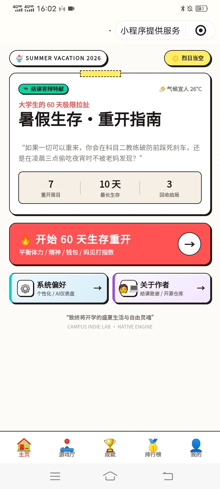 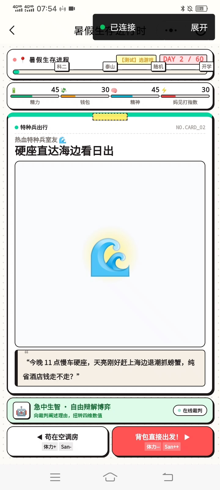 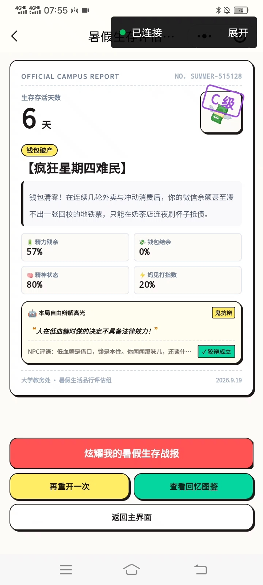</p>

自由辩解与 AI 测试：

<p align="center"> 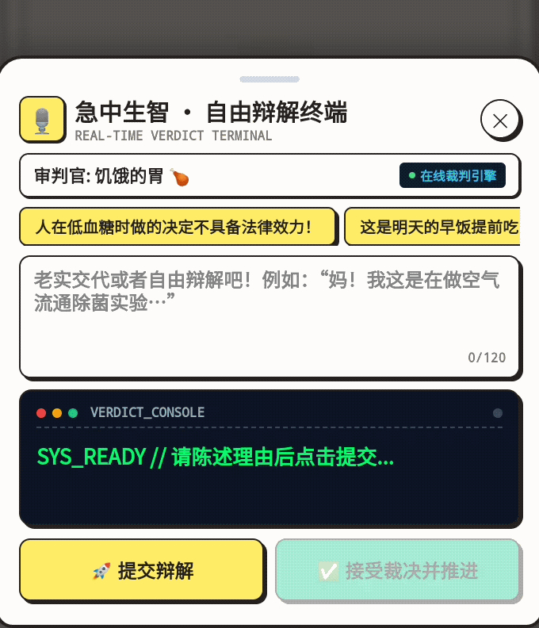 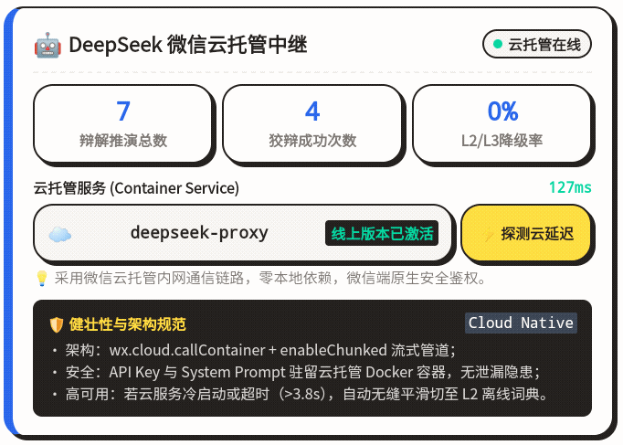  </p>

街机厅 & 成就图鉴 & 天梯榜

<p align="center"> 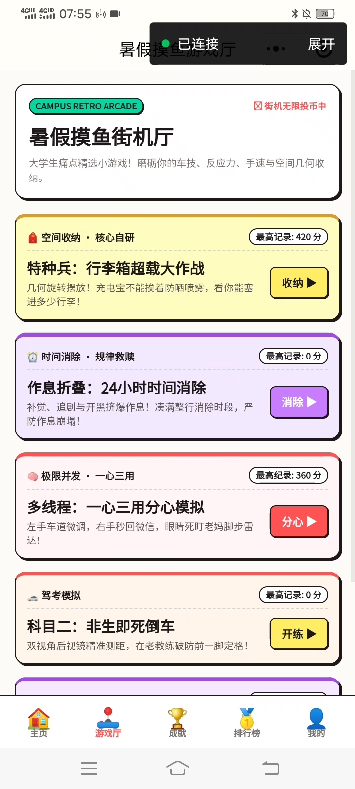 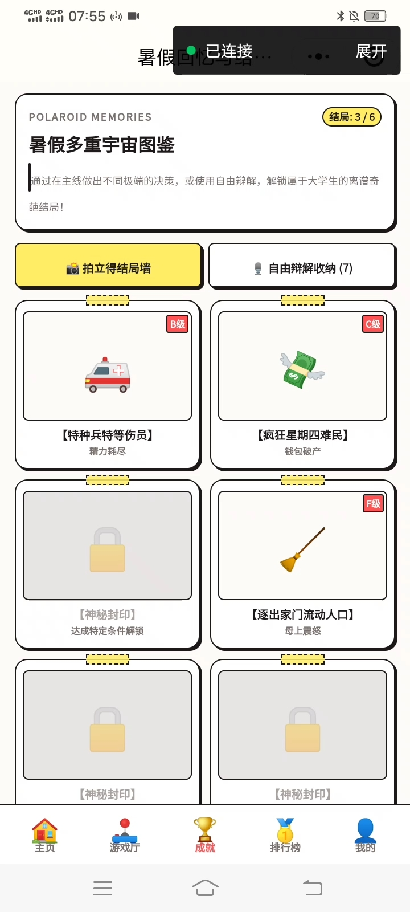 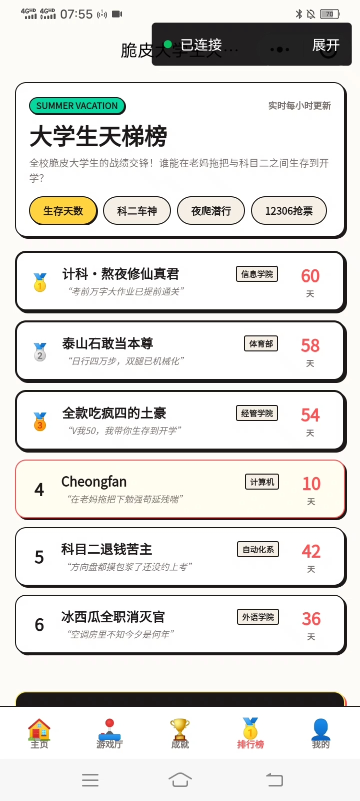 </p>

个人主页 & 系统设置 & 关于作者

<p align="center"> 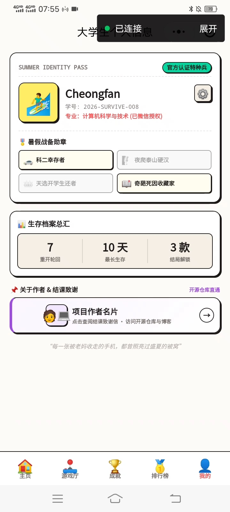 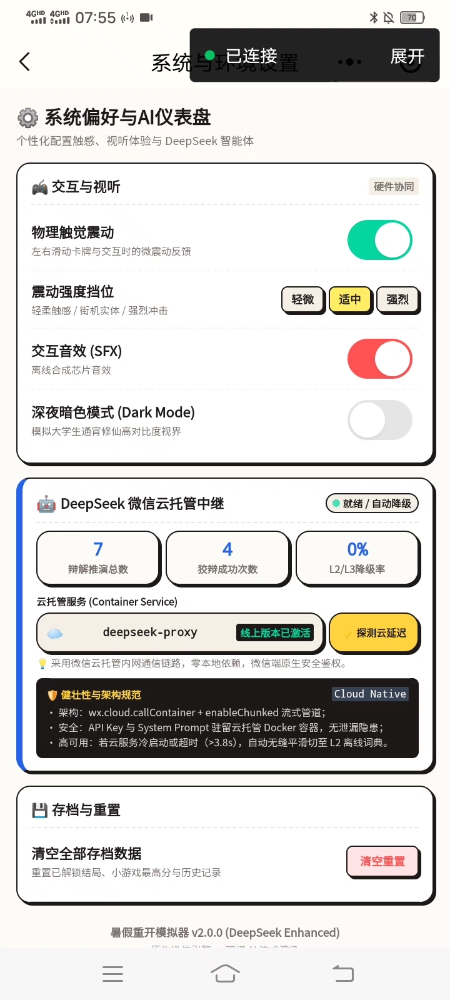 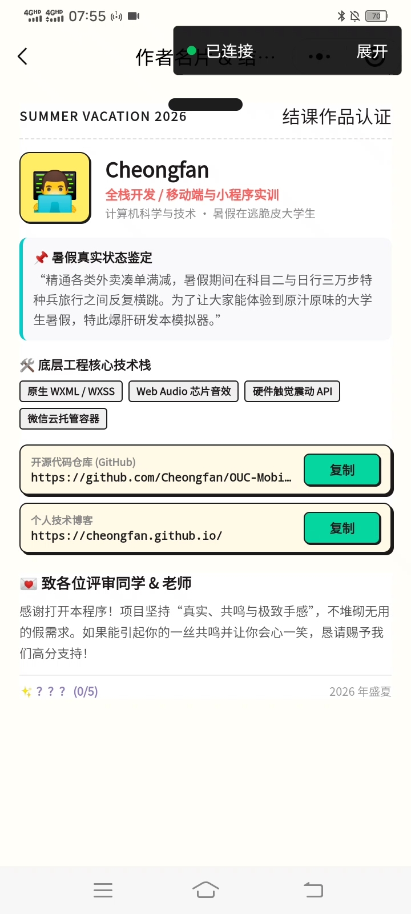 </p>

六款街机小游戏：

<p align="center"> 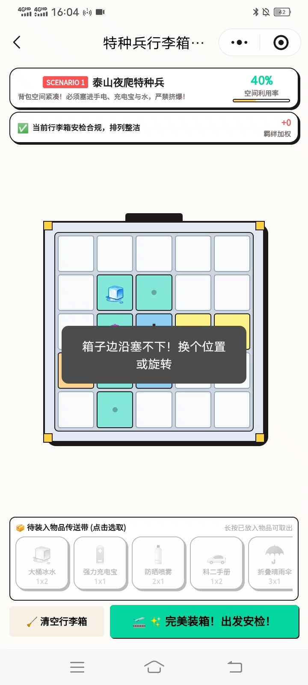 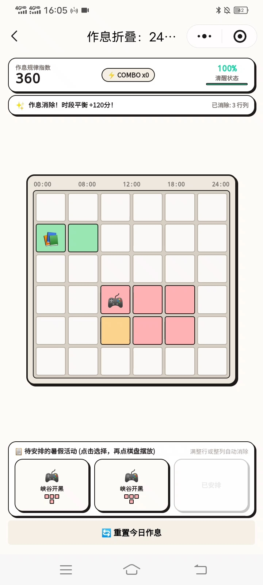 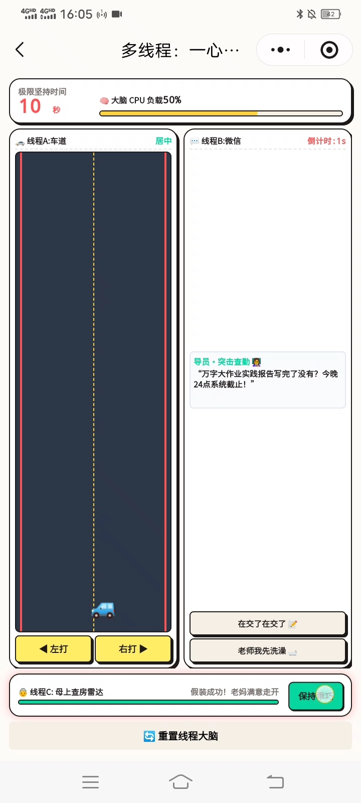 </p>

<p align="center"> 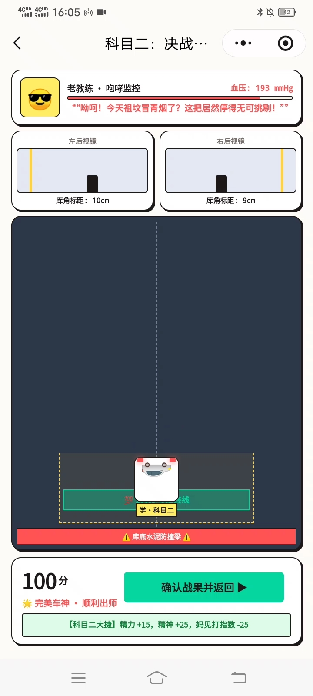 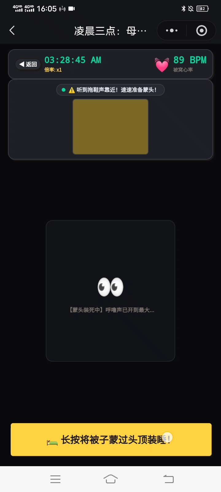 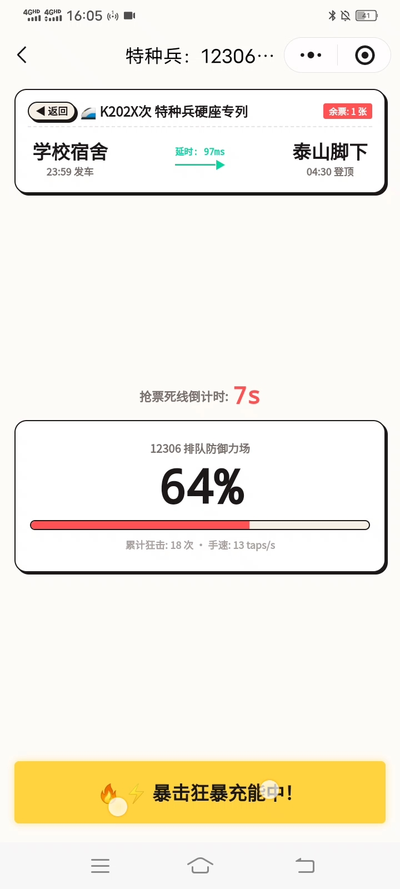 </p>

------

## 🛠️ 实现功能与技术细节

### 60 天暑假生存主线

​	主线位于 `pages/game/game`，以 60 天为生存周期，围绕精力、钱包、精神、妈见打指数四项体征推进。玩家通过左右滑动卡牌或点击底部决策按钮做出选择，不同选择会实时改变四维数值，并触发对应提示。当任一属性归零或妈见打指数爆表时，进入对应结局；成功活到第 60 天则解锁“天选之子·暑假生存大师”结局。

### DeepSeek 自由辩解与端云容错

​	`utils/aiEngine.js` 通过 `wx.cloud.callContainer` 调用微信云托管服务 `deepseek-proxy` 的 `/api/debate` 接口。服务端持有 DeepSeek API Key 与系统提示词，端侧不暴露密钥。

​	AI 返回不依赖脆弱的 `JSON.parse`，而是通过字段级正则容错提取 `stamina`、`money`、`sanity`、`momRage`、`title`、`passed` 等字段，兼容大模型漏冒号、漏引号、键名拼写错误与末尾截断。若云托管超时或不可用，15 秒内自动降级至 L2 离线规则库，保证主线流程不中断。

​	台词通过 35ms 逐字打印模拟流式输出，增强“在线裁判”的临场感。

### 六款原生街机小游戏

- **科目二：非生即死倒车**：观察左右后视镜与鸟瞰考场，在教练血压爆表前一脚刹停。
- **特种兵：行李箱超载大作战**：5×5 行李箱网格，旋转物品、规避充电宝与防晒喷雾相邻等危险布局。
- **凌晨三点：母上查房伪装**：长按蒙头装睡，结合心率、门缝光影与拖鞋声雷达逃过查房。
- **12306：神之右手抢票**：连点破盾、网络延迟波动、QTE 图形验证码三重压力。
- **作息折叠：24 小时时间消除**：6×6 棋盘摆放活动方块，凑满整行或整列消除，维持清醒状态。
- **多线程：一心三用分心模拟**：左手车道微调、右手秒回微信、眼睛盯老妈查房雷达。

各小游戏最高分写入本地存储，并接入排行榜与街机厅展示。

### 结局图鉴、排行榜与个人档案

​	`pages/collection` 展示全部结局图鉴，支持查看已解锁结局详情，并新增“自由辩解收纳”分页，记录玩家在主线中提交的 AI 辩解语录、NPC 评语与成立/驳回状态。

​	`pages/ranking` 提供生存天数、科二车神、夜爬潜行、12306 抢票、行李箱收纳、作息消除、多线程分心七类榜单。

​	`pages/profile` 展示重开轮回、最长生存、结局解锁数与勋章墙，并支持模拟微信授权登录。

### 视听与交互体验

- `utils/audio.js` 基于 `wx.createWebAudioContext` 合成点击、滑动、成功、危险、游戏结束等芯片音效，无外部音频资源依赖。
- `utils/haptics.js` 封装 `wx.vibrateShort` / `wx.vibrateLong`，根据场景提供轻、中、重三级触觉反馈。
- `custom-tab-bar` 实现自定义底部导航，`components/boot-screen` 提供 CRT 扫描线开屏动画。
- 全局采用 Neo-Brutalism 硬边框、实体阴影与波普色块，支持深夜暗色模式。

---

## 💻 本地运行指南

1. **克隆本仓库到本地**：

   ```bash
   git clone https://github.com/Cheongfan/OUC-MobileDev.git
   ```

2. **导入开发者工具**：

   * 打开 **微信开发者工具**，点击 **导入项目**。
   * 选择克隆仓库的个人项目根目录：`OUC-MobileDev\Personal Program\summer-survival`。
   * 在`project.config.json`文件中填入个人小程序的 `AppID`（需开通**微信云托管**）。

3. **云环境配置**：

   * 进入相同`AppID`的**微信云托管**账号的开发者主页，在合适的环境中**新建服务**。
   * 进入新创建的服务后，选择**手动上传代码包**，上传**压缩包**`OUC-MobileDev\Personal Program\ai-proxy-deploy\ai-proxy-deploy.zip`，端口填入80后**发布**。
   * 在服务的**服务设置**界面，将容器的最小**实例副本数**设为1；填入**环境变量**"**DEEPSEEK_API_KEY**": "**sk-xxxxxxxxxx**"(你的DeepSeek API KEY)，**保存**。
   * 回到刚刚导入了项目的微信开发者工具，在`app.js`和`utils\aiEngine.js`文件中将`your-env-id`替换为DeepSeek云托管服务所处环境的**环境ID**。

4. **模拟预览和真机预览：**
   * 点击 **编译** 即可在模拟器中体验项目功能；点击**真机调试**，用手机微信扫描生成的二维码可以进行真机预览。