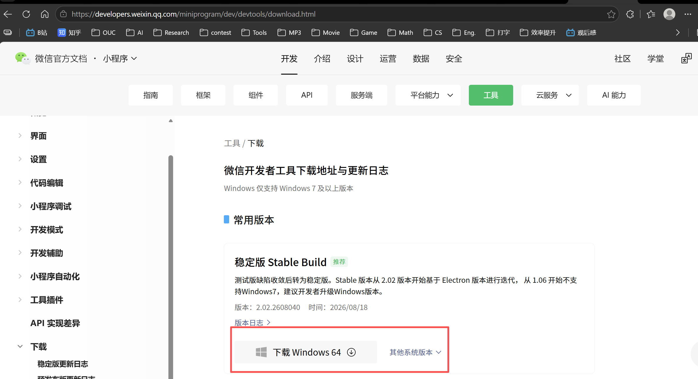
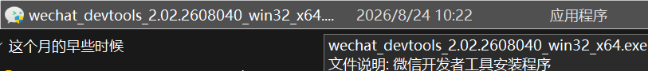
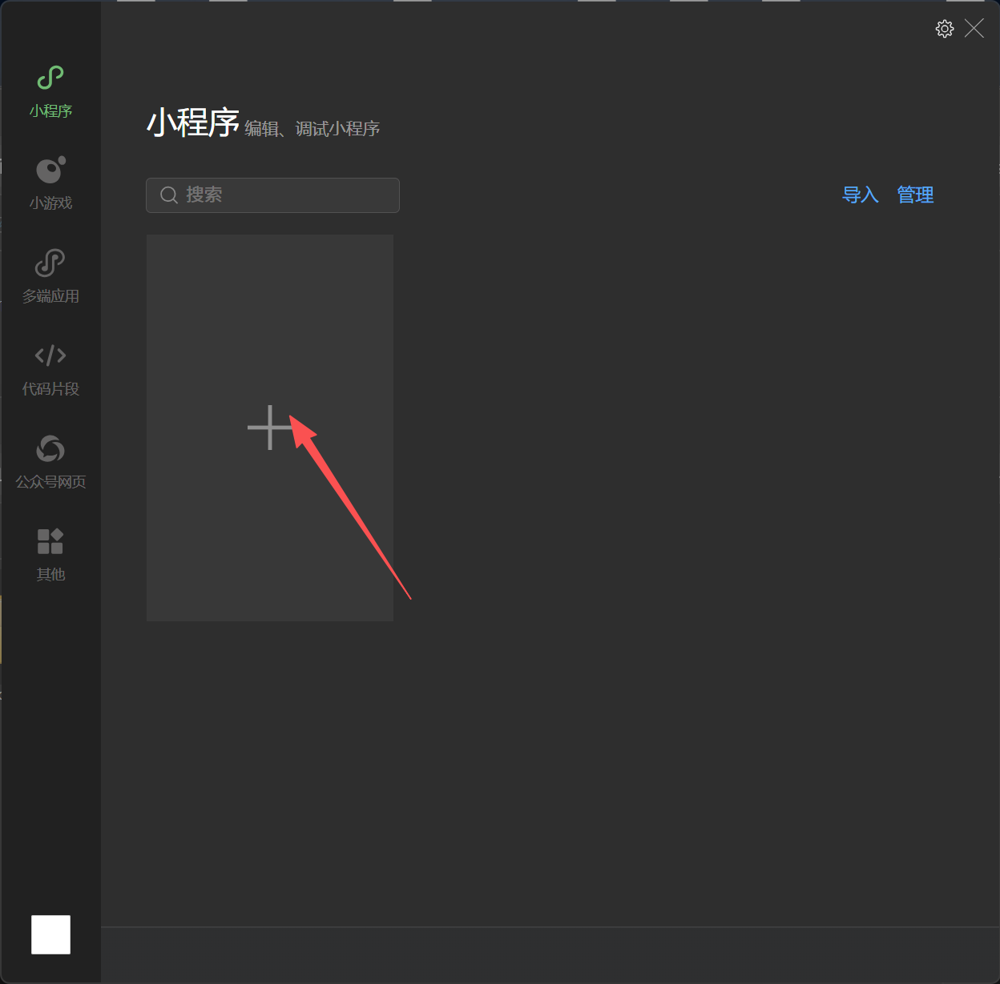
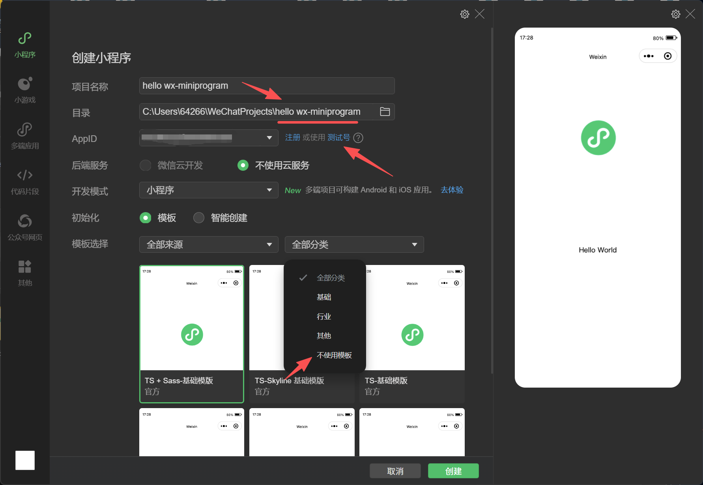
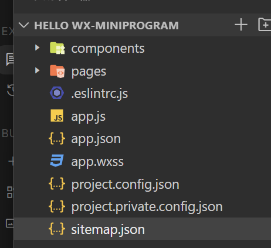
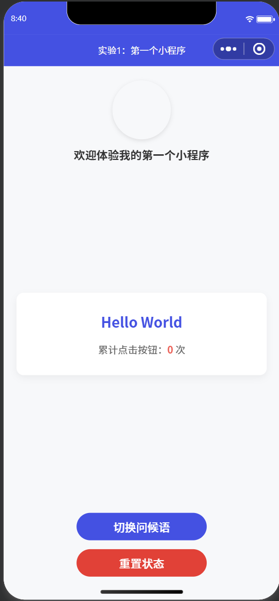
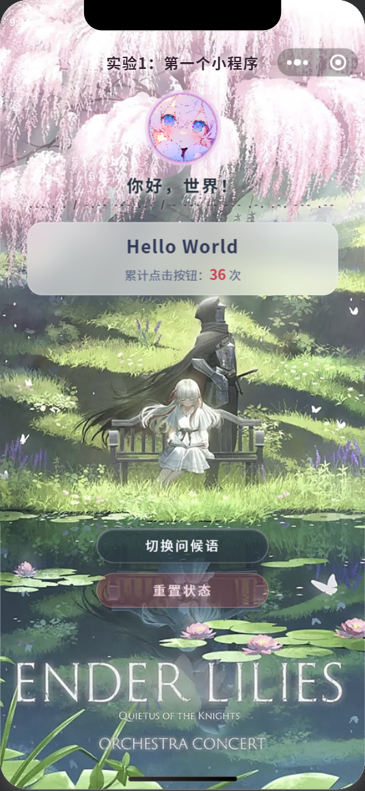
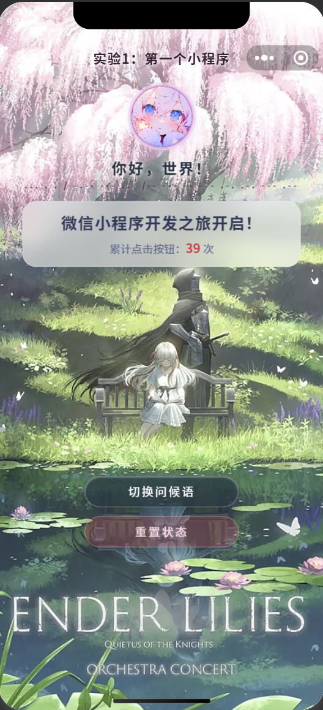

# 移动软件开发实验一报告
<center>姓名：吴啸天  学号：24020007137</center>

| 姓名和学号？         | [吴啸天]，[24020007137]            |
| -------------------- | -------------------------------- |
| 本实验属于哪门课程？ | 中国海洋大学26夏《移动软件开发》 |
| 实验名称？           | 实验1：第一个微信小程序          |

---

### 博客与开源代码链接
* **CSDN 博客链接**：https://cheongfan.github.io/
* **GitHub 仓库链接**：https://github.com/Cheongfan/OUC-MobileDev

---

## 一、实验目的
 1、学习使用快速启动模板创建小程序的方法；
 
 2、学习不使用模板手动创建小程序的方法。

## 二、 实验内容
**实验主线**：从**基础的工具安装与空白项目搭建**开始，先落实实验要求的 **“Hello World 动态文本切换”逻辑**，随后以此为骨架，进行界面美化、动画渲染以及沉浸式交互的拓展，逐步形成一个 **简单却高完成度的单页小程序**。

### 1、从零起步：环境搭建
实验第一步是下载并安装官方微信开发者工具，其过程记录如下。

微信开发者工具的版本发布页链接：https://developers.weixin.qq.com/miniprogram/dev/devtools/download.html 

选择合适的操作系统版本进行安装稳定版：


双击运行安装包：



安装过程省略，选择合适的盘符和文件夹即可。

启动开发工具，点击创建项目：


修改项目名称，**同步修改项目目录名单**，避免以后认不出来（因为这里微信工具不会自动帮你改），然后点击“测试号”获取测试号，模板选择在“全部分类”中找到“不使用模板”即可：



进入开发界面后，左边是项目目录，下方是终端（本实验用不到），右边是模拟运行的手机界面。


### 2、筑基：落实实验基本要求

#### （1）、 实验思路

本实验对代码的基本要求是简单且确定的：实现一个能够点击按钮修改页面文字的经典 Hello World 小程序，体会 WXML 与 JS 的数据绑定机制。

为实现这一功能并为后续实验打下基础，这里需要学习一下 WeChat Mini Program 的项目结构：



由于本人在之前学习过前端三件套（`HTML`+`CSS`+`JS`）的相关知识，因此以网页前端的视角对微信小程序的项目结构进行解释：

* 小程序的运行由多个页面(pages)组成，每个页面的渲染与网页页面并无不同，都是由“微信版本”的三件套外加配置文件构成，即`.wxml` `.wxss` `.js`+ `.json`。

* 组件(`components`)可以理解为特殊的页面(`pages`)，同样由上述四件套渲染；区别在于它可以出现在多个页面当中。

* `app`类文件是全局文件，除了`.wxml`外都包含。

* `project` 类和`sitemap`类分别配置项目的运行环境（分内外）和配置搜索环境。一般不作修改。

结合以上理解可知，本实验只需要在 `pages` 中创建一个页面，使其能够完成文本的渲染和切换任务即可。

#### （2）、实验过程

我在 `pages/index/` 目录下手动建齐了 `index.wxml`、`index.wxss`、`index.js` 和 `index.json` 四个文件，分管**结构、样式、逻辑与局部配置**。

经过合理的前端设计，本实验的初稿效果如下：



下面是具体实现：

在`app.json`中实现导航头的配置，渲染简易蓝色导航头和标题：
```json
{
  "pages": [
    "pages/index/index"
  ],
  "window": {
    "navigationBarBackgroundColor": "#2f54eb",
    "navigationBarTitleText": "实验1：第一个小程序",
    "navigationBarTextStyle": "white"
  },
  "style": "v2",
  "sitemapLocation": "sitemap.json"
}
```

然后在`pages/index/index.wxml`中完成页面结构的搭建。页面结构在设计思想上，应该自上而下呈现用户信息与配文、文本展示框和切换按钮三个模块，可以分为**头部展示区、核心展示区域、交互按钮组**这三个区域；接着，通过`image`、`text`、`button`等基础组件实现头像、文本等内容的呈现。对于代码如下：
```json
<view class="container">
  <!-- 头部展示区 -->
  <view class="header-card">
    <image class="avatar" src="https://mmbiz.qpic.cn/mmbiz_png/icTdbqWNOwNRna42FI242Lcia07jQodd2FJGIYQfG0LAJGFxM4FbnQP6yfMxBgJ0F3YRqJCJ1aPAK2dQagd67m4Q/0" mode="aspectFit"></image>
    <text class="title">欢迎体验我的第一个小程序</text>
  </view>

  <!-- 核心展示区域 -->
  <view class="content-card">
    <text class="message-text">{{message}}</text>
    <text class="counter-text">累计点击按钮：<text class="highlight">{{count}}</text> 次</text>
  </view>

  <!-- 交互按钮组 -->
  <view class="btn-group">
    <button class="btn btn-primary" bindtap="changeText">切换问候语</button>
    <button class="btn btn-warn" bindtap="resetAll">重置状态</button>
  </view>
</view>
```

在交互逻辑方面，本实验需要实现的是文本切换与回放的功能，我根据实验设计需求又升级为了文本的循环播报与计数，在设定的文本切换完毕后再次切换，会回到第一个句子。代码层面，需要在逻辑控制文件`pages/index/index.js`中做具体实现：通过`greetings`变量保存循环文本，利用`nextIndex`计数器和取模运算实现循环索引，并让按钮绑定一个具有文本切换功能函数，使其在被点击时触发对应的逻辑。代码实现如下：
```json
Page({
  data: {
    message: "Hello World",
    count: 0,
    // 出色完成亮点：设计多语种/多状态文本数组
    greetings: [
      "Hello World",
      "你好，中国海洋大学！",
      "欢迎来到《移动软件开发》课堂",
      "微信小程序开发之旅开启！"
    ],
    currentIndex: 0
  },

  // 1. 切换文本与增加计数
  changeText: function () {
    let nextIndex = (this.data.currentIndex + 1) % this.data.greetings.length;
    this.setData({
      currentIndex: nextIndex,
      message: this.data.greetings[nextIndex],
      count: this.data.count + 1
    });
  },

  // 2. 重置状态功能
  resetAll: function () {
    this.setData({
      message: "Hello World",
      count: 0,
      currentIndex: 0
    });
    // 调用微信原生 API 提供良好交互体验
    wx.showToast({
      title: '已重置为初始状态',
      icon: 'success',
      duration: 1500
    });
  }
});
```

最后微调样式，将具有以上逻辑的结构按照美观的方式摆放、塑性和调色。摆放一般通过设置结构的`width`、`height`、`padding`、`margin`等样式实现；塑性可以通过`border`类等样式实现；调色可以通过`box-shadow`、`color`等样式实现。具体实现如下：
```json
.container {
  display: flex;
  flex-direction: column;
  align-items: center;
  padding: 40rpx 30rpx;
  background-color: #f7f8fa;
  min-height: 100vh;
  box-sizing: border-box;
}

.header-card {
  display: flex;
  flex-direction: column;
  align-items: center;
  margin-bottom: 40rpx;
}

.avatar {
  width: 160rpx;
  height: 160rpx;
  border-radius: 50%;
  margin-bottom: 20rpx;
  box-shadow: 0 4rpx 12rpx rgba(0, 0, 0, 0.1);
}

.title {
  font-size: 32rpx;
  color: #333333;
  font-weight: bold;
}

.content-card {
  width: 90%;
  background: #ffffff;
  border-radius: 20rpx;
  padding: 50rpx 30rpx;
  display: flex;
  flex-direction: column;
  align-items: center;
  box-shadow: 0 8rpx 20rpx rgba(0, 0, 0, 0.05);
  margin-bottom: 60rpx;
}

.message-text {
  font-size: 40rpx;
  color: #2f54eb;
  font-weight: 600;
  margin-bottom: 30rpx;
  text-align: center;
}

.counter-text {
  font-size: 28rpx;
  color: #666666;
}

.highlight {
  color: #ff4d4f;
  font-weight: bold;
}

.btn-group {
  width: 90%;
}

.btn {
  margin-bottom: 25rpx;
  border-radius: 50rpx;
  font-size: 32rpx;
  font-weight: 500;
}

.btn-primary {
  background-color: #2f54eb;
  color: #ffffff;
}

.btn-warn {
  background-color: #f5222d;
  color: #ffffff;
}
```

### 3、提高：突出“出色完成”的创意设计
在完成了基础的点击切换功能后，我发现默认的白底黑字界面过于单调。为了追求更好的视觉效果与交互质感，我决定通过完善背景与用户头像、优化UI质感来提升视觉效果，在基础功能之上追加了以下创意设计：

#### （1）、基于暗黑奇幻风格的樱花水池壁纸为背景
我在网络上选取了合适的图片作为背景与用户头像，通过`margin`、`transform: translateY()`参数进行合理的布局调整，并通过调整阴影、透明度、高斯模糊、微亮边框实现UI美化。

#### （2）、沉浸式自定义导航栏与动态胶囊避让
原生的蓝色导航栏不仅遮挡了壁纸，也破坏了整体画风。我在 `app.json` 中配置了 `"navigationStyle": "custom"` 隐藏原生导航栏，使背景图向上贯穿至刘海屏。

为了防止自定义标题与微信官方胶囊按钮重叠，我在 `index.js` 的 `onLoad` 生命周期函数中调用 `wx.getMenuButtonBoundingClientRect()` API，动态计算出当前设备按钮的高度与边距，算出了准确的 `headerPaddingTop` 并动态传给页面容器，实现了标题与按钮的稳定对齐。

`pages/index/index.js`中对应代码如下：
```json
Page({
    data: {/*...*/},

    onLoad: function () {
      const menuButton = wx.getMenuButtonBoundingClientRect();
      const totalHeight = menuButton.top + menuButton.height + 12;
      this.setData({
        navTop: menuButton.top,
        navHeight: menuButton.height,
        headerPaddingTop: totalHeight
      });
    },

    //...
});
```
#### （3）、毛玻璃质感（Glassmorphism）与细节彩蛋
为了让中央的文字卡片和底部按钮不显得死板遮图，我采用了毛玻璃设计：通过 CSS 的 `backdrop-filter: blur(25rpx)` 与半透明白色衬底，让卡片透出背后隐隐约约的水草与水波。针对浅粉发色头像容易与粉白花树背景融为一体的问题，我设计了“暗梅紫内框 + 半透明光环”的双重立体圈，并配合 CSS 滤镜，让角色的宝蓝色眼睛和粉嫩气色脱颖而出。

同时，我在主标题下方添加了一行写有 `see you tomorrow` 的摩斯电码（`... . . / -.-- --- ..- / - --- -- --- .-. .-. --- .--`），为页面增添了一丝文艺彩蛋。

相关代码如下：
```json
Page({
  //pages/index/index.wxml中：
  <text class="morse-code">... . . / -.-- --- ..- / - --- -- --- .-. .-. --- .--</text>

  //pages/index/index.wxss中：
  .title {
    font-size: 36rpx;
    color: #22323d;
    font-weight: bold;
    letter-spacing: 4rpx;
    text-shadow: 0 2rpx 10rpx rgba(255, 255, 255, 0.9), 
                 0 0 20rpx rgba(255, 255, 255, 0.8);
    margin-top: 0rpx;
  }
  
  .morse-code {
    font-size: 20rpx;
    color: #430d30;
    font-weight: 600;
    letter-spacing: 6rpx;
    opacity: 0.85;
    text-shadow: 0 2rpx 8rpx rgba(255, 255, 255, 0.9);
  }
  
  .content-card {
    width: 88%;
    background: rgba(255, 255, 255, 0.55);
    backdrop-filter: blur(25rpx);
    -webkit-backdrop-filter: blur(25rpx);
    border: 2rpx solid rgba(255, 255, 255, 0.75);
    border-radius: 32rpx;
    padding: 23rpx 15rpx;
    display: flex;
    flex-direction: column;
    align-items: center;
    box-shadow: 0 16rpx 40rpx rgba(31, 38, 135, 0.1);
    margin-bottom: 540rpx;
  }
  
  .message-text {
    font-size: 38rpx;
    color: #2e3a59;
    font-weight: bold;
    margin-bottom: 10rpx;
    text-align: center;
    letter-spacing: 1rpx;
  }
  
  .counter-text {
    font-size: 26rpx;
    color: #5a6b8c;
  }
  
  .highlight {
    color: #e11d48;
    font-weight: bold;
    font-size: 30rpx;
  }
});
```
#### （4）、GPU 加速阶梯进场动画与防闪烁处理
为了让页面加载更具动感，我编写了基于 CSS3 `@keyframes` 的滑入动画，并配合 `cubic-bezier(0.16, 1, 0.3, 1)` 贝塞尔曲线，为头像、卡片和按钮组设置了 `0.05s -> 0.2s -> 0.35s` 的阶梯式延迟进场。为了解决刷新时白屏与动画抽搐的问题，我在 JS 中通过 `onReady` 生命周期控制 `loaded` 状态，并在 CSS 中加入了 `animation-fill-mode: both`，保证了动画在页面渲染完成的丝滑播放。

#### （5）、锁死单页体验与水色磨砂按钮
为了避免页面在手机上产生上下误滑动或左右拉出白边的现象，我在 `index.json` 中配置了 `"disableScroll": true`，并在 CSS 中锁死了横向溢出。在底部按钮的设计上，我摒弃了原生的红蓝强对比色，改用深池夜蓝半透明玻璃与睡莲暗粉镂空幽灵按钮（Ghost Button），使整个界面和谐划一。

### 4、落地：完整工程代码展示

经过上述从“基本要求”到“创意设计”的演进，本实验落地的完整工程代码如下：

#### （1）、配置文件：全局 `app.json` 与 页面 `index.json`
`app.json` 控制全局隐藏原生导航栏；`index.json` 开启页面级禁止滑动。
```json
// app.json
{
  "pages": [
    "pages/index/index"
  ],
  "window": {
    "navigationStyle": "custom",
    "navigationBarTextStyle": "white"
  },
  "style": "v2",
  "sitemapLocation": "sitemap.json"
}

// pages/index/index.json
{
  "navigationStyle": "custom",
  "disableScroll": true,
  "usingComponents": {}
}
```

#### （2）、逻辑层：页面 `pages/index/index.js`
包含基础的 `greetings` 数组、点击计数 `changeText`、重置 `resetAll`，以及为了创意设计追加的胶囊计算与动画控制 `loaded`。
```javascript
Page({
  data: {
    // 【基本要求】数据绑定
    message: "Hello World",
    count: 0,
    greetings: [
      "Hello World",
      "你好，中国海洋大学！",
      "欢迎来到《移动软件开发》课堂",
      "微信小程序开发之旅开启！"
    ],
    currentIndex: 0,

    // 【创意设计】动态避让与动画控制
    loaded: false,      
    navTop: 20,         
    navHeight: 32,      
    headerPaddingTop: 90
  },

  onLoad: function () {
    // 【创意设计】动态获取微信胶囊尺寸，计算顶部避让间距
    const menuButton = wx.getMenuButtonBoundingClientRect();
    const totalHeight = menuButton.top + menuButton.height + 12;
    this.setData({
      navTop: menuButton.top,
      navHeight: menuButton.height,
      headerPaddingTop: totalHeight
    });
  },

  onReady: function () {
    // 【创意设计】白屏消失后精准触发进场动画
    this.setData({
      loaded: true
    });
  },

  // 【基本要求】切换问候语逻辑
  changeText: function () {
    let nextIndex = (this.data.currentIndex + 1) % this.data.greetings.length;
    this.setData({
      currentIndex: nextIndex,
      message: this.data.greetings[nextIndex],
      count: this.data.count + 1
    });
  },

  // 【创意设计】重置状态与 Toast 反馈
  resetAll: function () {
    this.setData({
      message: "Hello World",
      count: 0,
      currentIndex: 0
    });
    wx.showToast({
      title: '已重置',
      icon: 'success',
      duration: 1000
    });
  }
});
```

#### （3）、视图层：页面 `pages/index/index.wxml`
采用了全屏背景、自定义导航栏、头像框、毛玻璃卡片与按钮组结构。
```xml
<view class="container" style="padding-top: {{headerPaddingTop}}px;">
  <!-- 全局背景图 -->
  <image class="bg-image" src="/images/a.png" mode="aspectFill"></image>

  <!-- 1. 自定义沉浸式导航栏 -->
  <view class="custom-nav" style="padding-top: {{navTop}}px; height: {{navHeight}}px;">
    <text class="nav-title">实验1：第一个小程序</text>
  </view>

  <!-- 2. 头部卡片（头像、主标题与摩斯电码彩蛋） -->
  <view class="header-card {{loaded ? 'animate-enter delay-1' : 'init-hide'}}">
    <view class="avatar-box">
      <image class="avatar-img" src="/images/2.png" mode="aspectFill"></image>
    </view>
    <text class="title">你好，世界！</text>
    <text class="morse-code">... . . / -.-- --- ..- / - --- -- --- .-. .-. --- .--</text>
  </view>

  <!-- 3. 【基本要求】绑定展示卡片 -->
  <view class="content-card {{loaded ? 'animate-enter delay-2' : 'init-hide'}}">
    <text class="message-text">{{message}}</text>
    <text class="counter-text">累计点击按钮：<text class="highlight">{{count}}</text> 次</text>
  </view>

  <!-- 4. 按钮组 -->
  <view class="btn-group {{loaded ? 'animate-enter delay-3' : 'init-hide'}}">
    <button class="btn btn-primary" bindtap="changeText">切换问候语</button>
    <button class="btn btn-warn" bindtap="resetAll">重置状态</button>
  </view>
</view>
```

#### （4）、样式层：全局 `app.wxss` 与 页面 `index.wxss`
```css
/* app.wxss */
.container {
  height: 100%;
  display: flex;
  flex-direction: column;
  align-items: center;
  justify-content: space-between;
  padding: 200rpx 0;
  box-sizing: border-box;
} 

/* pages/index/index.wxss */
page {
  width: 100%;
  overflow-x: hidden;
  background-color: #2e1a29;
}

.container {
  display: flex;
  flex-direction: column;
  align-items: center;
  padding: 160rpx 30rpx 140rpx 30rpx;
  min-height: 100vh;
  box-sizing: border-box;
  background-color: transparent;
}

.bg-image {
  position: fixed;
  top: 0;
  left: 0;
  width: 100vw;
  height: 100vh;
  z-index: -1;
}

.custom-nav {
  position: fixed;
  top: 0;
  left: 0;
  width: 100vw;
  z-index: 999;
  display: flex;
  align-items: center;
  justify-content: center;
  background: transparent;
}

.nav-title {
  font-size: 32rpx;
  font-weight: bold;
  color: #3d2235;
  letter-spacing: 2rpx;
  text-shadow: 0 2rpx 10rpx rgba(255, 255, 255, 0.9),
               0 0 20rpx rgba(255, 255, 255, 0.8);
}

.header-card {
  display: flex;
  flex-direction: column;
  align-items: center;
  margin-top: 10rpx;
  margin-bottom: 25rpx;
}

.avatar-box {
  position: relative;
  width: 140rpx;
  height: 140rpx;
  border-radius: 50%;
  margin-bottom: 20rpx;
  border: 5rpx solid #ec9cec;
  box-shadow: 0 12rpx 30rpx rgba(230, 190, 228, 0.45), 
              0 0 0 6rpx rgba(238, 214, 236, 0.7);
  background: #2e1a29;
  overflow: hidden;
}

.avatar-img {
  width: 100%;
  height: 100%;
  border-radius: 50%;
  display: block;
  filter: saturate(1.18) contrast(1.08) brightness(1.02);
  transform: scale(1.0); 
}

.title {
  font-size: 36rpx;
  color: #22323d;
  font-weight: bold;
  letter-spacing: 4rpx;
  text-shadow: 0 2rpx 10rpx rgba(255, 255, 255, 0.9), 
               0 0 20rpx rgba(255, 255, 255, 0.8);
  margin-top: 0rpx;
}

.morse-code {
  font-size: 20rpx;
  color: #430d30;
  font-weight: 600;
  letter-spacing: 6rpx;
  opacity: 0.85;
  text-shadow: 0 2rpx 8rpx rgba(255, 255, 255, 0.9);
}

.content-card {
  width: 88%;
  background: rgba(255, 255, 255, 0.55);
  backdrop-filter: blur(25rpx);
  -webkit-backdrop-filter: blur(25rpx);
  border: 2rpx solid rgba(255, 255, 255, 0.75);
  border-radius: 32rpx;
  padding: 23rpx 15rpx;
  display: flex;
  flex-direction: column;
  align-items: center;
  box-shadow: 0 16rpx 40rpx rgba(31, 38, 135, 0.1);
  margin-bottom: 540rpx;
}

.message-text {
  font-size: 38rpx;
  color: #2e3a59;
  font-weight: bold;
  margin-bottom: 10rpx;
  text-align: center;
  letter-spacing: 1rpx;
}

.counter-text {
  font-size: 26rpx;
  color: #5a6b8c;
}

.highlight {
  color: #e11d48;
  font-weight: bold;
  font-size: 30rpx;
}

.btn-group {
  width: 85%;
  margin-bottom: 150rpx;
}

.btn {
  margin-bottom: 26rpx;
  border-radius: 50rpx;
  font-size: 28rpx;
  font-weight: 500;
  letter-spacing: 4rpx;
  border: none !important;
  transition: all 0.3s ease;
}

.btn-primary {
  background: rgba(35, 56, 65, 0.75) !important;
  color: #f0f4f8 !important;
  backdrop-filter: blur(15rpx);
  -webkit-backdrop-filter: blur(15rpx);
  border: 2rpx solid rgba(255, 255, 255, 0.35) !important;
  box-shadow: 0 8rpx 24rpx rgba(0, 0, 0, 0.25),
              inset 0 2rpx 4rpx rgba(255, 255, 255, 0.4) !important;
  transform: translateY(-60rpx);
}

.btn-warn {
  background: rgba(180, 60, 80, 0.35) !important;
  color: #f7d6de !important;
  backdrop-filter: blur(15rpx);
  -webkit-backdrop-filter: blur(15rpx);
  border: 2rpx solid rgba(247, 214, 222, 0.45) !important;
  box-shadow: 0 6rpx 20rpx rgba(0, 0, 0, 0.15) !important;
  margin-top: 100rpx;
  transform: translateY(-140rpx);
}

.header-card, .content-card, .btn-group {
  will-change: transform, opacity;
}

.init-hide {
  opacity: 0 !important;
  transform: translateY(60rpx) scale(0.94) !important;
}

@keyframes silkySlideUp {
  0% {
    opacity: 0;
    transform: translateY(60rpx) scale(0.94);
  }
  100% {
    opacity: 1;
    transform: translateY(0) scale(1);
  }
}

.animate-enter {
  animation: silkySlideUp 0.8s cubic-bezier(0.16, 1, 0.3, 1) both;
}

.delay-1 { animation-delay: 0.05s; }
.delay-2 { animation-delay: 0.2s; }
.delay-3 { animation-delay: 0.35s; }
```

最终效果：



完整可运行代码将放在个人Github仓库中：https://github.com/Cheongfan/OUC-MobileDev 。

---

## 三、 问题总结与体会

在本次小程序的搭建与视觉重构过程中，我遇到了不少预料之外的细节问题。排查和解决这些问题的经历，让我对前端渲染与小程序底层机制有了更切实的体会。

最让我印象深刻的是动画渲染与生命周期的冲突问题。最开始，我直接在 WXSS 中给卡片绑定了带延迟的滑入动画。但在模拟器刷新时，由于白屏加载期 CSS 动画已经在后台默默计时，导致白屏结束后动画早已播放完毕，或者元素先闪现一下再缩回滑入。经过排查，我意识到需要将动画触发的控制权交给 JS：通过在 `onReady` 生命周期（即页面渲染完成、白屏消失的瞬间）将 `loaded` 设为 `true` 来动态挂载动画 Class，并配合 CSS 的 `animation-fill-mode: both`，这才实现了极其丝滑且无闪烁的滑入效果。

另一个困扰我较久的问题是页面滑动与布局溢出。开启隐藏原生导航栏后，页面顶部出现了漏白和内容挤压撞向系统胶囊的现象。我发现这是因为取消原生限制后，必须由开发者手动管理顶部安全距离。我首先将背景图设为全屏固定定位（`top: 0`）保证无缝覆盖，随后在 JS 的 `onLoad` 里通过 API 动态获取胶囊距离并赋值给 `headerPaddingTop`，精确地将页面头部推送到了胶囊下方。此外，针对单页小程序的上下误滑动问题，我在 `index.json` 中追加了 `"disableScroll": true`，锁死了页面拉伸，保持了原生应用的精致感。

这次实验让我受益匪浅。我不仅走通了从小程序创建到数据绑定的基本流程，更体会到了“满足基本需求”与“打磨优秀体验”之间的差距。代码不只是逻辑的堆砌，页面布局、色调的调整、动画时机的掌控，都或多或少地影响了最终产品的品质。

这些细节让我对移动端 UI 开发有了更加深刻的认识，也为我后续深入学习移动软件开发打下了扎实的基础。