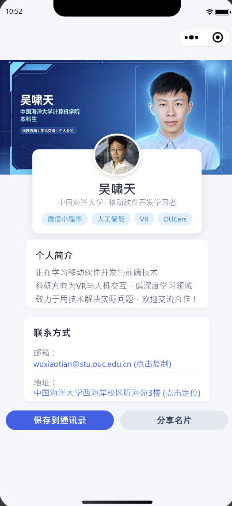

# 中国海洋大学《移动软件开发》课程实验二：名片小程序

`mini-card`为本人对中国海洋大学26夏《移动软件开发》课程的实验二的项目源码实现。

本项目基于微信小程序原生框架开发，以“基于个人肖像 AI 生成名片头图，打造具备一定交互力的数字名片”为主线，进行了名片UI设计和交互功能实现。

---

## 📌 实验目标

1. **小程序前端快速开发**：以制作名片小程序为案例，熟悉小程序的页面结构构建、样式设计以及 API 调用逻辑。
2. **AI 工具辅助设计**：尝试利用 AI 工具生成专属于个人的 16:9 名片头图，提升小程序的视觉呈现效果。
3. **视觉布局与体验优化**：采用 CSS 负边距实现半重叠悬浮卡片效果优化页面布局的 UI 展示效果，并借助 Flex 弹性盒搭建响应式技能标签云。
4. **系统原生 API 拓展**：结合实际应用场景，集成邮箱复制（`wx.setClipboardData`）、校园定位导航（`wx.openLocation`）、一键保存通讯录（`wx.addPhoneContact`）以及转发分享（`onShareAppMessage`）的功能。

---

## 📂 项目目录结构

```text
lab2/                          # 实验二目录
├── mini-card/                 # 实验二 名片小程序项目根目录
│   ├── images/                # 本地静态图像资源
│   │   ├── 1.png              # AI 生成的 16:9 风格名片头图
│   │   └── 2.png              # 个人照片/头像
│   ├── pages/                 # 页面模块目录
│   │   └── index/             # 首页核心模块
│   │       ├── index.js       # 交互逻辑（剪贴板复制、地图定位、通讯录写入、分享）
│   │       ├── index.json     # 页面级配置
│   │       ├── index.wxml     # 页面结构（悬浮卡片、标签云、联系方式）
│   │       └── index.wxss     # 页面局部样式（负边距悬浮、Flexbox 标签布局）
│   ├── app.js                 # 小程序全局逻辑入口
│   ├── app.json               # 小程序全局配置（路由与自定义导航风格）
│   ├── app.wxss               # 全局公共样式
│   ├── sitemap.json           # 微信搜索引擎索引配置文件
│   └── project.config.json    # 微信开发者工具核心工程配置文件
│
├── README.md                  # 实验二说明文档（本文件）
├── report.md                  # 实验二实验报告（.md）
├── report.pdf                 # 实验二实验报告（.pdf）
└── resources/                 # 文档配图资源
```

---

## 🖼️ 预览效果



---

## 🛠️ 实现功能与技术细节

项目在完成基础“AI 头图与文本描述”展示的基础上，对 UI 视觉与系统交互细节进行了深度拓展。

### 1. 界面构架与视觉层次
* **AI 视觉头图生成**：利用 AI 生成 16:9 比例的科技感视觉海报，存入本地 `images/` 目录作为卡片顶部背景。
* **半重叠悬浮卡片**：在 `index.wxss` 中通过设置 `.profile-card` 的负外边距（`margin-top: -80rpx`），使主信息卡片向上提拉压盖在 AI 头图上方。
* **响应式技能标签云**：使用 CSS Flexbox 弹性盒布局（`display: flex; flex-wrap: wrap; gap: 12rpx;`）呈现个人关键字标签（如微信小程序、人工智能、VR 等），实现自动换行排版。

### 2. 多维原生 API 交互扩展
* **邮箱一键复制**：绑定点击事件调用 `wx.setClipboardData` 接口将个人邮箱复制到剪贴板，并触发 `wx.showToast` 原生轻量提示。
* **校园精确定位导航**：配置中国海洋大学西海岸校区的坐标（北纬 `35.7728`，东经 `120.0322`），调用 `wx.openLocation` 接口并开启合理的放大比例，用户点击地址即可直接拉起微信原生地图。
* **一键存入手机通讯录**：调用 `wx.addPhoneContact` 结构化封装个人姓名、组织机构（中国海洋大学计算机学院）与邮箱，一键导入手机系统联系人。
* **名片转发分享**：配置 `onShareAppMessage` 原生转发接口，巧妙利用小程序的原生自动视图截图机制替代死板的静态路径，保证分享出的卡片始终展示最新的名片效果。

---

## 💻 本地运行指南

1. **克隆本仓库到本地**：
   ```bash
   git clone https://github.com/Cheongfan/OUC-MobileDev.git
   ```
2. **导入开发者工具**：
   * 打开 **微信开发者工具**，点击 **导入项目**。
   * 选择克隆仓库的实验二项目根目录：`OUC-MobileDev/lab2/mini-card`。
   * 填入个人小程序的 `AppID`（或选择测试号）。
3. **编译预览与真机调试**：
   * 点击工具栏的 **重新编译** 按钮即可在模拟器中运行界面。
   * 点击 **预览** 或 **真机调试** 扫码，可在手机微信上体验地图调起与通讯录写入等原生系统级功能。

---

## ⚠️ 已知局限与后续改进

* **PC 模拟器系统 API 限制**：`wx.addPhoneContact` 强依赖手机操作系统的通讯录组件，在 PC 端微信开发者工具模拟器中调用无界面响应，在真机预览环境下因为未知的原因无法成功导入（有可能是权限问题，目前没有验证这个问题）。
* **分享卡片虚拟路径兼容**：Windows 版开发者工具对 `onShareAppMessage` 中的本地图片路径在特定环境下存在解析异常，无法渲染指定的目标图片。
* **数据动态化**：当前名片信息硬编码在 `index.wxml` 与 `index.js` 中，后续可引入小程序云开发数据库或本地缓存实现多用户名片的动态配置与切换。