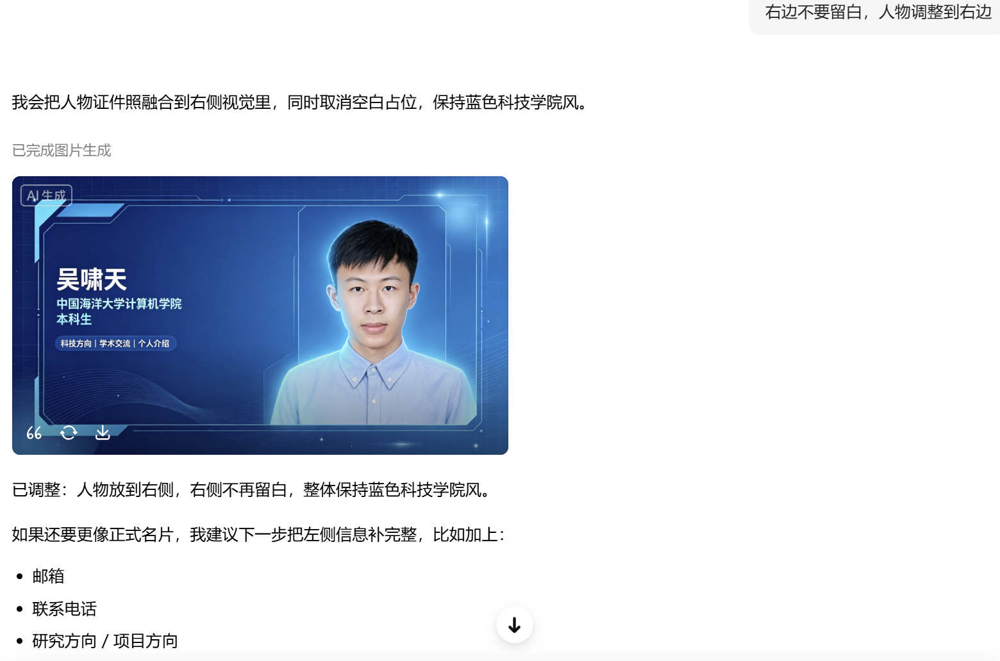
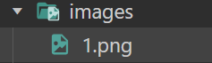
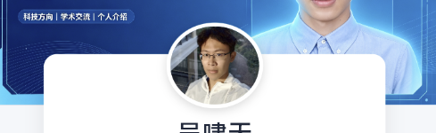
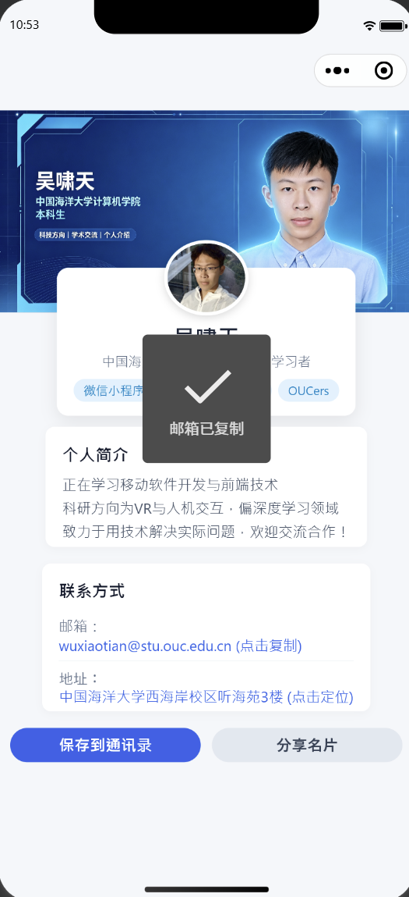
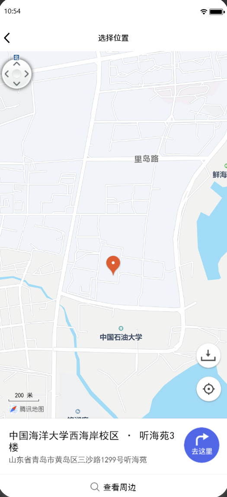
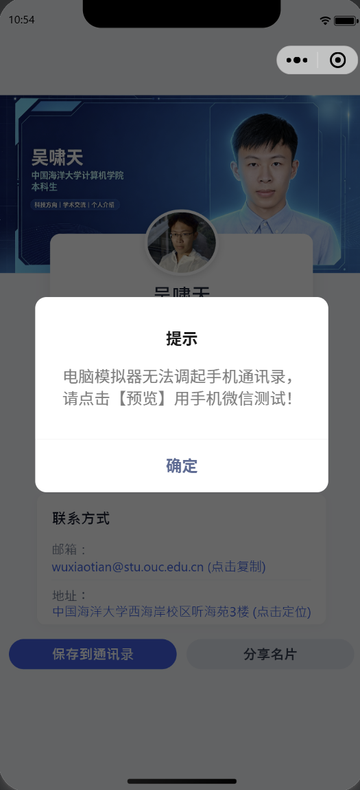
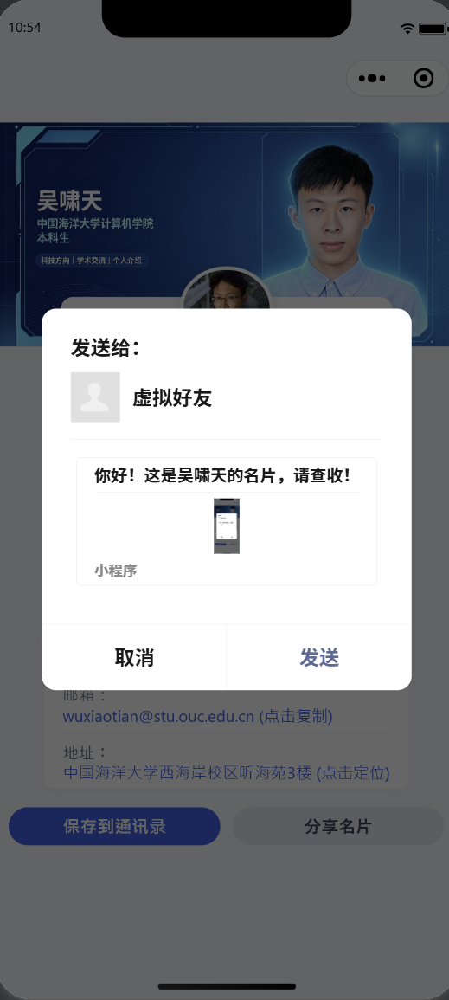

# 移动软件开发实验二报告
<center>姓名：吴啸天  学号：[24020007137]</center>

| 姓名和学号？         | 吴啸天，[24020007137] |
| -------------------- | -------------------------------- |
| 本实验属于哪门课程？ | 中国海洋大学26夏《移动软件开发》 |
| 实验名称？           | 实验2：名片小程序                |
| 博客地址？           | [https://Cheongfan.github.io]         |
| 代码仓库地址？        | [https://github.com/Cheongfan/OUC-MobileDev]       |

## 一、 实验目标

1. 以制作一个名片小程序为案例，快速学习了解小程序前端开发。

2. 制作一个专属于自己的名片小程序，包括头图、文本描述，可以分享给别人。

## 二、 实验内容

本次实验的主线是：基于个人肖像的AI生成名片头图，制作一个个人名片小程序，并尝试优化其视觉设计、丰富其功能体验。

因此，整个开发过程可以总结为，从 “AI头图生成” 到 “名片界面构建” 再到 “创意交互设计拓展”。

---
### 1. AI头图生成
使用豆包进行头图生成，上传个人证件照并给出对应的提示词，经过适当调整后得到AI头图：



在小程序项目根目录中创建目录 `images/` 保存微信小程序所需的静态图片资源：

<p align="center">
  
</p>

### 2. 基础界面构架：AI头图+悬浮卡片布局

根据实验教学视频中的要求，名片的上半部分需展示 AI 生成的 16:9 视觉头图，下半部分呈现个人信息。为了避免常见的“上图下文”割裂感，我采用**半重叠悬浮卡片**的视觉结构，优化了 UI 的视觉呈现。

在 `index.wxml` 中，我将页面拆解为头图背景、悬浮主卡片、简介区与扩展功能区：

```xml
<view class="container">
  <!-- 1. AI 16:9 头图 -->
  <image class="header-bg" src="/images/1.png" mode="aspectFill"></image>

  <!-- 2. 悬浮个人信息卡片 -->
  <view class="profile-card">
    <image class="avatar" src="/images/2.png" mode="aspectFill"></image>
    <view class="name">吴啸天</view>
    <view class="title">中国海洋大学 · 移动软件开发学习者</view>

  <!-- 3. 简介区 -->
  <view class="section">
    <view class="section-title">个人简介</view>
    <view class="section-content">
      正在学习移动软件开发与前端技术
    </view>
    <view class="section-content">
      科研方向为VR与人机交互，偏深度学习领域
    </view>
    <view class="section-content">
      致力于用技术解决实际问题，欢迎交流合作！
    </view>
  </view>
  <!-- 4. 扩展功能区 -->
  ...
</view>
```

为了实现卡片“压盖”在头图上的立体视觉，我在 `index.wxss` 中使用了负外边距（margin）：

```css
.profile-card {
  background: #ffffff;
  margin: -80rpx 30rpx 20rpx 30rpx;
  border-radius: 20rpx;
  box-shadow: 0 10rpx 30rpx rgba(0,0,0,0.08);
}

.avatar {
  width: 140rpx;
  height: 140rpx;
  border-radius: 50%;
  border: 6rpx solid #ffffff;
  margin-top: -90rpx;
}
```

呈现效果：



---

### 2. 交互设计扩展

在满足了基础的文本展示后，目前的个人名片在功能性上还有很大的提升空间，我围绕微信小程序原生 API ，额外实现了 4 个交互功能：

#### 亮点 1：剪贴板互动与自定义分享优化
我扩展了信息展示界面，展示了“邮箱”与“地址”的信息：

```xml
  <!-- 4. 联系方式 & 交互区 -->
  <view class="section">
    <view class="section-title">联系方式</view>
    <view class="info-item">
      <text class="label">邮箱：</text>
      <text class="value">wuxiaotian@stu.ouc.edu.cn</text>
    </view>
    <view class="info-item">
      <text class="label">地址：</text>
      <text class="value">中国海洋大学西海岸校区听海苑3楼</text>
  </view>
```

针对邮箱联系方式，有一个很简单的功能可以进行添加：利用view组件对特点逻辑的绑定，可以实现邮箱的“点击即复制”。

查阅资料后了解到复制功能通过微信小程序原生 API ——`wx.setClipboardData` 实现。于是我在`index.js`中书写了逻辑`copyEmail`，并在“邮箱”所在的`view`组件中绑定了这一逻辑。

逻辑 `copyEmail` 的代码实现如下：
```js
  copyEmail() {
    wx.setClipboardData({
      data: 'wuxiaotian@stu.ouc.edu.cn',
      success() {
        wx.showToast({ title: '邮箱已复制', icon: 'success' });
      }
    });
  },
```

#### 亮点 2：校园定位与地图调起 (`wx.openLocation`)
由于在信息展示中我展示了“邮箱”与“地址”的信息，在利用`wx.setClipboardData`接口实现**邮箱复制**功能后，我尝试为“地址”也添加一个功能。

查阅AI工具后，我利用微信小程序原生接口`wx.openLocation`，通过传入固定经纬坐标，实现固定位置的定位和地图唤起呈现：

```javascript
openLocation() {
  wx.openLocation({
    latitude: 35.7728,        // 目标纬度
    longitude: 120.0322,      // 目标经度
    scale: 18,                 // 放大视角
    name: '中国海洋大学西海岸校区 · 听海苑3楼',
    address: '山东省青岛市黄岛区三沙路1299号听海苑'
  });
}
```
用户点击界面上的地址文字，小程序会直接调起微信原生地图提供直观的位置信息。

#### 亮点 3：技能标签云
为直观展示我的个人关键词，我使用 Flex 弹性盒模型设计了自适应标签云：

```xml
<view class="tags">
  <text class="tag">微信小程序</text>
  <text class="tag">人工智能</text>
  <text class="tag">VR</text>
  <text class="tag">OUCers</text>
</view>
```
样式方面，利用 gap 和 flex-wrap 实现标签自适应间距与换行：

```css
.tags {
  display: flex;
  flex-wrap: wrap;
  gap: 12rpx;
  margin-top: 20rpx;
}
.tag {
  background: #e0f2fe;
  color: #0284c7;
  font-size: 22rpx;
  padding: 6rpx 18rpx;
  border-radius: 20rpx;
}
```

#### 亮点 4：通讯录写入 (`wx.addPhoneContact`)
此外，我还利用`wx.addPhoneContact`接口实现一键保存我的联系方式的功能，丰富名片功能并优化用户体验。

调试时发现由于微信开发者工具模拟调试的限制，无法调起手机通讯录，且没有任何反馈，这里人工书写提示信息以便测试该逻辑的运行与否。

代码实现如下：

```javascript
saveContact() {
  wx.addPhoneContact({
    firstName: '吴啸天',
    organization: '中国海洋大学计算机学院',
    email: 'wuxiaotian@stu.ouc.edu.cn',
    success() {
      wx.showToast({ title: '已保存到通讯录', icon: 'success' });
    },
    fail(err) {
      // 针对开发者工具无法调起手机通讯录的特性，给出反馈
      wx.showModal({
        title: '提示',
        content: '电脑模拟器无法调起手机通讯录，请点击【预览】用手机微信测试！',
        showCancel: false
      });
    }
  });
}
```

#### 亮点 5：名片分享（`onShareAppMessage`）
最后，考虑到名片的意义在于广播和转发，我利用微信转发接口`onShareAppMessage`书写了转发逻辑：

```js
  onShareAppMessage() {
    return {
      title: '你好！这是吴啸天的名片，请查收！',
      path: '/pages/index/index',
    };
  }
```

---

### 3. 页面最终效果展示

#### (1). 视觉效果


#### (2). 复制功能



#### (3). 定位与导航功能



#### (4). 通讯录保存功能



#### (5). 分享功能



---

## 三、 问题总结与体会

### 1. 遇到的问题与代码调优

在开发过程中，我遇到了两个跨端相关与 API 相关的问题，并进行了针对性的解决：

* **难题一：名片分享预览图渲染失败问题**
  * *现象*：最初在 `onShareAppMessage` 中显式指定了渲染图路径： `imageUrl: '/images/1.png'`，但在模拟运行的弹窗中总是渲染出“破图”。
  * *初步尝试*：猜测是图像过大（`>3MB`）导致缩略图无法渲染。
  * *挫折*：压缩为近`80KB`后，仍不能正常显示图片。
  * *分析与解决*：查阅资料后了解到，开发者工具在 Windows 环境下对本地盘符路径解析时会出现虚拟化 Bug，无法正常加载预览图片。最终的解决方案是直接移除 `imageUrl` 属性，让微信触发原生渲染截图机制，这反而使分享卡片能够实时反映主界面的卡片排版，达到了更好的展示效果。

* **难题二：PC 模拟器与真机 API 行为差异处理**
  * *现象*：点击“保存到通讯录”按钮在 PC 模拟器中无界面反馈。
  * *分析与解决*：`wx.addPhoneContact` 依赖手机操作系统底层的通讯录组件。为此我在 JS 中补充了 `fail` 异常捕获机制，利用 `wx.showModal` 弹窗告知用户环境差异。

### 2. 实验总结与收获

本次实验我按照“AI头图生成” ➔ 名片界面构建 ➔ 前创意交互设计拓展”的主线走完了实验全过程。

我体会最深的一点是：**好的前端开发不仅是把静态画面画出来，更在于如何通过书写逻辑实现真正方便用户、优化体验的微功能**。我通过运用 CSS 负边距进行的浮动设计、配合 `openLocation`、`addPhoneContact` 等原生地图与系统接口，成功将一张普通的图片文本展示页，升级为了具备一定交互价值的“数字名片”。

这一实践过程也为接下来的《移动软件开发》课程的实验与个人项目的设计打下了扎实的基础。