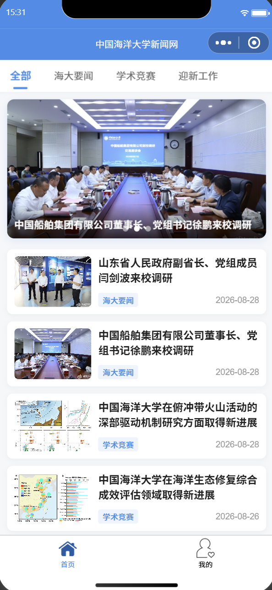
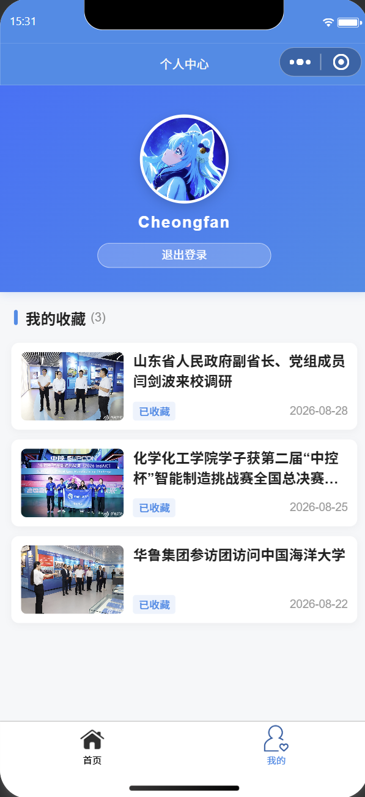

# 中国海洋大学《移动软件开发》课程实验三：高校新闻网小程序

`news_demo/` 为本人对中国海洋大学 26 夏《移动软件开发》课程实验三的项目源码实现。

本项目基于微信小程序原生框架开发，以“中国海洋大学新闻网”为案例，采用“初稿搭建 ➔ 逻辑拓展 ➔ 视觉重构”的三阶段递进式开发流程，实现了新闻轮播展示、分类筛选、离线数据持久化收藏、微信授权登录以及卡片化 UI 重构等功能。

---

## 📌 实验目标

1. **综合掌握前端核心开发**：熟练掌握微信小程序前端开发流程，涵盖组件联动（`swiper`、`scroll-view`、`image`、`button` 等）、页面路由传参、本地数据缓存 API 调用及授权登录机制。
2. **高校案例综合实践**：以中国海洋大学新闻网为背景，掌握完整的前端综合实例设计与开发流程，提高真机预览与真机调试能力。
3. **敏捷迭代与工程化思维**：体验“先跑通主线逻辑，再增强防错与功能，最后调优 UI/UX”的工程化开发节奏，注重边界条件防护与防错校验。

---

## 📂 项目目录结构

```text
lab3/                          # 实验三目录
├── news_demo/                 # 实验三 新闻网小程序项目根目录
│   ├── images/                # 本地静态图像资源
│   │   ├── 0.png              # 用户默认/自定义头像
│   │   ├── index.png          # “首页” Tab 未选中图标
│   │   ├── index_blue.png     # “首页” Tab 选中图标
│   │   ├── my.png             # “我的” Tab 未选中图标
│   │   └── my_blue.png        # “我的” Tab 选中图标
│   ├── pages/                 # 页面模块目录
│   │   ├── detail/            # 新闻详情页
│   │   │   ├── detail.js      # 详情页逻辑（离线缓存判定、收藏/取消、微信分享）
│   │   │   ├── detail.json    # 详情页配置
│   │   │   ├── detail.wxml    # 详情页结构（正文排版、动态收藏按钮）
│   │   │   └── detail.wxss    # 详情页样式
│   │   ├── index/             # 首页模块
│   │   │   ├── index.js       # 首页逻辑（轮播图截取、Tab 分类筛选、带参跳转）
│   │   │   ├── index.json     # 首页配置
│   │   │   ├── index.wxml     # 首页结构（动态轮播图、分类横向滚动栏、新闻列表）
│   │   │   └── index.wxss     # 首页样式（渐变遮罩、胶囊标签、卡片触控微缩）
│   │   └── my/                # 个人中心模块
│   │       ├── my.js          # 个人中心逻辑（`wx.getUserProfile` 登录、缓存遍历防错）
│   │       ├── my.json        # 个人中心配置
│   │       ├── my.wxml        # 个人中心结构（授权登录面板、双层白边头像、收藏列表、空状态）
│   │       └── my.wxss        # 个人中心样式（海洋蓝渐变 Header、空状态卡片）
│   ├── utils/                 # 工具函数目录
│   │   └── common.js          # 模拟新闻数据源及接口导出 (getNewList / getNewsDetail)
│   ├── .eslintrc.js           # 代码规范配置文件
│   ├── app.js                 # 全局应用逻辑入口
│   ├── app.json               # 全局路由、海大蓝导航栏及 TabBar 样式配置
│   ├── app.wxss               # 全局公共样式（全局卡片布局、浅灰背景 #f6f7f9）
│   ├── sitemap.json           # 微信搜索引擎索引配置文件
│   └── project.config.json    # 微信开发者工具核心工程配置文件
│
├── README.md                  # 实验三说明文档（本文件）
├── report.md                  # 实验三实验报告（.md）
├── report.pdf                 # 实验三实验报告（.pdf）
└── resources/                 # 文档配图资源
```

---

## 🖼️ 预览效果

<p align="center">
  
  
</p>

---

## 🛠️ 实现功能与技术细节
本项目在基础新闻展示功能之上，完成了 UI 视觉重构与核心交互逻辑的拓展。

1. 界面构架与视觉层次

* **卡片化布局与微交互**：新闻列表采用白色圆角卡片叠加柔和阴影，配合点击触控微缩动画（`scale(0.98)`），提升页面质感。
* **动态轮播图与文字遮罩**：顶部 `<swiper>` 轮播图叠加半透明渐变遮罩，解决浅色海报图上新闻标题识别度低的问题。
* **横向 Tab 分类栏**：使用 `<scroll-view scroll-x>` 实现分类栏横向滚动排版，结合 JS 数组 `filter()` 实现无刷新实时筛选。

2. 核心逻辑与系统 API 交互
* **路由带参跳转**：点击新闻卡片获取绑定的 `data-id`，通过 `wx.navigateTo` 携带 ID 跳转并加载对应新闻详情。
* **授权登录与状态切换**：调用 `wx.getUserProfile` 接口获取用户头像与昵称，利用 `wx:if` 条件渲染指令实现登录前后的视图切换。
* **原生微信一键分享**：详情页集成 `open-type="share"` 按钮并配置 `onShareAppMessage` 钩子，支持将当前新闻分享给微信好友。

3. 离线缓存与防错机制
* **持久化离线收藏**：利用 `wx.setStorageSync` 与 `wx.removeStorageSync` 实现新闻数据的本地存储与移除，同步更新收藏按钮状态。
* **缓存遍历与安全校验**：个人中心通过 `onShow` 与 `wx.getStorageInfoSync()` 遍历读取本地收藏，并通过属性校验（`obj.id && obj.title`）过滤无效的系统缓存。

---

## 💻 本地运行指南

1. **克隆本仓库到本地**：
   
   ```bash
   git clone https://github.com/Cheongfan/OUC-MobileDev.git
   ```
2. **导入开发者工具**：
   
   * 打开 **微信开发者工具**，点击 **导入项目**。
   * 选择克隆仓库的实验三项目根目录：`OUC-MobileDev/lab3/news_demo`。
   * 填入个人小程序的 `AppID`（或选择测试号）。
3. **编译预览与真机调试**：
   * 点击工具栏的 **重新编译** 按钮，即可在模拟器中体验轮播图、Tab 筛选与收藏逻辑。
   * 点击 **预览** 或 **真机调试** 扫码，可在手机微信上测试本地缓存持久化与原生分享功能。

---

## ⚠️ 问题总结与体会

### 1. 遇到的问题与代码调优

* **问题一：遍历本地缓存加载收藏夹时的“非新闻数据污染”问题**
  * *现象*：原代码通过 `wx.getStorageInfoSync()` 提取全部 key 压入 `newsList`，当本地存在系统日志（`logs`）或其它用户状态缓存时，导致界面渲染报错崩溃。
  * *解决*：在 `getMyFavorites` 循环遍历中加入了对象属性断言校验 `if (obj && obj.id && obj.title)`，确保只有合法的“新闻对象”才会被推送至展示数组。

* **问题二：嵌套卡片点击事件中 `e.target` 与 `e.currentTarget` 的参数丢失**
  * *现象*：点击新闻卡片内部的图片或标题文字时，详情页有时会收到 `id = undefined`，弹窗提示“新闻加载失败”。
  * *解决*：`e.target` 返回的是实际触发事件的最小子元素（如 `<image>`），其未绑定 `data-id` 属性；而 `e.currentTarget` 始终指向绑定了 `bindtap` 事件监听器的父级卡片容器。将跳转逻辑中的取值统一替换为 `e.currentTarget.dataset.id` 后，点击传参恢复稳定。

### 2. 实验总结与收获

* **敏捷迭代开发思想**：先搭建初稿完成核心主线逻辑，再针对分类、分享、缓存防错进行功能增强，最后进行卡片化 UI 美化，这种循序渐进的开发流程大幅降低了排错成本。特别是在 AI 时代，这种开发流程更加高效、质量更可控。
* **注重数据流与边界防护**：无论是利用 `mode="widthFix"` 解决组件固有尺寸限制，还是在读取缓存时添加类型校验过滤，都说明了在开发中进行边界条件防护和防错校验的重要性。
* **总结**：这次实践不仅积累了实操经验，也培养了我在前端开发中兼顾功能实现与边界防错的思维，为以后独立开发更复杂的小程序打下了基础。