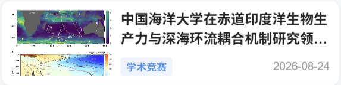
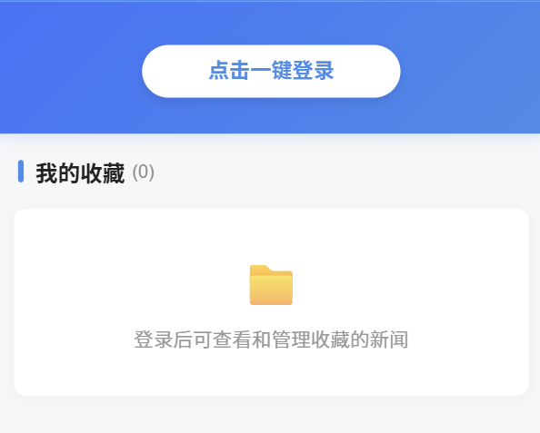

# 移动软件开发实验三报告

## 一、 实验目标

1.  综合所学知识创建完整的前端新闻小程序项目；能够在开发过程中熟练掌握真机预览、调试等操作。
2. 以制作一个海大主题的高校新闻网小程序为案例，综合运用微信小程序前端开发知识与各种组件（`swiper`、`scroll-view`、`image`、`button` 等），掌握完整的前端综合实例设计与开发流程。

---

## 二、 实验内容

​	本次实验按照迭代开发的流程，整体分为三个递进阶段：**“第一阶段：基础框架搭建（初稿实现）” ➔ “第二阶段：核心功能拓展与逻辑优化” ➔ “第三阶段：界面视觉重构与 UI/UX 美化”**。

### **1. 第一阶段：基础框架搭建（初稿实现）**

#### (1) 全局配置`app.json` 和数据源配置 `common.js`
​	在全局配置文件 `app.json` 中，可以通过 `window` 和`tabBar` 字段分别设置顶栏和底部导航的样式与文字。为了适应海大的风格，我将导航栏背景色 `navigationBarBackgroundColor` 设为海大蓝 `#328EEB`，标题文本 `navigationBarTitleText` 设为“中国海洋大学新闻网”；同时设置了“首页” `index`和“我的” `my`两个页面路径进行导航，利用已有差分图像资源（`*.png` 和 `*_blue.png`）进行选中与否的区分。

```json
{
  "pages": [
    "pages/index/index",
    "pages/detail/detail",
    "pages/my/my"
  ],
  "window": {
    "navigationBarBackgroundColor": "#328EEB",
    "navigationBarTitleText": "中国海洋大学新闻网",
    "navigationBarTextStyle": "white"
  },
  "tabBar": {
    "color": "#000000",
    "selectedColor": "#328EEB",
    "list": [
      {
        "pagePath": "pages/index/index",
        "text": "首页",
        "iconPath": "images/index.png",
        "selectedIconPath": "images/index_blue.png"
      },
      {
        "pagePath": "pages/my/my",
        "text": "我的",
        "iconPath": "images/my.png",
        "selectedIconPath": "images/my_blue.png"
      }
    ]
  }
}
```

​	数据源方面，从校官网 https://news.ouc.edu.cn 中获取新闻信息，将其填入实验提供的 `utils/common.js` 文件的`const news`变量即可。其中，每一条新闻包含了 `id`（唯一标识）、`title`（标题）、`poster`（海报图片链接）、`content`（新闻正文文本）以及 `add_date`（发布日期）等属性，从新闻页中对号入座即可。此外， `common.js`脚本还通过`module.exports` 抛出了 `getNewList()`和 `getNewsDetail(id)`两个工具函数，供各个页面调取使用。

```js
// utils/common.js (模拟数据源与接口抛出)
const news = [
 {
   // 仅作格式展示，省略 详细地址 和 详细文本
    id: '264692',
    category: '海大要闻',
    title: '山东省人民政府副省长、党组成员闫剑波来校调研',
    poster: 'https://news.ouc.edu.cn/.../f24f725e-9573-4bc8-a65b-bb7717917c1d.jpg',
    content: '本站讯 8月27日，山东省人民政府副省长、党组成员...',
    add_date: '2026-08-28'
  },
  ... // 省略其他新闻
];

function getNewList() { return news; }

function getNewsDetail(newsID) {
  let message = { code: '404', news: {} };
  for (let i = 0; i < news.length; i++) {
    if (newsID == news[i].id) {
      message.code = '200';
      message.news = news[i];
      break;
    }
  }
  return message;
}

module.exports = { getNewList, getNewsDetail };
```

#### (2) 首页初稿页面搭建（`pages/index`）
​	页面结构方面，我在 `index.wxml` 中，先利用 `<swiper>` 搭配 `<swiper-item>` 和 `<image>` 标签搭建了三图轮播区，紧接着在下方通过小程序的列表渲染指令 `wx:for="{{newsList}}"` 遍历展示新闻，作为新闻列表区；每个新闻项 `<view class="news-item">` 内部放置了一张展示海报的 `<image>` 和一段展示标题与日期的 `<text>` 文本组件，并在 `<text>` 上绑定了 `bindtap="goToDetail"` 点击事件，通过 `data-id="{{item.id}}"` 属性将当前新闻的唯一 ID 绑定在视图节点上。

```xml
<!-- pages/index/index.wxml (列表遍历与跳转绑定) -->
<view class="news-list">
  <view class="news-item" wx:for="{{newsList}}" wx:key="id">
    <image src="{{item.poster}}"></image>
    <text bindtap="goToDetail" data-id="{{item.id}}">{{item.title}}——{{item.add_date}}</text>
  </view>
</view>
```

​	样式方面，我在 `index.wxss` 与公共样式 `app.wxss` 中，使用了传统的 Flex 弹性盒模型进行布局，将 `.news-item` 设为 `display: flex; flex-direction: row;` ，使得海报图与文本横向并排展示；对于每条新闻，我将图片固定宽高为 `230rpx * 150rpx`，并在列表项底部加上 `1rpx solid #e6e6e6` 的灰线作为分隔。

​	逻辑层 `index.js` 主要实现了“新闻数据展示”与“页面跳转”。对于“新闻数据展示”，我通过 `require('../../utils/common.js')` 引入工具库，并在页面的 `onLoad` 生命周期函数中调用 `common.getNewList()` 获取初始数据，并使用 `this.setData({ newsList: list })` 将数据响应式地更新到页面上。对于“页面跳转”，当用户点击新闻时，触发 `goToDetail` 函数，利用事件对象 `e.currentTarget.dataset.id` 获取对应新闻的 ID，最后调用微信原生的页面路由接口 **`wx.navigateTo({ url: '../detail/detail?id=' + id })`** 完成新闻详情页的跳转。

```js
// pages/index/index.js (数据渲染与页面跳转逻辑)
var common = require('../../utils/common.js')

Page({
  data: { newsList: [] },
  onLoad: function () {
    this.setData({ newsList: common.getNewList() });
  },
  goToDetail: function (e) {
    let id = e.currentTarget.dataset.id;
    wx.navigateTo({ url: '../detail/detail?id=' + id });
  }
})
```

#### (3) 新闻详情页初稿搭建（`pages/detail`）
​	详情页的作用是完整展示点击选中的新闻内容，在页面布局方面，设计为**“大字号新闻标题+新闻海报+新闻文本+交互按钮”**的形式；逻辑方面主要实现的是**支持离线缓存的收藏功能**。

​	在 `detail.wxml` 中，我使用了 `<view class="container">` 作为全局大容器，内部依次使用 `<view class="title">` 展示新闻标题，用 `<image src="{{article.poster}}">` 展示新闻海报，用 `<text>` 标签包裹正文文本以支持换行与长文本排版，底部则使用 `<button plain>` 按钮组件用于触发收藏状态切换。

```xml
<!-- pages/detail/detail.wxml (新闻详情与收藏按钮) -->
<view class="container">
  <view class="title">{{article.title}}</view>
  <view class="poster"><image src="{{article.poster}}"></image></view>
  <view class="content"><text>{{article.content}}</text></view>
  <button wx:if="{{isAdd}}" plain bindtap="cancelFavorites">❤️已收藏</button>
  <button wx:else plain bindtap="addFavorites">🤍未收藏</button>
</view>
```

​	而样式方面则进行了简单的外边距 `padding: 15rpx` 设置、标题加粗居中以及发布日期的右对齐排版。

​	逻辑层 `detail.js` 是实现离线收藏的位置。

​	页面加载时，首先会读取本地的缓存数据，具体机制如下。

​	在 `onLoad(options)` 生命周期函数中通过参数对象 `options.id` 获取到从首页传递过来的新闻 ID，随后调用了微信本地缓存 API **`wx.getStorageSync(id)`** 检查本地是否已有该新闻的收藏记录。如果缓存中已存在，则标记并加载缓存中的新闻数据；如果缓存为空，则需要调用 `common.getNewsDetail(id)` 接口从工具库中获取新闻详情。

​	当用户主动进行“收藏”与“取消收藏”操作时，会分别执行编写的`addFavorites` 和 `cancelFavorites` 逻辑。

​	执行“收藏”逻辑时，系统会调用 **`wx.setStorageSync(article.id, article)`** 接口将整条新闻对象以 ID 为键写入微信本地存储，同时通过 `this.setData({ isAdd: true })` 改变按钮状态；执行“取消收藏”逻辑时，则调用 **`wx.removeStorageSync(article.id)`** 接口将该记录从本地缓存中彻底移除，并将 `isAdd` 重置为 `false`。

```js
// pages/detail/detail.js (缓存读取与收藏/取消逻辑)
var common = require('../../utils/common.js')

Page({
  data: { article: {}, isAdd: false },
  onLoad: function (options) {
    let id = options.id;
    var newarticle = wx.getStorageSync(id);
    if (newarticle != '') {
      this.setData({ isAdd: true, article: newarticle });
    } else {
      let result = common.getNewsDetail(id);
      if (result.code == '200') {
        this.setData({ article: result.news, isAdd: false });
      }
    }
  },
  addFavorites: function () {
    let article = this.data.article;
    wx.setStorageSync(article.id, article);
    this.setData({ isAdd: true });
  },
  cancelFavorites: function () {
    let article = this.data.article;
    wx.removeStorageSync(article.id);
    this.setData({ isAdd: false });
  }
})
```

#### (4) 个人中心页初稿搭建（`pages/my`）
​	个人中心页负责展示用户的身份信息和已收藏的新闻列表。在 `my.wxml` 中，我使用了 `<block wx:if="{{isLogin}}">` 条件渲染指令来区分未登录和已登录两种状态。未登录时只展示一个用于引导登录的 `<button>` 按钮组件；登录后则隐藏按钮，展示由 `<image>` 组件构成的圆形头像和 `<text>` 组件构成的用户昵称。下方的收藏列表区域则复用了首页的新闻列表结构。

```xml
<!-- pages/my/my.wxml (登录切换与收藏列表复用) -->
<view class="myLogin">
  <block wx:if="{{isLogin}}">
    <image src="{{src}}"></image>
    <text>{{nickName}}</text>
  </block>
  <button wx:else bindtap="getUserInfo">未登录，点此登录</button>
</view>

<view class="myFavorite">
  <text>我的收藏（{{number}}）</text>
  <view class="news-list">
    <view class="news-item" wx:for="{{newsList}}" wx:key="id">
      <image src="{{item.poster}}"></image>
      <text bindtap="goToDetail" data-id="{{item.id}}">{{item.title}}——{{item.add_date}}</text>
    </view>
  </view>
</view>
```

​	样式 `my.wxss` 中，顶部登录面板 `.myLogin` 被设为蓝色背景（`#328EEB`），高度设为 `400rpx`，使用 Flex 布局纵向居中对齐，头像图片设置 `border-radius: 50%` 实现圆形裁剪。

​	在逻辑层 `my.js` 中，我通过在登录按钮上绑定 `bindtap="getUserInfo"` 点击事件，调用了微信系统接口 **`wx.getUserProfile`**。在接口调用的 `success` 回调函数中拿到 `res.userInfo` 对象，提取里面的 `avatarUrl`（头像）与 `nickName`（昵称），通过 `this.setData` 更新页面并把 `isLogin` 标记设为 `true`。

​	每当个人中心页面展示时（即 `onShow` 生命周期函数触发时），如果 `isLogin` 为 `true`，就会执行 `getMyFavorites` 函数。在该函数内部，我调用了微信本地缓存信息获取接口 **`wx.getStorageInfoSync()`** 拿到本地所有的缓存键列表 `keys`，随后使用 `for` 循环搭配 **`wx.getStorageSync(keys[i])`** 将之前收藏的所有新闻对象逐一取出存入 `myList` 数组中，最后通过 `this.setData({ newsList: myList, number: myList.length })` 将真正收藏的新闻列表与数量实时渲染在页面上。

```js
// pages/my/my.js (授权登录与收藏缓存全量读取)
Page({
  data: { isLogin: false, src: '', nickName: '', number: 0, newsList: [] },
  getUserInfo: function () {
    let that = this;
    wx.getUserProfile({
      desc: '用于展示用户头像及昵称',
      success(res) {
        that.setData({ isLogin: true, src: res.userInfo.avatarUrl, nickName: res.userInfo.nickName });
      }
    });
  },
  onShow: function () {
    if (this.data.isLogin) { this.getMyFavorites(); }
  },
  getMyFavorites: function () {
    let info = wx.getStorageInfoSync();
    let myList = [];
    for (let i = 0; i < info.keys.length; i++) {
      let obj = wx.getStorageSync(info.keys[i]);
      myList.push(obj);
    }
    this.setData({ newsList: myList, number: info.keys.length });
  }
})
```

---

### 2. 第二阶段：核心功能拓展与逻辑优化

​	在初稿的基础之上，我针对交互体验与系统健壮性，进行了 4 项关键的功能拓展与代码重构：

#### (1) 轮播图动态绑定与点击跳转
​	原本的轮播图仅能展示静态硬编码图片。我对其进行了动态重构：在 `index.js` 的 `onLoad` 生命周期函数中，利用 `list.slice(0, 3)` 自动截取最新 3 条新闻作为轮播图数据，并在 `<swiper-item>` 上绑定 `bindtap="goToDetail"` 和 `data-id="{{item.id}}"`。使得轮播图既能与后台新闻数据实时联动，又能点击直达对应新闻详情页：

```javascript
// pages/index/index.js (轮播图动态截取)
onLoad: function (options) {
  let list = common.getNewList();
  this.setData({
    allNewsList: list,
    displayNewsList: list,
    swiperImg: list.slice(0, 3) // 💡 动态截取前3条新闻绑定到轮播图
  });
}
```

#### (2) 横向滑动 Tab 分类筛选栏
​	为了提升新闻检索体验，我在首页顶部引入了 `<scroll-view scroll-x>` 横向滚动分类栏，设置了“全部”、“海大要闻”、“学术竞赛”、“迎新工作”四个分类。在 JS 层通过 `filter()` 数组过滤函数实现分类实时筛选：

```javascript
// pages/index/index.js (分类切换逻辑)
switchTab: function (e) {
  let index = e.currentTarget.dataset.index;
  let categoryName = this.data.categories[index];
  let filteredList = (index === 0) 
    ? this.data.allNewsList 
    : this.data.allNewsList.filter(item => item.category === categoryName);
  this.setData({ currentTab: index, displayNewsList: filteredList });
}
```

#### (3) 显式社交分享功能 (`open-type="share"`)
​	在 `detail.wxml` 中增加了原生的转发按钮 `<button open-type="share">`，并在 `detail.js` 中实现了 `onShareAppMessage` 钩子函数，支持将海大新闻一键分享给微信好友：

```javascript
// pages/detail/detail.js
onShareAppMessage: function () {
  return {
    title: '【海大新闻】' + this.data.article.title,
    path: '/pages/detail/detail?id=' + this.data.article.id
  };
}
```

#### (4) 收藏夹安全读取与防错过滤
​	针对 `my.js` 全局读取缓存时可能读取到系统变量（如 `logs`）引发崩溃的问题，我增加了属性断言校验，并添加了无收藏时的**卡片式空状态**占位与交互 Toast 反馈：

```javascript
// pages/my/my.js (防错过滤)
getMyFavorites: function () {
  let info = wx.getStorageInfoSync();
  let myList = [];
  // 💡 安全校验：精准筛选出含有 id 与 title 属性的新闻数据
  for (let i = 0; i < info.keys.length; i++) {
    let obj = wx.getStorageSync(info.keys[i]);
    if (obj && obj.id && obj.title) { myList.push(obj); }
  }
  this.setData({ newsList: myList, number: myList.length });
}
```

---

### 3. 第三阶段：界面视觉重构与 UI 美化

​	为了消除传统列表硬线条分割的呆板设计，我对整体 UI 和细节之处的展示进行了视觉升级，更贴近商业化上线小程序的审美风格：

#### (1) 卡片 UI 设计
​	我重构了 `app.wxss`，引入 `#f6f7f9` 浅灰高质感背景，将新闻列表重构为白色圆角卡片 (`border-radius: 16rpx`) 并叠加柔和阴影 (`box-shadow: 0 4rpx 16rpx rgba(0,0,0,0.04)`)，点击卡片时加入 `scale(0.98)` 微缩触控反馈，贴近商业化小程序 UI 风格。

#### (2) 轮播图与新闻卡片信息优化
​	通过两侧留白、弧形大圆角，底部加入黑色渐变遮罩 (`linear-gradient(to top, rgba(0,0,0,0.75), transparent)`)，将新闻标题印在轮播图上方，优化了**轮播图**的视觉呈现。

​	呈现**新闻元信息**。我更改了原先拼接式 `—— 日期` 呈现方式，将左侧改为蓝色透明背景的“分类小胶囊标签”，右侧改为灰色【发布日期】，并在标题设置 `-webkit-line-clamp: 2` 截断文本，使得信息呈现高质有效。

**优化(1)、(2)的效果展示如下： **

<p align="center">
  
</p>

#### (3) 个人中心渐变 Header 与空状态卡片
​	将个人中心头部改为海洋蓝渐变背景 (`linear-gradient(135deg, #2575fc, #328eeb)`)，给头像加上双层白边与立体阴影。当收藏夹为空或未登录时，呈现带有图标的圆角空状态卡片。

<p align="center">
  
</p>

#### (4) 基于本地授权的一键登录 与 退出登录

​	采用微信特供的`wx.getUserProfile`接口发起用户登录状态授权。但由于微信官方为了保护用户隐私已经收回了该接口的授权框逻辑，因此没有授权弹窗反馈。但返回的灰色头像与“微信用户”名称说明逻辑无误。这里为了美观，将头像图片路径和名称改为自定义效果。

```js
  // 获取微信个人信息登录
  getUserInfo: function () {
    let that = this;
    wx.getUserProfile({
      desc: '用于展示用户头像及昵称',
      success(res) {
        let user = res.userInfo;
        that.setData({
          isLogin: true,
          src: '/images/0.png',  // 修改前：user.avatarUrl
          nickName: 'Cheongfan'  // 修改前：user.nickName
        });
        that.getMyFavorites();
      }
    });
  },
```

​	

#### 视觉升级后的最终效果展示：

<p align="center">
  
  
</p>


---

## 三、 问题总结与体会

### 1. 遇到的问题与代码调优

​	在本次小程序的开发与迭代过程中，我遇到了一些涉及图像适配、缓存安全与事件冒泡的问题，并进行了针对性的解决：

* **问题一：遍历本地缓存加载收藏夹时的“非新闻数据污染”问题**
  * *现象*：原教学代码通过 `wx.getStorageInfoSync()` 提取全部 key 压入 `newsList`，当本地存在系统日志（`logs`）或其它用户状态缓存时，导致界面渲染报错崩溃。
  * *分析与解决*：我在 `getMyFavorites` 循环遍历中加入了对象属性断言校验 `if (obj && obj.id && obj.title)`，确保只有合法的“新闻对象”才会被推送至展示数组，增强了代码的健壮性。

* **问题二：嵌套卡片点击事件中 `e.target` 与 `e.currentTarget` 的参数丢失**
  * *现象*：点击新闻卡片内部的图片或标题文字时，详情页有时会收到 `id = undefined`，弹窗提示“新闻加载失败”。
  * *分析与解决*：`e.target` 返回的是实际触发事件的最小子元素（如 `<image>`），其可能并未绑定 `data-id` 属性；而 **`e.currentTarget`** 始终指向绑定了 `bindtap` 事件监听器的父级卡片容器。将跳转逻辑中的取值统一替换为 `e.currentTarget.dataset.id` 后，点击传参恢复稳定。

---

### 2. 实验总结与收获


​	这次实验不仅让我把小程序的路由传参、本地存储、授权登录和组件联动等核心知识串了一遍，更让我对前端开发中的工程细节和 UI/UX 体验调优有了更深体会。

​	在开发流程方面，我体会到了“先跑通再优化”的便利：先搭出初稿跑通主线逻辑，再逐步补全分类、分享以及缓存防错，最后进行卡片化 UI 美化。这种循序渐进的开发方式，比一上来就面面俱到要省去大量的排错成本。特别是在AI时代，这种开发流程会更加的高效、质量更可控。

​	另外，我也感受到了数据边界防护的重要性。无论是用 mode="widthFix" 解决图片组件默认尺寸限制的视觉问题，还是在读取本地缓存时加入类型校验和过滤，这些细节上的防御性代码都是保证页面稳定性和体验的关键。

​	总的来说，这次实践不仅积累了实操经验，也培养了我在前端开发中兼顾功能实现与边界防错的思维，为以后独立开发更复杂的小程序打下了基础。