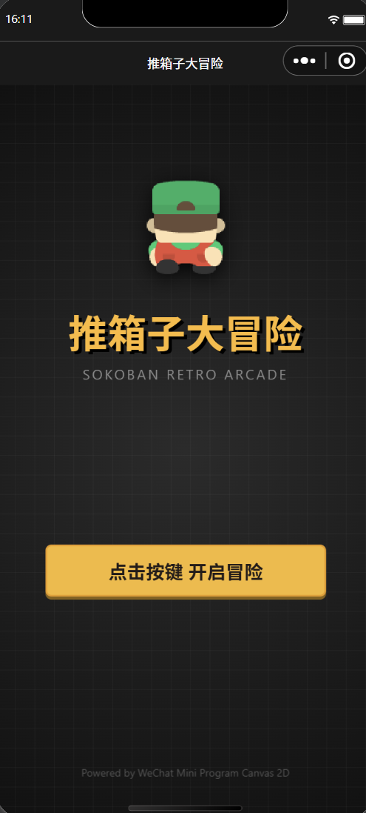
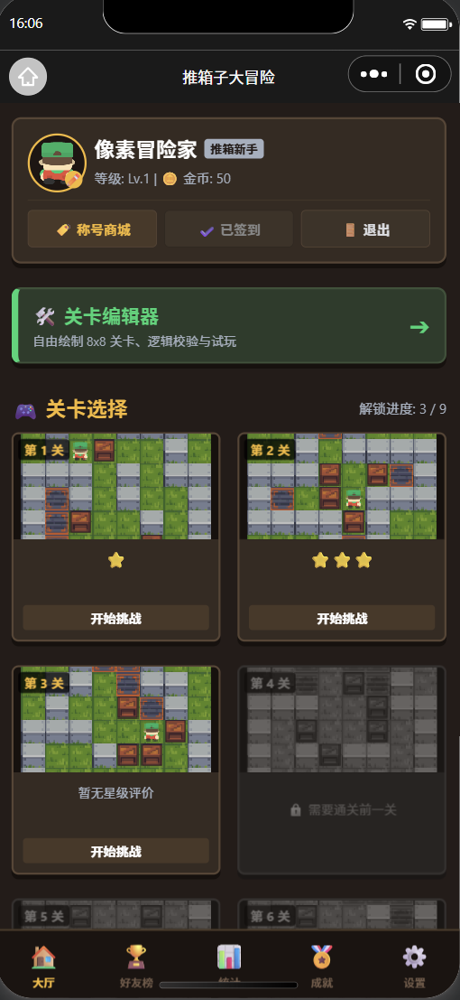
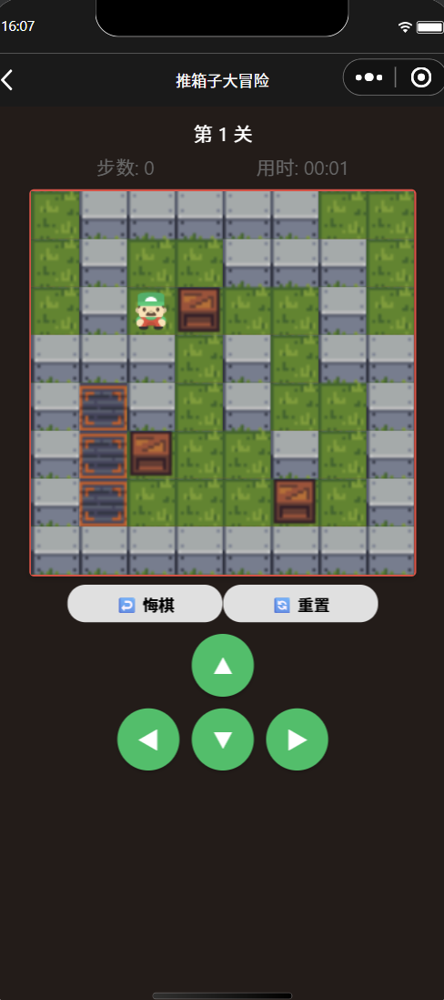
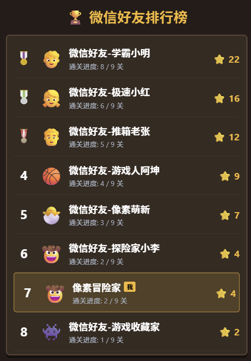
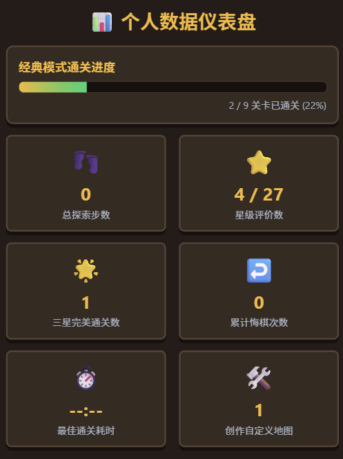
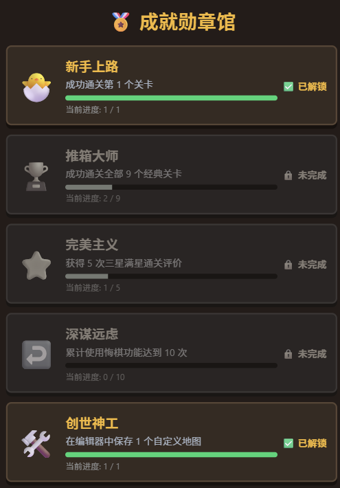
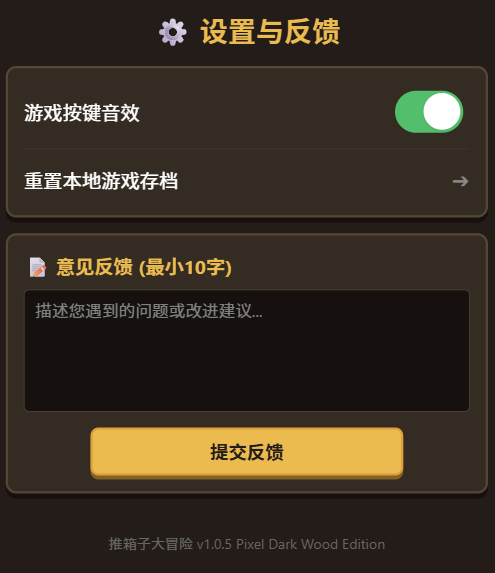

# 中国海洋大学《移动软件开发》课程实验四：推箱子游戏

`sokoban-game/` 为本人对中国海洋大学 26 夏《移动软件开发》课程实验四的项目源码实现。

本项目基于微信小程序原生框架开发，以经典游戏“推箱子”为案例，实现了关卡渲染、平滑插值位移与角色的 4 方向脚踏帧动画、移动撤销栈、自定义关卡编辑器（含合法性规则校验）、微信好友排行榜、个人数据仪表盘、成就勋章馆、称号商店以及每日防重签到等功能。

---

## 📌 实验目标

1. 综合所学知识创建完整的推箱子游戏；
2. 能够在开发过程中熟练掌握真机预览、调试等操作。

---

## 

---

## 📂 项目目录结构

```text
lab4/                          # 实验四目录
├── sokoban-game/              # 实验四 推箱子小游戏项目根目录
│   ├── audio/                 # 本地音效与背景音乐资源目录（由于资源版权问题不作上传）
│   │   ├── bgm.mp3            # 复古 8-bit 背景音乐
│   │   ├── move.mp3           # 角色移动脚步音效
│   │   ├── push.mp3           # 推箱子碰撞音效
│   │   └── win.mp3            # 关卡通关胜利音效
│   ├── images/                # 本地静态图像资源目录
│   │   ├── tileset.png        # 场景 5x5 地形图集
│   │   ├── rank/              # 好友排行榜专属奖牌目录 (icon_gold/silver/bronze.png)
│   │   └── player/            # 24 张 Player 像素动画帧 (player_01.png ~ player_24.png)
│   ├── pages/                 # 页面模块目录
│   │   ├── splash/            # 1. 开屏加载页
│   │   ├── index/             # 2. 游戏大厅
│   │   ├── game/              # 3. 推箱子游戏界面
│   │   ├── editor/            # 4. 自定义关卡编辑器
│   │   ├── rank/              # 5. 好友排行榜
│   │   ├── stats/             # 6. 个人仪表盘
│   │   ├── achievement/       # 7. 成就
│   │   └── about/             # 8. 设置与反馈
│   ├── utils/                 # 工具函数与数据配置
│   │   ├── audio.js           # 音频管理对象
│   │   └── data.js            # 核心数据库（关卡数据矩阵、好友排行榜 Mock、称号配置、成就规则等）
│   ├── .eslintrc.js           # 代码规范配置文件
│   ├── app.js                 # 全局逻辑入口
│   ├── app.json               # 全局路由及窗口配置
│   ├── app.wxss               # 公共样式
│   ├── sitemap.json           # 搜索引擎索引配置文件
│   └── project.config.json    # 核心工程配置文件
│
├── README.md                  # 实验四说明文档（本文件）
├── report.md                  # 实验四实验报告（.md）
├── report.pdf                 # 实验四实验报告（.pdf）
└── resources/                 # 文档配图资源
```

---

## 🖼️ 预览效果
开屏页效果：

<p align="center">
  
</p>

核心界面展示：

<p align="center">
  
  
</p>

---
其他界面：
<p align="center">
  
</p>

<p align="center">
  
</p>

<p align="center">
  
</p>

<p align="center">
  
</p>

## 🛠️ 实现功能与技术细节

### 动态 Canvas 关卡预览

关卡选择界面摒弃了静态图片依赖，在首页 `onReady` 钩子中遍历 9 大地图矩阵，利用 Canvas 2D 动态渲染 $160 \times 160\text{px}$ 的像素缩略图，并对卡片限定统一高度（`min-height: 340rpx`），彻底解决了不同星级下卡片塌陷错位的问题。

### 平滑位移插值与 4 方向脚踏动画

内置 `animateSlide` 动效引擎，在 120ms（共 6 帧，每 20ms 一帧）内对角色坐标 `playerRenderX, playerRenderY` 和被推箱子坐标进行线性插值计算，同时按比例循环播放 `player_01` ~ `player_24` 的 4 方向脚踏动画，移动结束时强制复位至双脚站立静态帧，消除了卡顿与朝向异常。

### 栈式无损悔棋

利用 `historyStack` 压栈保存每一步深拷贝的 `map` 与 `box` 矩阵，支持不限步数的无损撤销与状态回滚。

---

## 💻 本地运行指南

1. **克隆本仓库到本地**：

   ```bash
   git clone https://github.com/Cheongfan/OUC-MobileDev.git
   ```

2. **导入开发者工具**：

   * 打开 **微信开发者工具**，点击 **导入项目**。
   * 选择克隆仓库的实验四项目根目录：`OUC-MobileDev/lab4/sokoban-game`。
   * 填入个人小程序的 `AppID`（或选择测试号）。

3. **编译预览与真机调试**：

   * 点击工具栏的 **重新编译** 按钮，即可在模拟器中体验开屏动画、一键登录、关卡选择与地图编辑器。
   * 点击 **预览** 或 **真机调试** 扫码，可在手机微信上体验触屏手势滑动、平滑位移插值动画与离线存储持久化功能。