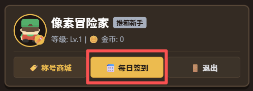
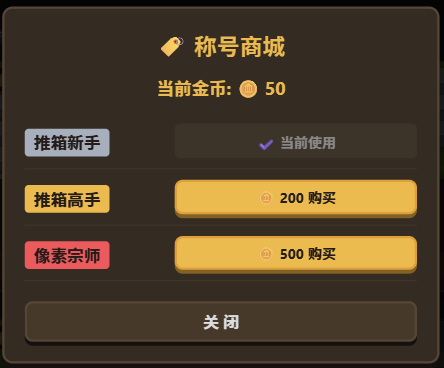
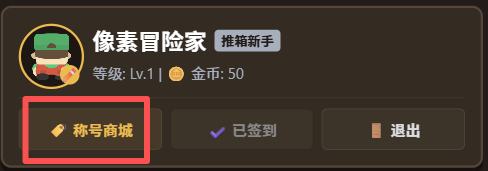
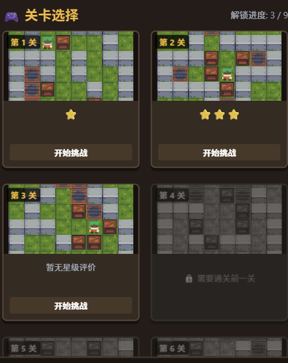
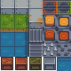
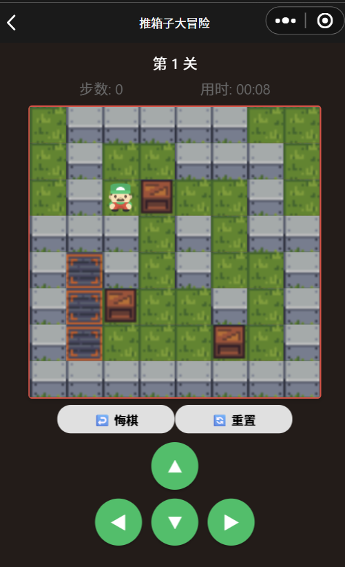
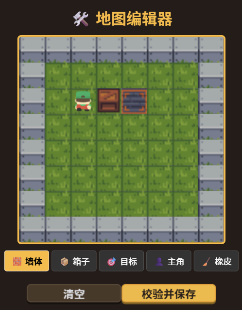

# 移动软件开发实验四报告

## 一、 实验目标

1. 综合所学知识创建完整的推箱子游戏；
2. 能够在开发过程中熟练掌握真机预览、调试等操作。

---

## 二、 实验内容

​	本次实验开发了一款名为《推箱子大冒险》的游戏，玩家扮演一名像素风格的冒险家，在充满复古地下城色彩的关卡地图中推箱子，游戏获胜的目标是将地图中所有的木箱顺利推入指定的目标槽位。小程序围绕游戏内容丰富游戏的生态设计与交互功能，包含签到系统、称号商店系统、关卡系统、自定义模式系统、排行榜系统、仪表盘系统、成就系统、设置系统等多个独立的系统，以最大程度提升用户的游玩沉浸感与交互趣味性。

​	下面将分系统对本小程序的核心功能及其实现做详细的介绍。

### **1. 签到系统**

​	签到系统能够鼓励玩家登录游戏。本签到为每日签到，为此本系统设计了基于本地日期（格式如 `YYYY-MM-DD`）的防重校验机制。

​	在视图层 `pages/index/index.wxml` 中，签到按钮的样式与文本会根据 `hasCheckedInToday` 状态进行动态渲染。当玩家今日未签到时，展示高亮的黄金按钮 `📅 每日签到`提醒签到；若今日已完成签到，则展示暗色的禁用按钮 `✔️ 已签到`。

```xml
<!-- pages/index/index.wxml (签到按钮动态渲染) -->
<button class="card-action-btn checkin-btn {{hasCheckedInToday ? 'disabled' : ''}}" bindtap="handleCheckin">
  {{hasCheckedInToday ? '✔️ 已签到' : '📅 每日签到'}}
</button>
```

​	逻辑层 `pages/index/index.js` 在页面加载时通过 `wx.getStorageSync('lastCheckinDate')` 读取上一次签到日期，并与当天的日期字符串进行比对。若比对一致，则将 `hasCheckedInToday` 置为 `true`。当玩家点击签到时，若通过校验，系统会将金币余额增加 50，更新本地存储中的 `userCoins` 与 `lastCheckinDate`，并弹出提示。

```javascript
// pages/index/index.js (签到日期校验与奖励发放)
handleCheckin: function () {
  let todayStr = this.getTodayStr(); // 获取格式如 "2026-09-01" 的当前日期
  let lastCheckinDate = wx.getStorageSync('lastCheckinDate') || '';

  if (lastCheckinDate === todayStr) {
    wx.showToast({ title: '今天已签到过，明天再来吧！', icon: 'none' });
    return;
  }

  let newCoins = this.data.userInfo.coins + 50;
  wx.setStorageSync('lastCheckinDate', todayStr);
  wx.setStorageSync('userCoins', newCoins);
  this.setData({ hasCheckedInToday: true, 'userInfo.coins': newCoins });
  wx.showToast({ title: '签到成功！🪙 金币+50', icon: 'success' });
}
```

​	由于账号的历史记录及信息均与缓存绑定，清理缓存会导致用户的所有数据丢失（包括金币），不用担心用户通过清理缓存并反复签到获取金币。当然，这一设计是在无后端条件下的防御性处理，若是正式项目，数据和校验机制会以服务器当中的数据为准，缓存机制仅用于提高小程序的加载与运行效率。

效果展示：

<p align="center">
  
</p>

<p align="center">↓↓↓</p>

<p align="center">
  
</p>


---

## **2. 称号商店系统**

​	称号商店系统通过消耗金币换取对应的称号，目前包括 3 级称号徽章，支持“未解锁”、“已解锁未佩戴”与“当前使用”三种称号佩戴状态的切换。

​	在 `utils/data.js` 中，称号配置包含了 `id`、`name`（名称）、`price`（价格）与 `tagColor`（专属徽章背景色）。

```javascript
// utils/data.js (称号数据库配置)
var titleCatalog = [
  { id: 'title_01', name: '推箱新手', price: 0, tagColor: '#a4b0be' },
  { id: 'title_02', name: '推箱高手', price: 200, tagColor: '#f7b731' },
  { id: 'title_03', name: '像素宗师', price: 500, tagColor: '#ff4757' }
];
```

​	在 `pages/index/index.wxml` 弹窗中，通过列表指令 `wx:for="{{titlesList}}"` 循环渲染称号列表。视图层依据状态使用条件渲染分支展示不同的控制按钮。

```xml
<!-- pages/index/index.wxml (称号三态控制按钮) -->
<view class="shop-item" wx:for="{{titlesList}}" wx:key="id">
  <text class="title-preview-badge" style="background: {{item.tagColor}};">{{item.name}}</text>
  <button class="buy-btn equipped" wx:if="{{item.isEquipped}}">✔️ 当前使用</button>
  <button class="pixel-btn-gold buy-btn equip" wx:elif="{{item.isUnlocked}}" bindtap="equipTitle" data-id="{{item.id}}">使 用</button>
  <button class="pixel-btn-gold buy-btn" wx:else bindtap="buyTitle" data-id="{{item.id}}" data-price="{{item.price}}">🪙 {{item.price}} 购买</button>
</view>
```

​	逻辑层 `buyTitle` 函数实现了校验扣费、解锁与自动佩戴。系统通过 `wx.getStorageSync('unlockedTitles')` 维护已解锁称号数组，通过 `equippedTitleId` 维护当前佩戴项。购买成功后，主页卡片上的 `title-badge` 文本与背景色会实时同步更新。

```javascript
// pages/index/index.js (购买称号与持久化)
buyTitle: function (e) {
  let titleId = e.currentTarget.dataset.id;
  let price = e.currentTarget.dataset.price;
  if (this.data.userInfo.coins < price) {
    wx.showToast({ title: '金币不足，快去签到通关吧！', icon: 'none' });
    return;
  }
  let newCoins = this.data.userInfo.coins - price;
  let unlockedTitles = wx.getStorageSync('unlockedTitles') || ['title_01'];
  if (!unlockedTitles.includes(titleId)) unlockedTitles.push(titleId);

  wx.setStorageSync('userCoins', newCoins);
  wx.setStorageSync('unlockedTitles', unlockedTitles);
  wx.setStorageSync('equippedTitleId', titleId); // 自动佩戴新称号
  this.loadTitlesData();
}
```

效果展示：

<p align="center">
  
</p>

<p align="center">↓↓↓</p>

<p align="center">
  
</p>

---

## **3. 关卡系统**

### (1) 关卡数据配置

​	本系统提供了 9 个推箱子游戏关卡。关卡数据配置在 `utils/data.js` 文件中，采用 $8 \times 8$ 的二维矩阵对物理地图建模。矩阵中定义了统一的物理标记数值：`0` 代表外围空地，`1` 代表障碍墙体，`2` 代表可通行走廊，`3` 代表箱子放置目标点，`4` 代表箱子初始位置，`5` 代表主角起始位置。

```javascript
// utils/data.js (关卡矩阵与星级步数限制配置)
var map1 = [
  [0, 1, 1, 1, 1, 1, 0, 0],
  [0, 1, 2, 2, 1, 1, 1, 0],
  [0, 1, 5, 4, 2, 2, 1, 0],
  [1, 1, 1, 2, 1, 2, 1, 1],
  [1, 3, 1, 2, 1, 2, 2, 1],
  [1, 3, 4, 2, 2, 1, 2, 1],
  [1, 3, 2, 2, 2, 4, 2, 1],
  [1, 1, 1, 1, 1, 1, 1, 1]
]; // ... 省略 map2 ~ map9

var starLimits = [
  { three: 25, two: 40 }, // 第1关：<=25步为三星，<=40步为二星
  ... // 省略其他关卡配置
];
```

### (2) 关卡选择与预览图

​	关卡选择界面摒弃了传统的静态图片依赖，采用了 **Canvas 2D 动态实时渲染引擎**。在首页渲染时，小程序会在 `onReady` 钩子中遍历 9 大地图矩阵，直接在各关卡卡片上的 `<canvas>` 组件中实时绘制地图像素缩略图，避免了缺失静态预览图导致的加载异常。

```xml
<!-- pages/index/index.wxml (关卡卡片 Canvas 预览容器) -->
<view class="level-grid">
  <view class="level-card-wrapper" wx:for="{{levels}}" wx:key="index">
    <view class="pixel-card level-card {{unlockedLevels > index ? '' : 'locked'}}" bindtap="chooseLevel" data-level="{{index}}">
      <view class="preview-box">
        <canvas canvas-id="preview_{{index}}" class="preview-canvas"></canvas>
        <view class="level-num-tag">第 {{index + 1}} 关</view>
      </view>
    </view>
  </view>
</view>
```

​	逻辑层 `drawAllLevelPreviews` 循环读取 `data.maps[k]`，通过 `wx.createCanvasContext('preview_' + k)` 在 $160 \times 160\text{px}$ 的小型画布上按比例绘制草地、墙体、目标与箱子，实现“代码驱动预览”。这种方案同时也避免了离线预览图的空间占用导致项目资源文件过大的问题。

```javascript
// pages/index/index.js (动态 Canvas 关卡预览绘制)
drawAllLevelPreviews: function () {
  let maps = data.maps;
  let imgTileSize = 16, pw = 20; // 160px / 8 = 20px/格
  for (let k = 0; k < maps.length; k++) {
    let ctx = wx.createCanvasContext('preview_' + k, this);
    let mapData = maps[k];
    for (let i = 0; i < 8; i++) {
      for (let j = 0; j < 8; j++) {
        let x = j * pw, y = i * pw;
        ctx.drawImage('/images/tileset.png', 0, imgTileSize, imgTileSize, imgTileSize, x, y, pw, pw);
        if (mapData[i][j] === 1) ctx.drawImage('/images/tileset.png', 0, 0, imgTileSize, imgTileSize, x, y, pw, pw);
        // ... 省略其他元素的裁切绘制
      }
    }
    ctx.draw();
  }
}
```

预览效果如下：

<p align="center">
  
</p>

### (3) 关卡地图渲染

​	游戏核心页 `pages/game/game.wxml` 包含一个 $320 \times 320\text{px}$ 的原生 `<canvas canvas-id="myCanvas">` 画布。

​	地图渲染依赖于 $80 \times 80\text{px}$ 的图集 `tileset.png`（$5 \times 5$ 阵列，单格像素 $16 \times 16\text{px}$）。在 `drawCanvas` 函数中，通过 `drawImage` 的 9 参数重载语法对图集进行精确地定位裁切。渲染分层则按照**“底层草地 ➔ 墙体/目标点 ➔ 静态箱子/滑动箱子 ➔ 动画角色”**的顺序叠加，确保各图层上下关系正确。

```javascript
// pages/game/game.js (图集裁切与分层重绘)
drawTile: function (ctx, colIndex, rowIndex, canvasX, canvasY) {
  let sx = colIndex * imgTileSize, sy = rowIndex * imgTileSize;
  ctx.drawImage('/images/tileset.png', sx, sy, imgTileSize, imgTileSize, canvasX, canvasY, w, w);
},
drawCanvas: function () {
  let ctx = this.ctx;
  ctx.clearRect(0, 0, 320, 320);
  for (let i = 0; i < 8; i++) {
    for (let j = 0; j < 8; j++) {
      this.drawTile(ctx, 0, 1, j * w, i * w); // 1. 铺草地
      if (map[i][j] === 1) this.drawTile(ctx, 0, 0, j * w, i * w); // 2. 墙体
      if (box[i][j] === 4) this.drawTile(ctx, 0, 4, j * w, i * w); // 3. 箱子
    }
  }
  // 4. 绘制当前方向的动画主角
  ctx.drawImage(currentFrameImg, this.playerRenderX, this.playerRenderY, w, w);
  ctx.draw();
}
```

素材图与地图渲染质量如下：

<p align="center">
  
</p>

<p align="center">
  
</p>

### (4) 关卡交互与动画

​	关卡交互包含**角色碰撞移动**、**推箱子碰撞**、**撤销栈** 以及 **平滑滑行动画**。

​	**移动与推箱逻辑**：当玩家按下方向键或滑动触屏时，执行 `move(rOffset, cOffset, dirName)`。系统首先检测前方目标格 `targetR, targetC`：

1. 若前方为墙体 `1` 或越界，则仅更新角色朝向，取消位移；

2. 若前方为箱子 `4`，则继续探测箱子前方的格子 `nextBoxR, nextBoxC`。若该格为空地，则将历史状态（深拷贝 `map` 与 `box` 数组）推入 `historyStack` 栈，更新箱子与主角坐标；

3. 若前方为空地，直接压栈保存并更新主角坐标。

​	**平滑平移动效与脚踏动画**：为了避免角色瞬移，系统设计了 `animateSlide` 位移插值引擎。在 120ms（共 6 帧，每 20ms 一帧）的时间内，通过 `progress = currentFrame / totalFrames` 对角色渲染坐标 `playerRenderX, playerRenderY` 和推动的箱子坐标 `boxRenderPos` 进行线性插值计算，同时按比例循环切换角色的迈脚帧（如 `player_03` ➔ `player_04`➔ `player_05`）。当到达目标格时，强制将角色复位至对应方向的双脚站立静态帧（如 `player_03`），以避免停顿时的姿态异常。

```javascript
// pages/game/game.js (平滑位移插值与帧动画引擎)
animateSlide: function (startR, startC, targetR, targetC, boxInfo, onComplete) {
  this.isAnimating = true;
  let startX = startC * w, targetX = targetC * w;
  let startY = startR * w, targetY = targetR * w;
  let totalFrames = 6, currentFrame = 0;

  let animTimer = setInterval(() => {
    currentFrame++;
    let progress = currentFrame / totalFrames;
    this.playerRenderX = startX + (targetX - startX) * progress; // 坐标线性插值
    this.playerRenderY = startY + (targetY - startY) * progress;
    this.animFrameIndex = currentFrame; // 切换脚踏动画帧

    if (boxInfo) { // 箱子同步滑行
      this.boxRenderPos = {
        x: boxInfo.startX + (boxInfo.targetX - boxInfo.startX) * progress,
        y: boxInfo.startY + (boxInfo.targetY - boxInfo.startY) * progress
      };
    }
    this.drawCanvas();

    if (currentFrame >= totalFrames) { // 归位并重置为站立姿态
      clearInterval(animTimer);
      this.playerRenderX = targetX; this.playerRenderY = targetY;
      this.animFrameIndex = 0; this.boxRenderPos = null; this.isAnimating = false;
      this.drawCanvas();
      if (onComplete) onComplete();
    }
  }, 20);
}
```

---

## **4. 自定义模式系统**

### (1) “所见即所得”的自定义地图设计

​	自定义关卡编辑器 `pages/editor/` 给玩家提供了自由创作地图的功能，用户可以自行放置游戏中可能出现的所有要素，自行构建符合自己喜好的关卡。界面包含一个 $320 \times 320\text{px}$ 的编辑画布与包含“墙体”、“箱子”、“目标”、“主角”、“橡皮”的放置项选择。

```xml
<!-- pages/editor/editor.wxml (编辑画布与刷子调色盘) -->
<canvas canvas-id="editorCanvas" class="editorCanvas" bindtouchstart="onCanvasTap"></canvas>
<view class="palette">
  <view class="palette-item {{currentBrush === 1 ? 'active' : ''}}" bindtap="selectBrush" data-brush="{{1}}">🧱 墙体</view>
  <view class="palette-item {{currentBrush === 4 ? 'active' : ''}}" bindtap="selectBrush" data-brush="{{4}}">📦 箱子</view>
  <view class="palette-item {{currentBrush === 3 ? 'active' : ''}}" bindtap="selectBrush" data-brush="{{3}}">🎯 目标</view>
  <view class="palette-item {{currentBrush === 5 ? 'active' : ''}}" bindtap="selectBrush" data-brush="{{5}}">👤 主角</view>
</view>
```

​	逻辑层 `onCanvasTap` 通过触屏事件对象 `e.touches[0]` 实时获取点击坐标 `(x, y)`，通过 `c = Math.floor(x / w)` 与 `r = Math.floor(y / w)` 转换为网格索引 `[r][c]`，将当前选中的刷子数值写入 `mapData` 阵列并即时重绘，实现“所见即所得”的绘制体验。

```javascript
// pages/editor/editor.js (触屏坐标转换与网格绘制)
onCanvasTap: function (e) {
  let c = Math.floor(e.touches[0].x / w);
  let r = Math.floor(e.touches[0].y / w);
  if (r >= 0 && r < 8 && c >= 0 && c < 8) {
    this.mapData[r][c] = this.data.currentBrush;
    this.drawEditor();
  }
}
```

### (2) 地图合法性校验逻辑

​	当然，自由的编辑很可能产生有问题的关卡。因此在保存自定义地图前，系统会调用 `validateAndSave` 逻辑对地图进行合法性校验，检验内容如下：

1. **主角数量校验**：地图中有且必须仅有 1 个主角（`playerNum === 1`）；
2. **元素存在性校验**：地图中必须包含至少 1 个箱子（`boxNum >= 1`）和 1 个目标点（`targetNum >= 1`）；
3. **数量匹配校验**：箱子的总数量必须严格等于目标点的总数量（`boxNum === targetNum`），确保逻辑可通关。

```javascript
// pages/editor/editor.js (地图合法性规则校验)
validateAndSave: function () {
  let playerNum = 0, boxNum = 0, targetNum = 0;
  for (let i = 0; i < 8; i++) {
    for (let j = 0; j < 8; j++) {
      if (this.mapData[i][j] === 5) playerNum++;
      if (this.mapData[i][j] === 4) boxNum++;
      if (this.mapData[i][j] === 3) targetNum++;
    }
  }
  if (playerNum !== 1) {
    wx.showToast({ title: '地图必须有且仅有1位主角！', icon: 'none' }); return;
  }
  if (boxNum < 1 || targetNum < 1 || boxNum !== targetNum) {
    wx.showToast({ title: '箱子数量必须等于目标数量！', icon: 'none' }); return;
  }
  wx.setStorageSync('customMap', this.mapData);
  wx.showToast({ title: '校验通过，地图已保存！', icon: 'success' });
}
```

最终效果：

<p align="center">
  
</p>

---

## **5. 排行榜系统**

​	排行榜系统被设计为“微信好友排行榜” `pages/rank/`。考虑到本测试版本不具有读取真实微信好友的数据的权限，且又需要呈现出具体效果，于是本系统内置了 7 位虚拟微信好友的基础排名数据，并将当前登录玩家的本地真实通关数据动态注入列表，进行多级比较排序，得到最终的排行榜。在正式项目中，可以利用获取的真实数据替换掉排行榜获取的虚拟数据。展示页的数据接口项参考下面的代码：

```xml
<!-- pages/rank/rank.wxml (好友榜单列表与高亮) -->
<view class="rank-item {{item.isMe ? 'is-me' : ''}}" wx:for="{{rankList}}" wx:key="index">
  <view class="rank-num">
    <image class="medal-img" wx:if="{{index === 0}}" src="/images/rank/icon_gold.png"></image>
    <text wx:else>{{index + 1}}</text>
  </view>
  <view class="user-info">
    <view class="name">{{item.name}} <text class="me-tag" wx:if="{{item.isMe}}">我</text></view>
    <view class="sub">通关进度: {{item.completedCount}} / 9 关</view>
  </view>
  <view class="star-badge">⭐ {{item.stars}}</view>
</view>
```

​	逻辑层 `pages/rank/rank.js` 在 `onShow` 中从 `wx.getStorageSync` 提取玩家的已通关关数 `myCompleted` 和累计星数 `myTotalStars`，压入好友数组后执行排序算法，按照以下规则排序：先比较通关关数（`completedCount`），关数多者靠前；若关数相同，再比较总星数（`stars`），星数多者靠前。

```javascript
// pages/rank/rank.js (好友数据注入与双重多级排序算法)
onShow: function () {
  let myCompleted = (wx.getStorageSync('unlockedLevels') || 1) - 1;
  let starsArr = wx.getStorageSync('levelStars') || [0,0,0,0,0,0,0,0,0];
  let myTotalStars = starsArr.reduce((a, b) => a + b, 0);

  let list = JSON.parse(JSON.stringify(data.friendsLeaderboard));
  list.push({ name: wx.getStorageSync('userNickname') || '像素冒险家', avatar: '🤠', completedCount: myCompleted, stars: myTotalStars, isMe: true });

  list.sort((a, b) => { // 排序规则：通关数优先，星数次之
    if (b.completedCount !== a.completedCount) return b.completedCount - a.completedCount;
    return b.stars - a.stars;
  });
  this.setData({ rankList: list });
}
```

效果展示：

<p align="center">
  
</p>

---

## **6. 仪表盘系统**

​	仪表盘系统 `pages/stats/` 为玩家提供了个人游玩数据的统计性分析，包含“通关进度”、“总探索步数”、“总星数”、“完美通关数”、“累计悔棋数”、“最佳通关耗时”和“自定义创作地图数”等统计信息，并使用进度条与数据列举两种形式进行呈现。

```xml
<!-- pages/stats/stats.wxml (数据仪表盘网格) -->
<view class="pixel-card progress-card">
  <view class="progress-bar-box"><view class="progress-fill" style="{{stats.progressStyle}}"></view></view>
  <view class="progress-text">{{stats.completedCount}} / 9 关卡已通关 ({{stats.progressPercent}}%)</view>
</view>
<view class="stats-grid">
  <view class="pixel-card grid-item"><view class="item-val">{{stats.totalSteps}}</view><view class="lbl">总探索步数</view></view>
  <view class="pixel-card grid-item"><view class="item-val">{{stats.threeStarCount}}</view><view class="lbl">三星完美通关数</view></view>
</view>
```

​	逻辑层 `pages/stats/stats.js` 实时对本地缓存数据进行聚合计算，计算出通关百分比 `progressPercent`、累计步数 `totalSteps`、满星数 `threeStarCount`、累计悔棋数 `undoCount` 和最佳通关耗时，并将进度条样式拼装为 `progressStyle` 赋给视图层。

```javascript
// pages/stats/stats.js (本地缓存数据聚合与格式化)
onShow: function () {
  let starsArr = wx.getStorageSync('levelStars') || [0,0,0,0,0,0,0,0,0];
  let completed = (wx.getStorageSync('unlockedLevels') || 1) - 1;
  let totalStars = starsArr.reduce((a, b) => a + b, 0);
  let pct = Math.round((completed / 9) * 100);

  this.setData({
    stats: {
      completedCount: completed, progressPercent: pct,
      progressStyle: 'width: ' + pct + '%;',
      totalSteps: wx.getStorageSync('totalStepsCount') || 0,
      totalStars: totalStars, threeStarCount: starsArr.filter(s => s === 3).length
    }
  });
}
```

效果展示：

<p align="center">
  
</p>

---

## **7. 成就系统**

​	成就系统 `pages/achievement/` 包含了 `新手上路`、`推箱大师`、`完美主义`、`深谋远虑` 和 `创世神工` 5 项成就。未解锁的成就会展示灰色遮罩、目标达成条件与完成进度条，以便用户主动追求达成成就。

```xml
<!-- pages/achievement/achievement.wxml (成就卡片与进度条) -->
<view class="pixel-card ach-card {{item.unlocked ? 'unlocked' : 'locked'}}" wx:for="{{list}}" wx:key="id">
  <view class="ach-body">
    <view class="ach-name">{{item.name}}</view>
    <view class="ach-progress-bar"><view class="fill" style="{{item.progressStyle}}"></view></view>
    <view class="ach-target-text">当前进度: {{item.current}} / {{item.target}}</view>
  </view>
  <view class="ach-status-badge">{{item.unlocked ? '✅ 已解锁' : '🔒 未完成'}}</view>
</view>
```

​	为了消除微信开发者工具在解析 WXML 行内样式 `style="width: {{percent}}%;"` 时抛出的 CSS 语法检查错误，逻辑层 `achievement.js` 在计算当前指标 `current` 与完成百分比 `percent` 后，将样式字符串统一拼装为 `progressStyle = 'width: ' + percent + '%;'` 后再绑定到视图节点上，成功实现了渲染。

```javascript
// pages/achievement/achievement.js (成就规则判定与样式安全拼装)
onShow: function () {
  let completedCount = (wx.getStorageSync('unlockedLevels') || 1) - 1;
  let configs = JSON.parse(JSON.stringify(data.achievements));

  configs.forEach(item => {
    let currentVal = 0;
    if (item.id === 'first_win') currentVal = completedCount >= 1 ? 1 : 0;
    else if (item.id === 'master_win') currentVal = completedCount;
    // ... 计算其他指标
    item.current = Math.min(currentVal, item.target);
    item.percent = Math.round((item.current / item.target) * 100);
    item.progressStyle = 'width: ' + item.percent + '%;'; // 消除 CSS Linter 误报
    item.unlocked = item.current >= item.target;
  });
  this.setData({ list: configs });
}
```

效果展示：

<p align="center">
  
</p>

---

## **8. 设置系统**
​	设置界面 `pages/about/` 提供了背景音效开关控制、清空本地存档的二次确认弹窗以及意见反馈表单。

​	在音效控制方面，设置开关通过全局音频管理模块 `utils/audio.js` 调用小程序的原声音频 API **`wx.createInnerAudioContext()`** 进行状态切换；在数据重置方面，调用 **`wx.clearStorageSync()`** 重置所有通关缓存；在意见反馈表单方面，实现了针对输入字数的严格校验（最少输入 10 个字符），若未达到要求则弹出 Toast 阻止提交。

​	需要注意的是，意见反馈功能仅在前端完成了文本字数校验、清空表单和 Toast 成功提示等交互，并没有将反馈文本真正发送并持久化存储到后端服务器。因为本次实验重点在于小程序前端交互与离线存储逻辑的构建，未搭建独立的 Node.js / 云开发后端数据库，因此该功能仅设计为前端模拟交互的形式。

```javascript
// pages/about/about.js (音效切换、缓存清理与反馈字数校验)
toggleSound: function (e) {
  audioManager.setSoundEnabled(e.detail.value);
},
clearData: function () {
  wx.showModal({
    title: '重置警告', content: '确定要清除所有本地通关记录吗？',
    success: (res) => { if (res.confirm) wx.clearStorageSync(); }
  });
},
submitFeedback: function () {
  if (this.data.fbText.trim().length < 10) {
    wx.showToast({ title: '反馈内容不能少于 10 字！', icon: 'none' }); return;
  }
  wx.showToast({ title: '提交成功，感谢反馈！', icon: 'success' });
  this.setData({ fbText: '' });
}
```

效果展示：

<p align="center">
  
</p>

---

## 三、 问题总结与体会

### 1. 遇到的问题与代码调优

​	在本次小程序的开发与调优的过程中，我遇到了与 Canvas 动画渲染与语法校验相关的问题，解决思路与过程记录如下：

**问题一： Canvas 角色动画卡顿与停止朝向异常**

* *问题描述*：在早期版本中，角色的按键移动，会出现“卡在抬脚中间姿势”、“移动停止后朝向不正确”以及画面轻微闪烁卡顿等问题。
* *“动画朝向”问题*：经过分析，我发现原始的`images/Player/`图像资源的索引不是顺序的。为此我重新整理了每个方向的运动动作对应的编号序列，解决了朝向问题。
* *“卡顿”问题*：经过排查，我发现绘图方法 `wx.createCanvasContext` 采用了 `setInterval` 每 20ms 重绘一次的高频策略。为此，我将 `animateSlide` 位移插值引擎重构为 6 帧平滑过渡，并在位移结束时重置动画索引，解决了Sub-pixel坐标抖动问题。

**问题二：行内样式 WXML 检查报错**

* *现象*：在控制台出现了 `semi-colon expected` 的 CSS 语法错误。
* *初步尝试*：尝试在 WXML 行内样式中使用字符串拼接 `style="width: {{percent + '%'}};"`，并为名字节点设置 `float: left`。
* *结果与分析*：IDE 依然报错，因为 WXML 语法检查器将行内 `style="..."` 中的双花括号识别为了非法 CSS 语法。
* *最终方案*：改为在 JS 逻辑层拼装好完整的 `progressStyle = 'width: X%;'` 样式字符串后直接绑定，解决了报错。

---

### 2. 实验总结与收获

​	这次实验依托微信小程序开发平台，通过制作一款经典的推箱子小游戏的形式，让我学习并巩固了前端开发中关于 Canvas 2D 绘图、本地离线存储方面的知识，同时也让我系统性地体会到了设计一款具体类似功能生态的游戏小程序需要做哪些功能，以及如何利用免费开源的游戏开发者素材资源平台获取所需的资源。

​	在设计之初呢，本系统只是一个从 UI 和配色、到具体功能和游玩体验都十分简单的小程序，单纯服务于“推箱子”这一游戏设计——没有“大厅”、没有“个人主页”、也没有任何“多余”的功能设计。这样看似纯粹的风格，掩盖不了设计的贫瘠，会让人没有在这个小程序停留的动力。

​	为此，在完成了对推箱子核心模块的模型升级与移动动画渲染后，我重构了整个app架构设计，加入了诸如“签到”、“商店”、“自定义”、“排行榜”、“成就”、“设置”之类的系统，丰富了用户的使用体验；同时通过优化了UI和视觉设计，呈现出了“高级感”。以上经验对于我这样一个移动软件开发的初学者来说，是十分有益的财富。

​	总的来说，这次实践不仅积累了小程序原生组件与 Canvas 游戏开发的实操经验，也培养了我兼顾功能逻辑实现、UI 美学设计与边界防错的综合开发思维，受益匪浅。