# 移动软件开发实验五报告

## 一、 实验目标

1. 掌握基础的ArkTS程序开发；
2. 开发一个具有自己个性风格的计算器。

---

## 二、 实验环境

* **开发平台**：Windows 11 64位家庭版
* **开发集成环境（IDE）**：DevEco Studio 5.0.3 Release（编译运行环境构建工具：Hvigor）
* **开发语言与规范**：ArkTS、HarmonyOS NEXT 声明式开发范式
* **运行与调试环境**：HarmonyOS 7.0.0(26.0.0) 模拟器（分辨率 1320px×2232，像素密度480dpi，屏幕大小6.39"）

---

## 三、 实验内容

​	本次实验基于 HarmonyOS NEXT， 在 DevEco Studio 上利用 ArkTS 语言进行多功能计算器的软件开发，使其能够编译运行于鸿蒙系统中。该应用集成了普通计算器、科学计算器和**程序员计算器**三大核心计算器，同时包含了**汇率计算、常见单位换算、BMI计算与金额汉字大写转换**等实用功能，并通过**历史记录**、主题切换、**黑夜模式**和美观的UI设计优化了用户体验。
​	
​	下面将按照页面对本应用的核心功能及其实现做详细的介绍。

### 1. 计算页

​	计算页为应用默认展示的主页面，集成了三种不同的计算模式以及一套历史记录追溯系统。

#### (1) 普通计算器

​	普通计算器布局上采用整齐的 6 行 4 列网格。上部设计了支持字符长度自适应缩放的大字算式区，并提供弱化字号的实时求值预览；下部键盘第一排为 `mc/m+/m-/mr` 记忆键，右侧排列基础四则运算符，右下角则配置了高饱和度的主题色实心大圆形等号。

```typescript
// views/calculator/StandardKeypadView.ets (标准 6x4 矩阵键盘布局)
Column() {
  Row() {
    this.BlueTextKey('mc'); this.BlueTextKey('m+'); this.BlueTextKey('m-'); this.BlueTextKey('mr');
  }.width('100%').justifyContent(FlexAlign.SpaceAround)

  Row() {
    this.BlueTextKey('AC'); this.BlueTextKey('←'); this.BlueTextKey('+/-'); this.BlueTextKey('÷');
  }.width('100%').justifyContent(FlexAlign.SpaceAround)

  Row() {
    this.NumberKey('7'); this.NumberKey('8'); this.NumberKey('9'); this.BlueTextKey('×');
  }.width('100%').justifyContent(FlexAlign.SpaceAround)

  Row() {
    this.NumberKey('4'); this.NumberKey('5'); this.NumberKey('6'); this.BlueTextKey('-');
  }.width('100%').justifyContent(FlexAlign.SpaceAround)

  Row() {
    this.NumberKey('1'); this.NumberKey('2'); this.NumberKey('3'); this.BlueTextKey('+');
  }.width('100%').justifyContent(FlexAlign.SpaceAround)

  Row() {
    this.NumberKey('%'); this.NumberKey('0'); this.NumberKey('.'); this.EqualBigCircleKey();
  }.width('100%').justifyContent(FlexAlign.SpaceAround)
}
.width('100%').height('100%').justifyContent(FlexAlign.SpaceAround)
```

​	普通计算的核心在于中缀表达式解析与四则运算优先级的实现。为了杜绝浮点数计算失真以及 `2+3×4` 这种复合算式的优先级混乱，我利用调度场算法（Shunting-Yard Algorithm）将输入的算式转换为逆波兰表达式（RPN），并通过栈结构执行准确求解，消除了浮点精度误差。

```typescript
// common/MathEngine.ets (逆波兰四则运算核心调度)
// 依据优先级将中缀表达式队列转化为后缀队列
while (operatorStack.length > 0 &&
  operatorStack[operatorStack.length - 1].symbol !== '(' &&
  MathEngine.getPrecedence(operatorStack[operatorStack.length - 1].symbol) >= MathEngine.getPrecedence(token.symbol)) {
  const popped: EvalToken | undefined = operatorStack.pop();
  if (popped) outputQueue.push(popped);
}
operatorStack.push(token);
```

效果展示图：

<p align="center">
  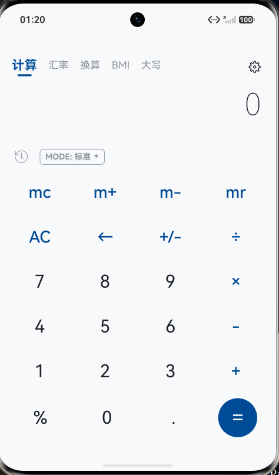
</p>

#### (2) 科学计算器

​	为了容纳更为复杂的三角函数与指数开方运算，科学计算器重构为了 6 行 8 列的全功能专业矩阵，并在左上角配置了高亮状态的 `2nd`（第二功能）功能换挡键。
​	
​	界面的前五列包含三角函数、方幂开方等科学算子，后三列与普通计算键盘无缝平铺。当点击 `2nd` 键时，界面局部组件直连响应式状态，第四、五行的 `sin`、`cos`、`tan`、`ln`、`e^x` 会瞬间动态变身为高阶的反三角函数 `asin`、`acos`、`atan`、对数 `log2` 以及底数幂 `2^x`。

```typescript
// views/calculator/ScientificView.ets (2nd 动态换挡按键声明)
Row() {
  // sin / asin 动态切换
  CalcKey({
    text: this.isSecondActive ? 'asin' : 'sin',
    fontColor: this.isSecondActive ? this.currentTheme.primaryColor : this.currentTheme.textColorPrimary,
    onClickAction: (): void => {
      this.onKeyClick(this.isSecondActive ? 'asin' : 'sin');
    }
  })
  ... // 省略 acos, atan, log2 等并行变身键声明
  this.NumberKey('4'); this.NumberKey('5'); this.NumberKey('6'); this.BlueKey('-');
}
.width('100%').justifyContent(FlexAlign.SpaceAround)
```

​	在数学代数逻辑上，该模块落实了严格的手写视觉输入流：针对任意次方根键 `x√y`，允许用户先输入开方次数（如 `3`），点击算子追加成 `3√(`，接着输入被开方数 `8`，最终通过底层自研解析器将 `x nroot y` 解析为 $y^{1/x}$ 计算求得结果 `2`；同时将自然底数常数 `e` 独立作为按键，免去用户多重组合输入的繁琐。

```typescript
// pages/Index.ets (科学计算流派 B 输入流构建)
} else if (key === 'x√y') {
  if (this.expression && !['+', '-', '×', '÷', '('].includes(this.expression.slice(-1))) {
    this.expression += '√('; // 构建为 3√( 视觉手写结构
  } else {
    this.expression += '2√('; // 前无数字默认进行开平方
  }
  this.previewResult = MathEngine.evaluate(this.expression);
}
```

效果展示图：

<p align="center">
  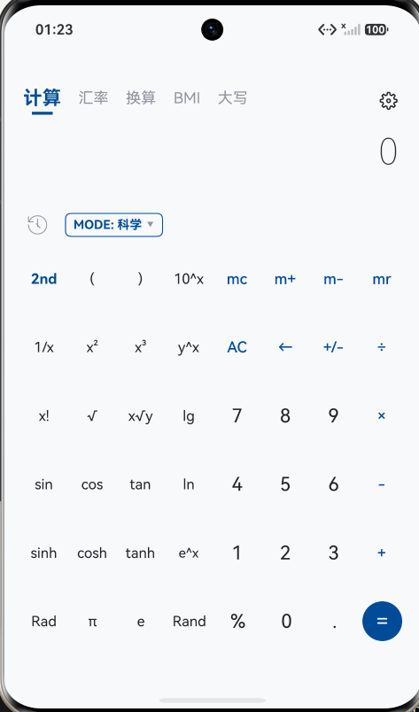
</p>


#### (3) 程序员计算器

​	程序员计算器专为计算机体系结构数据处理设计，整体结构分为上半部的“四进制联动卡片”与下半部的“位运算与十六进制键盘”。
​	
​	卡片区实时展示数值在十六进制（HEX）、十进制（DEC）、八进制（OCT）以及按四位成组格式化的二进制（BIN）。用户点击某一行即可将当前输入锁定为该进制基准，界面底部的按键会自动进行可用性校验：切换到 BIN 模式时，按键动态将除 `0`、`1` 外的所有字符置灰并禁用点击；在 HEX 模式下则全量点亮 `A~F` 字符键。

```typescript
// views/calculator/ProgrammerView.ets (进制切换与字符输入约束)
private checkCharAvailable(char: string): boolean {
  if (this.activeRadix === RadixType.BIN) return char === '0' || char === '1';
  if (this.activeRadix === RadixType.OCT) return ['0', '1', '2', '3', '4', '5', '6', '7'].includes(char);
  if (this.activeRadix === RadixType.DEC) return !['A', 'B', 'C', 'D', 'E', 'F'].includes(char);
  return true; // HEX 模式下全部可用
}
```

​	逻辑层内部维护无符号 32 位有符号/无符号整型数据体系，支持 `AND`、`OR`、`XOR`、`NOT`、`<<`（左移）位运算。在计算执行逻辑中，采用前置参数捕获机制，并在顶部右上角生成运算表达式水印提示，确保如 `6 << 3 = 48` 这样的位运算能精确展示与入栈。

```typescript
// views/calculator/ProgrammerView.ets (位运算执行与历史保存)
private onExecuteCalculate(): void {
  if (!this.pendingOp) return;
  const leftNum: number = this.previousVal;
  const rightNum: number = this.currentVal;
  let res: number = 0;
  if (this.pendingOp === 'AND') res = (leftNum & rightNum) | 0;
  else if (this.pendingOp === 'XOR') res = (leftNum ^ rightNum) | 0;
  else if (this.pendingOp === '<<') res = (leftNum << rightNum) | 0;
  ... // 省略其他位运算分支
  const exprText: string = `${leftNum} ${this.pendingOp} ${rightNum}`;
  this.progHistoryList.unshift(new HistoryItem(exprText, res.toString()));
  this.currentVal = res;
  this.refreshAllDisplays(res);
}
```

效果展示图：

<p align="center">
  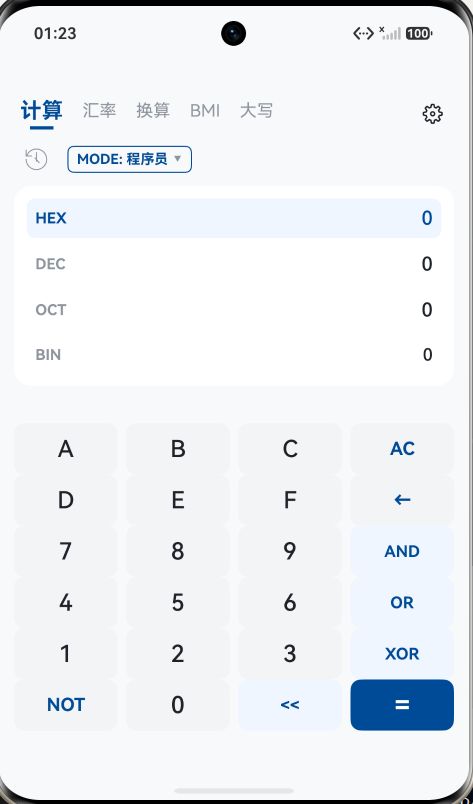
</p>

#### (4) 历史记录功能

​	本应用实现了水平分割的卡片式历史记录面板。
​	
​	在主页面上，当用户点击顶栏的时钟图标 `🕒` 后，图标通过平滑状态切换变为撤销回退箭头 `↩`；同时，页面左侧 75% 的数字键盘区域会被替换为一个圆角灰色背景的 `List` 历史卡片，卡片倒序滚动显示过往的表达式与结算结果，确保最新的记录总是在最上层。

```typescript
// pages/Index.ets (键盘与历史卡片 75%:25% 左右分栏渲染)
Row() {
  if (this.isShowHistory) {
    // 展开历史记录卡片
    HistoryCardView({
      historyList: $historyList,
      themeColor: this.primaryColor,
      onItemClick: (val: string): void => {
        this.expression = val; // 点击回填表达式
        this.isShowHistory = false;
      }
    })
    .layoutWeight(3).height('100%')

    // 右侧运算列始终固定
    Column({ space: 12 }) {
      this.SideBtn('←'); this.SideBtn('÷'); this.SideBtn('×'); this.SideBtn('-'); this.SideBtn('+'); this.SideEqualBtn();
    }
    .layoutWeight(1).height('100%')
  } else { ... } // 普通键盘渲染
}
```

​	每条历史记录挂载了回填事件回调，用户点击历史运算结果即可将其作为输入直接填入输入框中，用户可以切回键盘继续参与计算；卡片底部添加了清除按钮，可一键清空历史缓存。

​	同时，针对“程序计算器”不一样的计算特点和布局特点，我设计了两套历史记录系统的页面布局，效果呈现如下：

<p align="center">
  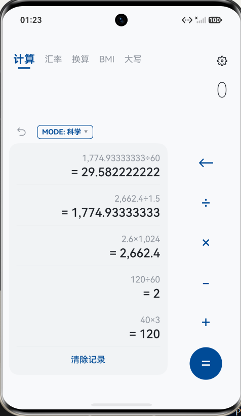
  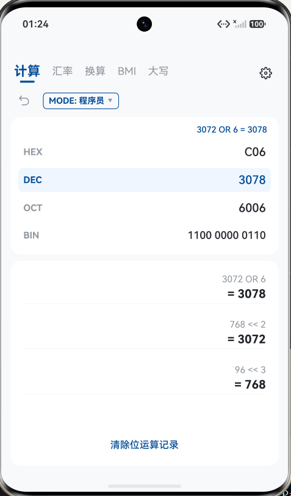
</p>

---

### 2. 汇率转换页

​	本工具支持 **美元（USD）、人民币（CNY）、欧元（EUR）、日元（JPY）、英镑（GBP）、港元（HKD）等 11 种国际主流货币** 的汇率双向实时转换，并突破性地引入了网络数据更新机制。
​	
​	界面视觉上由上下两个双币种卡片和底部键盘组成。两张卡片分别配备了状态指示灯，点击哪张卡片，该卡片即刻亮起主题色高光，并被激活为输入卡片，另一张则自动转为目标换算卡片。点击币种右侧的导航箭头，会触发半模态面板 `bindSheet` ，弹出可选币种列表以供切换。

```typescript
// views/rate/RateConverterMainView.ets (双币种卡片与键盘布局)
Column({ space: 14 }) {
  // 卡片 A 容器
  Column() {
    Row() {
      Row().width(9).height(9).borderRadius(4.5)
        .backgroundColor(this.activeCardIndex === 0 ? this.primaryColor : '#B0B5C0')
      Text(`${this.currencyA.name}  ${this.currencyA.code} ＞`).onClick((): void => { this.openSheetA(); })
    }
    Text(this.inputValA).fontSize(38)
  }
  .backgroundColor(AppColorSystem.getCardBg(this.isDarkMode))
  .border({ width: 1.5, color: this.activeCardIndex === 0 ? this.primaryColor : Color.Transparent })
  .onClick((): void => { this.activeCardIndex = 0; })
  ... // 省略卡片 B 类似声明
}
```

​	数据时效性上，我通过鸿蒙官方的 `@ohos.net.http` 模块编写了网络服务，异步调用国际公开金融汇率接口拉取最新行情并更新内存基准数据。页面在 `aboutToAppear` 生命周期中会自动拉取更新，并在卡片下方动态更新带有“年月日 时分秒”的真实同步时间戳，且支持通过点击“刷新”按钮进行手动即时轮询。

```typescript
// common/RateService.ets (鸿蒙 HTTP 网络汇率异步同步)
public static async fetchLatestRates(): Promise<string> {
  const httpRequest: http.HttpRequest = http.createHttp();
  try {
    const response = await httpRequest.request('https://open.er-api.com/v6/latest/USD', {
      method: http.RequestMethod.GET, connectTimeout: 6000
    });
    if (response.responseCode === 200) {
      const json = JSON.parse(response.result.toString()) as ExchangeRateApiResult;
      // 遍历刷新各国际货币针对基准美元的乘数矩阵
      for (let i = 0; i < GLOBAL_CURRENCIES.length; i++) {
        const code = GLOBAL_CURRENCIES[i].code;
        if (json.rates[code] !== undefined) GLOBAL_CURRENCIES[i].rateToUSD = json.rates[code];
      }
      return '汇率已同步更新于: ' + new Date().toLocaleTimeString();
    }
  } finally { httpRequest.destroy(); }
  return '使用本地基准汇率';
}
```

效果展示图：

<p align="center">
  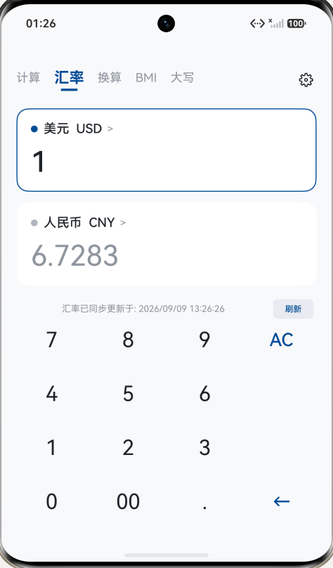
  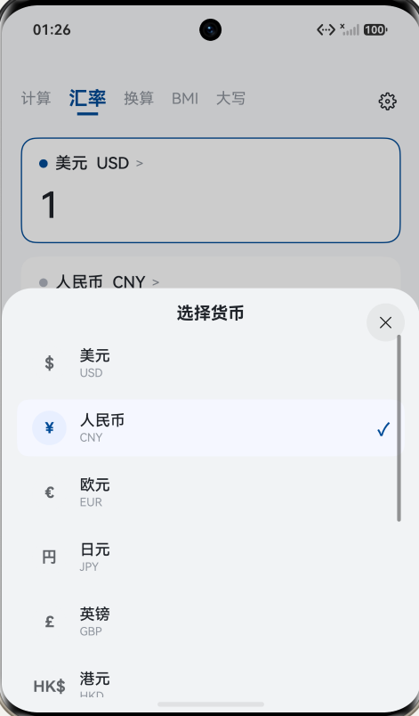
</p>

---

### 3. 单位换算页

​	本工具包含“长度”、“重量”和“面积”三类单位的换算，分别支持 7 种、6 种和 5 种常用度量衡在同类单位内的相互换算。
​	
​	在界面设计上，页面顶部使用分段胶囊按钮进行各分类的切换，主体区采用“源单位输入卡片”与“目标单位结果卡片”上下排布。输入数据支持浮点数，以单精度浮点数的形式存储。

```typescript
// pages/Index.ets (单位换算双卡片与小数输入框)
TextInput({ text: this.unitInputVal })
  .type(InputType.NUMBER_DECIMAL) // 开放负数与小数点输入支持
  .fontSize(28)
  .fontWeight(FontWeight.Bold)
  .backgroundColor(this.isDarkMode ? '#24242A' : '#F5F7FA')
  .onChange((v: string): void => {
    this.unitInputVal = v;
    this.recalcUnit(); // 联动实时重算
  })
```

​	逻辑实现方面，我建立了一套以国际标准量（米、千克、平方米）为基准的系数字典。换算时，先将输入的数值乘以源单位的转化系数归一化为基准值，再除以目标单位的系数得出最终结果。避免了为每对单位单独写转化公式的冗余设计，计算结果对于过长的小数位执行格式化过滤与科学计数法保底保护。

```typescript
// pages/Index.ets (基于基准归一化矩阵的换算算法)
private recalcUnit(): void {
  const list: UnitItem[] = this.getUnitList();
  const val: number = parseFloat(this.unitInputVal) || 0;
  // 先将源单位折算为标准国际基准量，再反除求得目标量
  const base: number = val * list[this.sourceUnitIdx].factorToBase;
  const res: number = base / list[this.targetUnitIdx].factorToBase;
  this.unitResultVal = res >= 1000000 ? res.toExponential(4) : res.toFixed(4).replace(/\.?0+$/, '');
}
```

效果展示图：

<p align="center">
  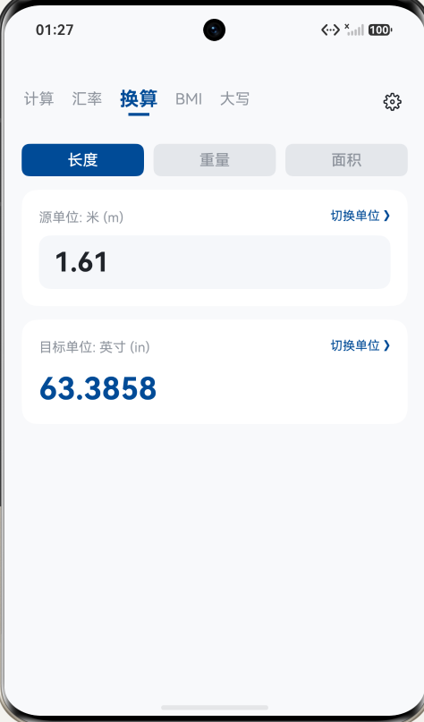
  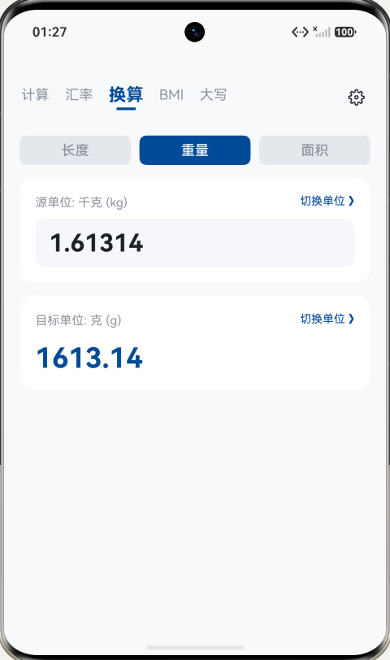
  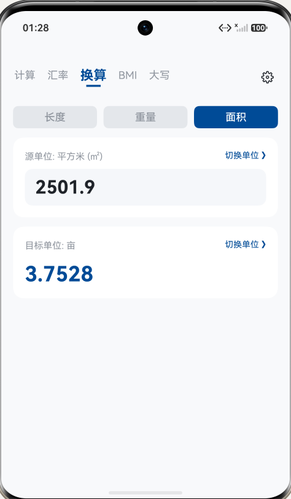
</p>

---

### 4. BMI计算页

​	BMI 计算页是一项切中生活健康的创意功能，用户可以快捷计算自己的BMI数据，以评估自身的身高体重是否符合健康标准。
​	
​	页面设计上，该页包含身高输入行、体重输入行和下方的评估卡片。输入的身高体重数据通过 `InputType.NUMBER_DECIMAL` 属性存储，支持单精度小数输入。

```typescript
// pages/Index.ets (BMI 指数评测输入行)
Row() {
  Text('身高 (cm):').fontSize(16).width(90)
  TextInput({ text: this.bmiHeight })
    .type(InputType.NUMBER_DECIMAL)
    .onChange((v: string): void => {
      this.bmiHeight = v;
      this.recalcBMI();
    })
}
```

​	评估的逻辑基于中国国家卫生健康委员会的标准，计算公式为 $\text{BMI} = \text{体重(kg)} / (\text{身高(m)})^2$。系统实时计算出 BMI 得分，并在结果卡片中渲染带颜色的健康评级：如蓝色的“偏瘦”、绿色的“标准健康”、橙色的“超重”和红色的“肥胖”，直观展示健康状态。

```typescript
// pages/Index.ets (国标分级判定逻辑)
const bmi: number = w / (h * h);
this.bmiScore = bmi.toFixed(1);
if (bmi < 18.5) { this.bmiLevel = '偏瘦'; this.bmiColor = '#3B82F6'; }
else if (bmi < 24.0) { this.bmiLevel = '标准健康'; this.bmiColor = '#10B981'; }
else if (bmi < 28.0) { this.bmiLevel = '超重'; this.bmiColor = '#F59E0B'; }
else { this.bmiLevel = '肥胖'; this.bmiColor = '#EF4444'; }
```

效果展示图：

<p align="center">
  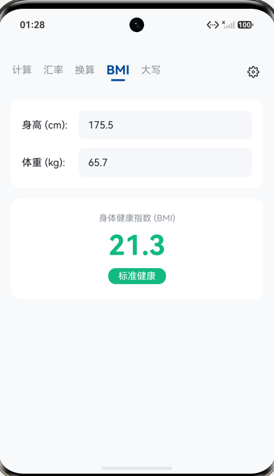
</p>

---

### 5. 金额大写转换页

​	金额大写转换是针对财务报销场景开发的特色工具，能够将常见的小写阿拉伯数字金额实时转译为规范的汉字大写。

```typescript
// pages/Index.ets (大写金额展示卡片)
Column({ space: 10 }) {
  Text('中国银行规范大写:').fontSize(14).fontColor(AppColorSystem.getTextSecondary(this.isDarkMode))
  Text(this.rmbResultVal)
    .fontSize(20)
    .fontWeight(FontWeight.Medium)
    .fontColor(this.primaryColor) // 突出显示大写结果
}
.padding(18)
.backgroundColor(AppColorSystem.getCardBg(this.isDarkMode))
```

​	该功能的转换逻辑在 `toRMBWords` 函数中实现。该函数首先通过取余算法把小数部分分离并映射到“角”和“分”，随后将整数部分按每四位（“万”、“亿”）进行分段截断，递归匹配大写字符表 `['零', '壹', '贰', '叁', '肆', '伍', '陆', '柒', '捌', '玖']` 与数位阶级 `['', '拾', '佰', '仟']`，并在最后自动处理内部多零的连续合并。基于以上机制，可以生成严密而规范的会计文本。

```typescript
// pages/Index.ets (财务中文汉字转换状态机)
let integerPart: number = Math.floor(money);
let unitPos: number = 0;
while (integerPart > 0) {
  let section: string = '';
  const secVal: number = integerPart % 10000;
  for (let i = 0; i < 4 && i < secVal.toString().length; i++) {
    const d: number = Math.floor(secVal / Math.pow(10, i)) % 10;
    if (d > 0) section = digit[d] + unit[1][i] + section;
    else if (section && !section.startsWith('零')) section = '零' + section;
  }
  if (secVal > 0) strInt = section + unit[0][unitPos] + strInt;
  unitPos++;
  integerPart = Math.floor(integerPart / 10000);
}
```

效果展示图：

<p align="center">
  
</p>

---

### 6. 系统设置页

​	系统设置页可以进行黑夜模式切换、主题强调色切换、震动开启或关闭以及本地缓存和数据的清除，包含产品的基本信息。
​	
​	系统设置页的基本布局，采用的是苹果 iOS 风格的圆角分组列表设计，通过四个卡片分组划分了“外观与主题”、“交互与触觉”、“数据与历史”以及“关于”四个业务区。在此处我引入了独立的 **黑夜模式（OLED 纯黑）开关**，并在外层通过 ArkTS 的 `.expandSafeArea` 属性让纯黑背景穿透系统状态栏与底部导航条，呈现完整而独立的黑夜背景（避免实际开发中出现过的屏幕顶部与底部的“漏白”现象）。

```typescript
// views/settings/SettingsView.ets (沉浸式全屏穿透与开关设置)
Column() {
  // 分组卡片列表
  Scroll() {
    Column({ space: 20 }) {
      this.SectionCard('外观与主题', [ ... ])
      this.SectionCard('交互与触觉', [ ... ])
    }
  }
}
.backgroundColor(AppColorSystem.getPageBg(this.isDarkMode))
// 状态栏及导航栏系统级全沉浸扩展，彻底消除边缘漏白
.expandSafeArea([SafeAreaType.SYSTEM], [SafeAreaEdge.TOP, SafeAreaEdge.BOTTOM])
```

​	不仅如此，设置页还支持针对“中国海大蓝”、“极简蓝”、“翡翠绿”和“活力橙”多套主题模板的切换。在代码实现上，主题变更通过双向绑定变量实时下发；效果上，触发切换后，主页面的等号键、导航下划线、激活卡片均会联动变色。

​	页面底部还提供了全量历史记录数据的安全清除功能。

```typescript
// views/settings/SettingsView.ets (强调色多色板单选机制)
Stack({ alignContent: Alignment.Center }) {
  if (this.primaryColor === hex) {
    Text('✓').fontSize(14).fontColor('#FFFFFF').fontWeight(FontWeight.Bold)
  }
}
.width(28).height(28).borderRadius(14).backgroundColor(hex)
.onClick((): void => {
  this.primaryColor = hex; // 响应式触发全局强调色刷新
})
```

效果展示图：

<p align="center">
  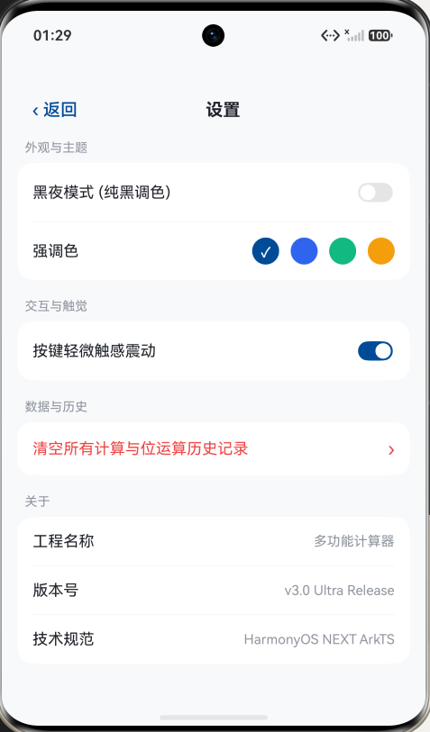
  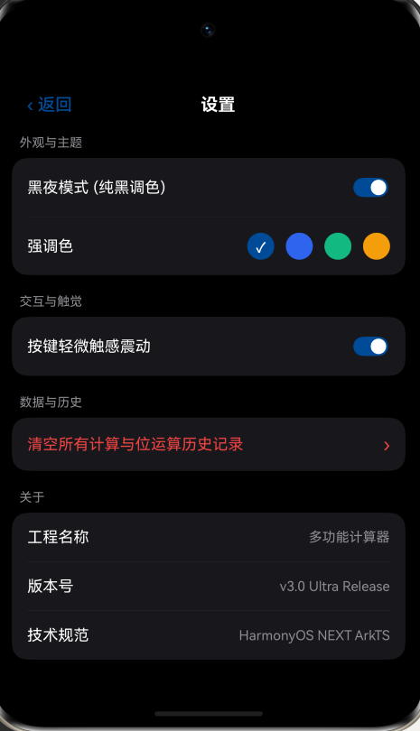
</p>

---

## 四、 问题总结与体会

### 1. 遇到的问题与代码调优

​	在本次多功能计算器的开发的过程中，我遇到了一些涉及 **ArkTS 数据绑定机制** 以及 **并发弹窗生命周期** 的问题，记录如下：

* **问题一：程序员计算器和汇率计算器下点击按键后界面数据无刷新**
  * *现象*：在完成程序员模式及汇率换算页面的搭建后，在模拟器中点击键盘按键，虽然确认按键点击逻辑已经正常触发并执行了数值更新，但界面四进制文本及汇率卡片中的数值依然维持在初始的 `0` 或 `1`，没有任何动态反馈。
  * *分析与解决*：排查发现，该问题是由于 ArkTS 编译器的底层参数求值机制引起。在原代码中，我将显示字符串通过普通形参传入了自定义的 `@Builder` 函数（如 `this.RadixRow('HEX', this.hexText, ...)`）。在 ArkTS 静态类型检查范式下，按值传递给 `@Builder` 的参数会被识别为静态快照，其内部无法监听状态变量的更改，导致局部 UI 树被阻断刷新。针对此问题，我重构了展示组件，剔除了中间 `@Builder` 的形参值传递，改为在组件内部直接通过 `this.hexText` 读取 `@State` 状态变量，恢复了响应式依赖链路，界面数值恢复了即时跳动效果。

* **问题二：设置面板触发延迟与弹窗阻塞 Bug**
  * *现象*：点击主页右上角的“设置”齿轮按钮后，系统没有任何反应；只有当用户随后点击中间的“MODE”模式切换按钮时，此前被点击的“设置”弹窗才延迟弹出。
  * 初步尝试：起初我推测是事件冒泡或按钮触控热区过小导致的漏触，尝试增大了齿轮按钮的有效点击尺寸并为事件绑定添加独立的防抖机制，但延迟弹出的现象依旧存在。
  * 结果与分析：进一步审阅代码后发现，该 Bug 是由于在同一个页面的根节点上链式绑定了两个 `.bindSheet` 半模态转场组件。在鸿蒙底层的窗口与转场状态机中，同一容器挂载多个同类型模态弹窗会导致内部状态产生时序竞争与覆盖冲突，导致前一个弹窗被后续的事件所阻塞拦截。
  * *最终方案*：我彻底废弃了使用模态弹窗承载系统设置的做法，将其重构为一个独立的二级页面组件 `SettingsView`，通过顶层 `Stack` 条件渲染与动画机制接管路由流转。这一举措不仅彻底排除了双 `bindSheet` 的竞争隐患，还让设置模块拥有了全屏的展示空间，能够从容布局深色模式与强调色的复杂分组，体验大幅提升。

---

### 2. 实验总结与收获

​	这次实验让我实现了从微信小程序开发到鸿蒙系统应用开发的跨越，两者虽然使用不同的IDE和语言描述项目，但制作的过程总是相通的。使用过程中，我学习了鸿蒙 ArkTS 的声明式 UI 开发、组件状态管理（`@State`/`@Prop`/`@Link`）、网络数据通信以及系统级沉浸式布局等核心知识，更让我对移动端复杂多模态工具的架构分层和 UI/UX 体验调优有了更深体会。
​	
​	在开发流程方面，我通过模块解耦循序渐进地推进项目进度。从最先构筑底层的逆波兰数学计算引擎开始，到逐步落地标准、科学与程序员三大核心视窗，再到后期把各工具模块独立为并列 Tab 并统一进行 OLED 纯黑与海大蓝的沉浸式换肤。我逐渐熟练这种自底向上、步步为营的工程化开发方式，不仅条理清晰，也极大降低了组件联动与数据追踪时的排错成本。
​	
​	另外，我也深刻感受到了项目稳定正常运行的重要性。无论是深入排查 `@Builder` 传值机制导致的局部刷新阻断，还是通过输入类型限制和除零容错保障复杂代数计算的稳定性，亦或是调用真机网络 API 解决汇率时效性问题，都让我受益很多。只有在细节上进行严密的构思与反复考究，才能使一款工具类应用从课程作业式的“玩具级”应用，逐步蜕变为具有上线潜力的工业级产品。
​	
​	总的来说，这次实践不仅积累了鸿蒙系统的实战开发经验，也培养了我在软件设计中兼顾硬核算法、严密架构与人机交互质感的工程思维，受益匪浅。