# 移动软件开发实验六报告

## 一、 实验目标

1. 综合应用小程序云开发的基础知识创建图片分享社区小程序。
2. 掌握云数据集创建、云存储管理和云函数调用等知识。

---
## 二、 实验环境

* **操作系统**：Windows 11
* **开发工具**：微信开发者工具（Stable 2.02）
* **运行环境**：微信基础库 3.17.2
* **后端支撑**：腾讯云·微信小程序云开发（云数据库、云存储、Node.js 云函数）

---
## 三、 实验内容

​	本次实验基于微信小程序云开发的后端数据库，开发了一款名为《Aura时空留声馆》的图片分享社区小程序，创造性地打造了印象声音定格、朦胧轻触显形的印象化交互和足迹地图一览等功能。此外，小程序围绕社区分享的主题功能，优化了界面与UI设计，具有独特的审美品味与艺术风格。

​	下面将按照功能模块对本小程序的功能和实现做详细的介绍。

### **1. 主页“胶片流”**

#### (1) “胶片”数据读取与呈现

​	主页“胶片流”是整个社区内容展示的核心载体。在视觉设计上，本模块采用了极简拟物风格的**复古拍立得相纸**视觉系统。每张卡片上方展示作者头像、昵称、打卡地标以及根据时间戳计算出的相对时间（如“3分钟前”、“昨天”）；卡片主体是一张照片，周围以拍立得白边相纸包裹；相纸底部留白处为发布者的配文、发布视觉和点赞。

```xml
<!-- pages/index/index.wxml (拍立得卡片主体结构) -->
<view class="polaroid-card" wx:for="{{photoList}}" wx:key="_id">
  <!-- 卡片头部：作者与时空足迹 -->
  <view class="card-header">
    <image class="author-avatar" src="{{item.userInfo.avatarUrl}}" catchtap="navToAuthor" data-openid="{{item._openid}}" mode="aspectFill" />
    <view class="author-meta" catchtap="navToAuthor" data-openid="{{item._openid}}">
      <text class="author-name">{{item.userInfo.nickName}}</text>
      <view class="sub-line">
        <text class="location-tag" wx:if="{{item.location && item.location.placeName}}">📍 {{item.location.placeName}}</text>
        <text class="time-tag">{{item.relativeTime}}</text>
      </view>
    </view>
  </view>
  <!-- 照片取景相框 -->
  <view class="photo-frame" bindtap="handlePhotoTap" data-id="{{item._id}}" data-index="{{index}}">
    <image class="main-image {{item.isBlurred ? 'darkroom-blur' : ''}}" src="{{item.photoUrl}}" mode="widthFix" lazy-load />
    <view class="darkroom-tag" wx:if="{{item.isBlurred}}"><text class="flask-text">🧪 轻触显影</text></view>
  </view>
  <!-- 底部打字机留白区 -->
  <view class="polaroid-bottom">
    <text class="card-caption" wx:if="{{item.caption}}">{{item.caption}}</text>
    <view class="action-footer">
      <view class="date-stamp">{{item.addDate}} · FILM ARCHIVE</view>
      <view class="like-btn" catchtap="handleLike" data-id="{{item._id}}" data-index="{{index}}">
        <text class="like-icon">{{item.isLiked ? '❤️' : '🤍'}}</text>
        <text class="like-count {{item.isLiked ? 'liked-text' : ''}}">{{item.likeCount || 0}}</text>
      </view>
    </view>
  </view>
</view>
```

​	在数据获取方面，页面逻辑层通过初始化云数据库并调用 `photos` 集合的拉取接口，使用 `orderBy('createTime', 'desc')` 保证最新发布的胶片置于顶端，并在每次页面回显（`onShow`）时动态合并本地刚冲洗的暂存记录，确保用户定格结果立即可见。

```js
// pages/index/index.js (云数据库全量数据动态拉取)
fetchPhotoList: function (callback) {
  this.setData({ isLoading: true });
  const db = wx.cloud.database();
  db.collection('photos')
    .orderBy('createTime', 'desc')
    .limit(30)
    .get()
    .then(res => {
      const cloudList = res.data || [];
      const developedIds = wx.getStorageSync('developed_photo_ids') || [];
      // 动态转换相对时间，并根据永久显影白名单消除已洗出照片的模糊
      const formattedList = cloudList.map(item => ({
        ...item,
        relativeTime: getRelativeTime(item.createTime),
        isBlurred: item.isBlurred && !developedIds.includes(item._id)
      }));
      this.setData({ photoList: formattedList, isLoading: false });
      this.buildMapMarkers(formattedList);
      if (callback) callback();
    });
}
```

效果展示图：

<p align="center">
  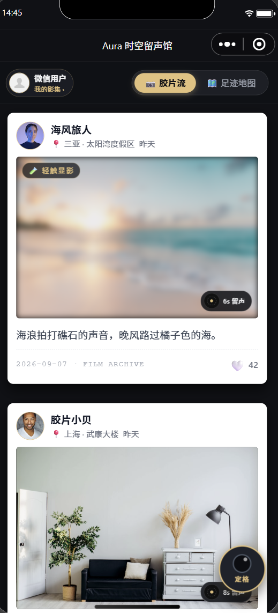
</p>

#### (2) “胶片”轻触交互与定格印象原声播放

​	为了提升定格的回忆感与静态胶片的生命力，主页引入了视听双维度的微交互。

​	在视觉上，系统设计了**双击胶片爆裂红心**的手势算法：通过计算相邻两次点击相片的时间差（阈值设为 350ms），在相纸正中唤起贝塞尔弹性放大的爱心动画，并在底层以乐观更新策略同步递增点赞计数，同时通过云函数 `toggleLike` 触发原子的高并发累加。

```js
// pages/index/index.js (双击手势识别与红心粒子触发)
handlePhotoTap: function (e) {
  const curTime = e.timeStamp;
  const lastTime = this.data.lastTapTime;
  const { id, index } = e.currentTarget.dataset;

  if (curTime - lastTime < 350) {
    // 判定为双击：触发爆裂红心动效并点赞
    const animKey = `photoList[${index}].showHeartAnim`;
    this.setData({ [animKey]: true });
    setTimeout(() => { this.setData({ [animKey]: false }); }, 800);
    this.handleLikeCore(photoId, index);
  } else {
    // 单击则延时判定，防误触直入胶片详情
    setTimeout(() => {
      if (this.data.lastTapTime === curTime) this.navToDetailDirect(id);
    }, 300);
  }
  this.setData({ lastTapTime: curTime });
}
```

​	在听觉上，针对录制了“留声胶囊”的相片，在其右下角嵌有专属的拟物**黑胶唱片徽标**。利用挂载于 `app.globalData` 的全局唯一音频单例 `innerAudioContext`，实现了“就地换轨播放”能力。当用户轻触黑胶徽标时，黑胶盘面立即伴随 CSS 连续旋转动效（`spinDisc`），并输出清晰的环境录音，再次轻触或播放完毕后唱片平滑归位。

```js
// pages/index/index.js (黑胶唱片留声播放控制)
togglePlayVoice: function (e) {
  const { voice, id } = e.currentTarget.dataset;
  const player = app.globalData.innerAudioContext;
  if (!voice) return;

  if (this.data.currentPlayingId === id) {
    player.stop();
    this.setData({ currentPlayingId: null });
  } else {
    player.stop();
    this.setData({ currentPlayingId: id });
    player.src = voice;
    player.play();
  }
}
```

效果展示图：

<p align="center">
  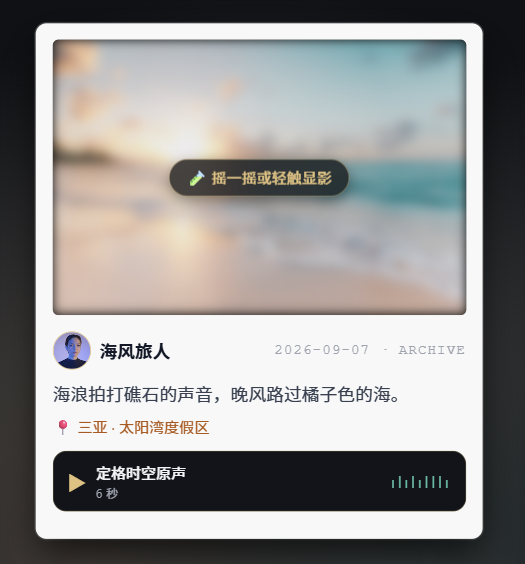
</p>

#### (3) “胶片”高清预览、下载、海报生成与分享

​	点击胶片主体后，页面经由路由传参跳转进入“胶片原件”详情页（`pages/detail`）。页面背景通过 CSS 高斯模糊将原图色调作为自适应动态漫反射底衬，当用户轻触画面时，过往的记忆渐渐浮现在眼前，通过交互设计提升用户的视觉沉浸感和回忆感。

​	底部操作栏采用栅格排版，对称布置了存至相册、拍立得海报生成、全屏预览与分享好友四大功能。

```xml
<!-- pages/detail/detail.wxml (四大功能工具栏) -->
<view class="action-grid-fixed">
  <view class="action-col ripple-tap" bindtap="saveToLocalAlbum">
    <view class="action-circle">💾</view>
    <text class="action-text">存至相册</text>
  </view>
  <view class="action-col ripple-tap" bindtap="generatePoster">
    <view class="action-circle poster-circle">🎨</view>
    <text class="action-text poster-text">拍立得海报</text>
  </view>
  <view class="action-col ripple-tap" bindtap="previewFullImage">
    <view class="action-circle">🔍</view>
    <text class="action-text">全屏预览</text>
  </view>
  <button class="action-col share-clean-btn ripple-tap" open-type="share">
    <view class="action-circle">💌</view>
    <text class="action-text">分享好友</text>
  </button>
</view>
```

​	其中，最具特色的是**Canvas 2D 拍立得电影海报动态合成引擎**。该模块采用小程序最新的 Canvas 2D 离屏节点，自动适配设备的物理像素比（DPR），将象牙白卡纸、照片主体居中裁切、拍摄地标、手写碎念以及打字机日期印戳逐一渲染，最终调用 `wx.canvasToTempFilePath` 并通过 `wx.saveImageToPhotosAlbum` 保存到系统相册，可供一键发布朋友圈。

```js
// pages/detail/detail.js (Canvas 2D 离屏绘制拍立得海报逻辑片段)
renderCanvasPoster: function (photoPath) {
  const query = wx.createSelectorQuery();
  query.select('#posterCanvas').fields({ node: true, size: true }).exec(async (res) => {
    const canvas = res[0].node;
    const ctx = canvas.getContext('2d');
    const dpr = wx.getSystemInfoSync().pixelRatio;
    canvas.width = 600 * dpr;
    canvas.height = 860 * dpr;
    ctx.scale(dpr, dpr);

    // 绘制象牙白相纸与照片主体
    ctx.fillStyle = '#FAF9F6';
    ctx.fillRect(0, 0, 600, 860);
    const photoImg = canvas.createImage();
    photoImg.src = photoPath;
    photoImg.onload = () => {
      ctx.drawImage(photoImg, 40, 40, 520, 580);
      ctx.fillStyle = '#1F2937';
      ctx.font = 'bold 22px sans-serif';
      ctx.fillText(this.data.photoInfo.caption || '在漫长时光中定格此瞬。', 40, 670);
      ctx.font = '14px Courier New';
      ctx.fillText(`定格于 ${this.data.photoInfo.addDate} · AURA FILM ARCHIVE`, 40, 760);
      // 导出图片并存入相册
      wx.canvasToTempFilePath({ canvas, success: (saveRes) => {
        wx.saveImageToPhotosAlbum({ filePath: saveRes.tempFilePath });
      }});
    };
  });
}
```

效果展示图：

<p align="center">
  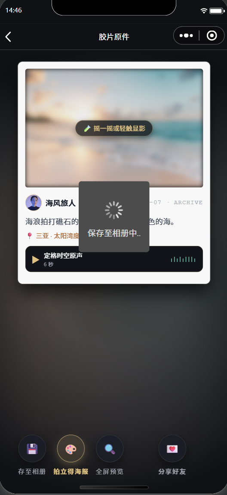
  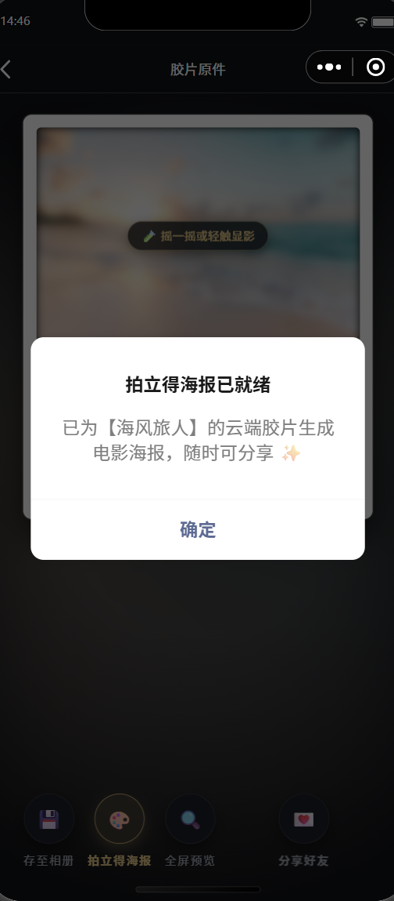
  
</p>

#### (4) “胶片”分享博主个人主页与预览胶片馆

​	社区中每一张胶片的作者头像皆可点击交互。点击头像时，通过事件对象提取作者的 `_openid`，借助 `wx.navigateTo` 携带参数路由至“时空档案馆”（`pages/homepage`）。该模块实现动态解耦：若传入的是当前用户标记，则加载本人名下的全部作品；若传入的是其他创作者标识，则从云数据库调取该创作者名下的所有历史定格作品。

```js
// pages/homepage/homepage.js (多作者胶片馆动态检索逻辑)
fetchAuthorDataFromCloud: function (openid) {
  const db = wx.cloud.database();
  // 根据传入的 openid 精确检索云数据库中的作品集合
  db.collection('photos')
    .where({ _openid: openid })
    .orderBy('createTime', 'desc')
    .get()
    .then(res => {
      const photos = res.data || [];
      if (photos.length > 0) {
        // 动态读取该用户存入数据库的真实头像和昵称，拒绝写死
        const author = photos[0].userInfo;
        const likes = photos.reduce((acc, cur) => acc + (cur.likeCount || 0), 0);
        this.setData({ authorInfo: author, authorPhotos: photos, totalLikes: likes });
      }
    });
}
```

效果展示图：

<p align="center">
  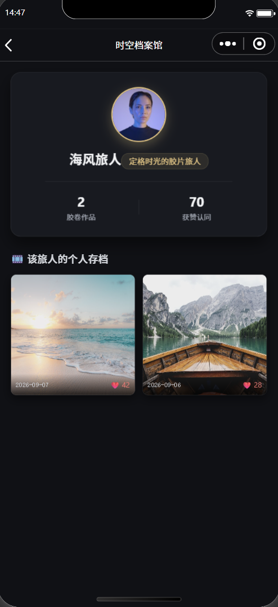
</p>

---

### **2. “足迹地图”一览**

#### (1) 地图图钉与迷你照片卡片

​	首页右上方搭载了一个仿毛玻璃质感的控制器，用户可以从“胶片流”主页切换到“足迹地图”中。“足迹地图”利用原生的 `<map>` 组件构筑，通过数据管道筛选出包含有效地理位置（经纬度）的所有公开相片，转化为地图上的标记点集合（`markers`）。

```xml
<!-- pages/index/index.wxml (地图与自定义头像图钉插槽) -->
<map id="footprintMap" class="custom-map" latitude="{{centerLat}}" longitude="{{centerLng}}" scale="{{mapScale}}" markers="{{mapMarkers}}" bindmarkertap="onMarkerTap" show-location>
  <!-- 利用 customCallout 插槽在经纬度原位渲染作者头像与地标名 -->
  <cover-view slot="callout">
    <block wx:for="{{mapMarkers}}" wx:key="id">
      <cover-view class="avatar-callout-box" marker-id="{{item.id}}">
        <cover-image class="callout-avatar" src="{{item.customData.userInfo.avatarUrl}}" />
        <cover-view class="callout-meta">
          <cover-view class="callout-title">{{item.customData.location.placeName}}</cover-view>
          <cover-view class="callout-author">@{{item.customData.userInfo.nickName}}</cover-view>
        </cover-view>
      </cover-view>
    </block>
  </cover-view>
</map>
```

​	在视觉渲染上，通过小程序的 `customCallout` 插槽机制，将原本平淡的红水滴图钉替换为由“博主小头像+金色地标名”复合而成的**头像气泡图钉**。地图下方悬浮着一条支持水平横滑（`scroll-x`）的“迷你胶片抽屉”，直观展示各城市地标的相片封面与定格者信息。

效果展示图：

<p align="center">
  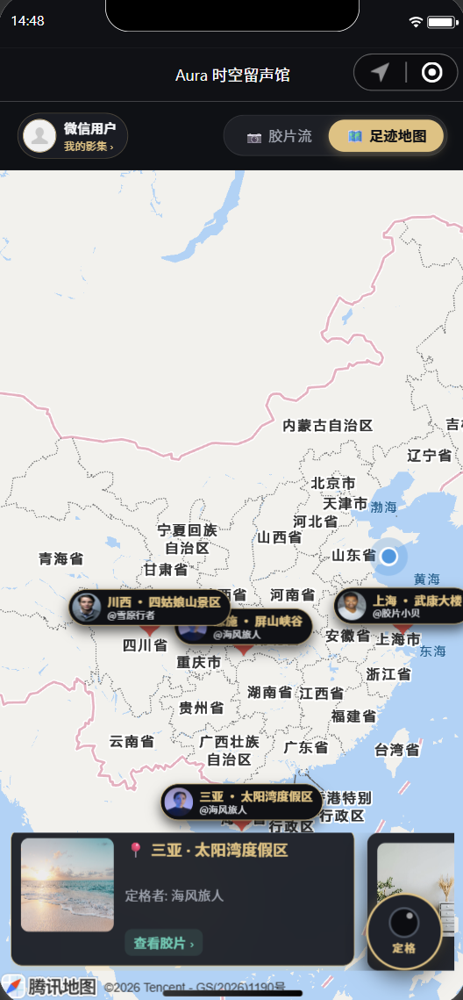
</p>


#### (2) “胶片”切换与即时定位放大

​	底部相片卡片与地图之间建立了流畅的映射。当用户在底部胶卷抽屉中滑动并点击某一张胶片时，逻辑层会捕获目标地标的地理经纬度，动态调整地图的中心视点，并将缩放级别平滑拉近至城市详细级别（`scale: 12`），同时高亮被选中的相片框并给予短震动反馈。

```js
// pages/index/index.js (镜头飞跃平移与标记点聚焦联动)
locateToPhoto: function (e) {
  const item = e.currentTarget.dataset.item;
  if (!item.location) return;

  // 平滑拉近镜头至城市级视点并聚焦
  this.setData({
    centerLat: item.location.latitude,
    centerLng: item.location.longitude,
    mapScale: 12,
    selectedPhotoId: item._id
  });
  wx.vibrateShort({ type: 'light' });
}
```

效果展示图：

<p align="center">
  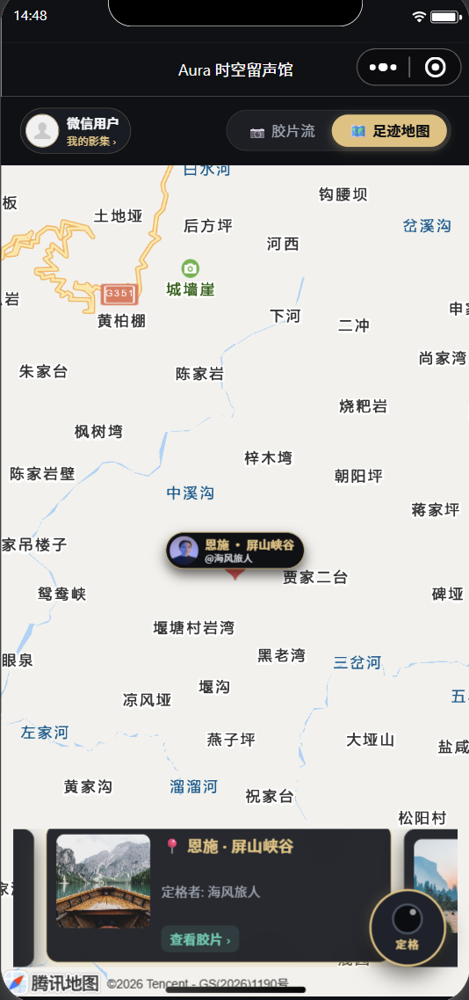
</p>


---

### **3. 个人定格工坊**

#### (1) 图文与留声

​	点击首页右下角的金色悬浮相机（FAB）即可进入冲洗发布的个人定格工坊（`pages/add`）。在图像采集上，提供了纯净的取景相框，结合 ActionSheet 原生交互，支持用户显式选择“现场实拍”（使用支持度最高的 `wx.chooseMedia` 直接唤起后置摄像头取景）或“相册导入”。

```js
// pages/add/add.js (多媒体采集调用逻辑)
showPhotoSourceActionSheet: function () {
  wx.showActionSheet({
    itemList: ['📸 现场拍摄定格', '🖼️ 从手机相册选取'],
    success: res => {
      const source = res.tapIndex === 0 ? 'camera' : 'album';
      wx.chooseMedia({
        count: 1,
        mediaType: ['image'],
        sourceType: [source],
        camera: 'back',
        success: (imgRes) => {
          this.setData({ tempPhotoPath: imgRes.tempFiles[0].tempFilePath, canSubmit: true });
        }
      });
    }
  });
}
```

​	在留声采集方面，利用微信原生录音管理器 `wx.getRecorderManager()` 实现了双模态采集（手机端支持长按录音、松手即停；电脑端支持单击启停）。录音期间，界面伴随拟物音频电平波柱跳动和实时秒数递增；录音结束后以 AAC 高保真编码生成临时音频，并支持就地试听与一键重录。

```js
// pages/add/add.js (留声录制监听与动态倒计时)
setupAudioRecorder: function () {
  recorderManager.onStart(() => {
    recordStartTime = Date.now();
    this.setData({ isRecording: true, currentRecordSec: 1 });
    recordTimer = setInterval(() => {
      const sec = Math.floor((Date.now() - recordStartTime) / 1000) + 1;
      if (sec >= 10) this.stopRecordingProcess();
      else this.setData({ currentRecordSec: sec });
    }, 1000);
  });
  recorderManager.onStop(res => {
    clearInterval(recordTimer);
    const actualSec = Math.max(1, Math.round((Date.now() - recordStartTime) / 1000));
    this.setData({ isRecording: false, tempVoicePath: res.tempFilePath, voiceDuration: actualSec });
  });
}
```

效果展示图：

<p align="center">
  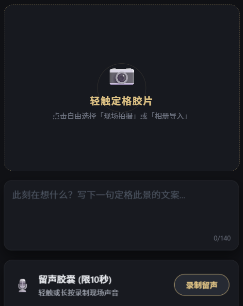
</p>

#### (2) 时空足迹定位

​	为了让每张胶片拥有鲜活的时空经纬，本模块集成了位置选择服务。在完成了全局权限授权后，调用微信原生选点 API **`wx.chooseLocation`**。用户可以在弹出的全屏腾讯地图中随意拖拽移动大头针，或者通过关键词检索全国范围内的地标名称与详细地点，选定后自动将经纬度坐标与地名回显到控制面板中。

```js
// pages/add/add.js (原生地图打卡选点接口调用)
chooseLocation: function () {
  wx.chooseLocation({
    success: res => {
      this.setData({
        latitude: res.latitude,
        longitude: res.longitude,
        placeName: res.name || res.address
      });
      wx.showToast({ title: '已选定地标', icon: 'success' });
    }
  });
}
```

效果展示图：

<p align="center">
  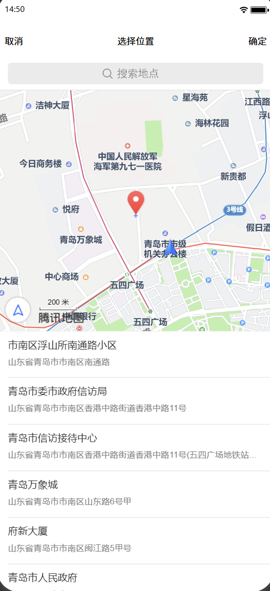
</p>

#### (3) 朦胧印象化交互

​	工坊内设计了一个名为“暗房神秘显影”的开关。若用户开启此开关，冲洗出的胶片将带有一层朦胧的浅柔焦效果（`filter: blur(8rpx)`），并在左上角盖上精巧的微光印戳。

​	**摇一摇显影**机制的实现如下。通过调用微信硬件传感器接口 **`wx.onAccelerometerChange`** 监听三轴加速度。当用户晃动手机的超过阈值时，就会触发手机强震动反馈和模糊遮罩的平滑过渡消退，**仿佛是过去的回忆渐渐浮现的眼前**。显影状态会被持久化写入本地存储 `developed_photo_ids` 白名单中，只有初见的回忆胶片才有模糊效果。

```js
// pages/detail/detail.js (加速度计摇一摇显影判定)
initShakeSensor: function () {
  wx.startAccelerometer({ interval: 'game' });
  wx.onAccelerometerChange(res => {
    const curTime = Date.now();
    if ((curTime - this.data.lastShakeTime) > 100) {
      const diffTime = curTime - this.data.lastShakeTime;
      const speed = Math.abs(res.x + res.y + res.z - this.data.lastX - this.data.lastY - this.data.lastZ) / diffTime * 10000;
      // 达到摇晃阈值且未曾显影，触发洗照片动效
      if (speed > 160 && !this.data.isDeveloped) {
        wx.stopAccelerometer();
        wx.vibrateLong();
        const developedIds = wx.getStorageSync('developed_photo_ids') || [];
        developedIds.push(this.data.photoId);
        wx.setStorageSync('developed_photo_ids', developedIds);
        this.setData({ isDeveloped: true });
        wx.showToast({ title: '显影完成 ✨', icon: 'none' });
      }
      this.setData({ lastX: res.x, lastY: res.y, lastZ: res.z, lastShakeTime: curTime });
    }
  });
}
```

效果展示图：

<p align="center">
  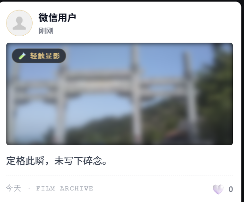
</p>

#### (4) “胶片”冲刷与入库

​	点击“入库并冲洗胶片”大按钮后，系统正式步入端云一体化存储管道。

​	在这个过程中，图像文件首先通过 **`wx.cloud.uploadFile`** 流式上传至腾讯云存储空间 `photos/` 目录，换取跨端合法的云文件标识 `realPhotoFileID`（即 `cloud://` 格式的资源地址）；若录制了环境音，音频临时文件也同步上传至 `voices/` 目录换取音频 `fileID`。随后，基于数据库入库规范，构造不含 _id 的标准记录并推送至云数据库 `photos` 集合中；作者信息则直接绑定授权的全局对象。

```js
// pages/add/add.js (云存储上传与云数据库入库事务)
handleSubmit: async function () {
  // 1. 上传图片至云存储
  const uploadPhotoRes = await wx.cloud.uploadFile({
    cloudPath: `photos/${Date.now()}_${Math.random().toString(36).slice(-6)}.jpg`,
    filePath: this.data.tempPhotoPath
  });
  // 2. 存在录音则上传音频至云存储
  let realVoiceFileID = '';
  if (this.data.tempVoicePath) {
    const uploadVoiceRes = await wx.cloud.uploadFile({
      cloudPath: `voices/${Date.now()}_${Math.random().toString(36).slice(-6)}.aac`,
      filePath: this.data.tempVoicePath
    });
    realVoiceFileID = uploadVoiceRes.fileID;
  }
  // 3. 构造不含 _id 的标准记录并写入集合
  const cloudPayload = {
    photoUrl: uploadPhotoRes.fileID,
    caption: this.data.caption || '定格此瞬，未写下碎念。',
    voiceUrl: realVoiceFileID,
    voiceDuration: this.data.voiceDuration || 0,
    location: this.data.placeName ? {
      latitude: this.data.latitude, longitude: this.data.longitude, placeName: this.data.placeName
    } : null,
    isBlurred: this.data.isBlurred,
    likeCount: 0,
    likedUsers: [],
    userInfo: app.globalData.userInfo || wx.getStorageSync('user_profile'),
    addDate: '今天',
    createTime: Date.now()
  };
  const db = wx.cloud.database();
  await db.collection('photos').add({ data: cloudPayload });
  wx.showToast({ title: '已真实存入云端！', icon: 'success' });
}
```

效果展示图：

<p align="center">
  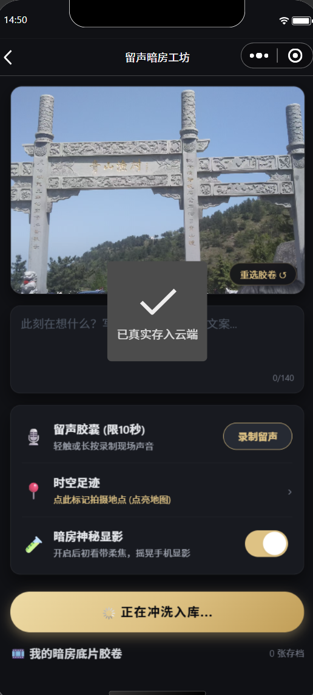
</p>

<p align="center">
  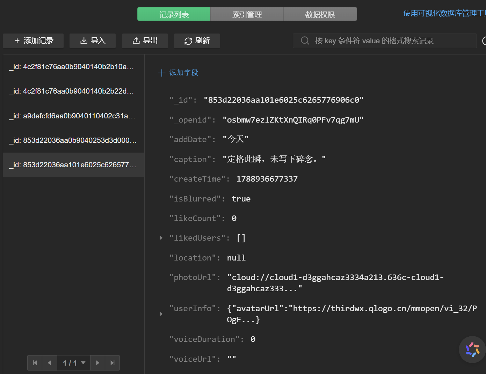
</p>


---

### **4. 个人主页**

​	个人主页（`pages/homepage`）是本用户专属的“时空档案馆”。页面顶层设计了极具质感的暗黑发光档案卡，呈现头像、称号和数据库数据的统计数据（如“胶卷作品”和“获赞认同”）。

​	下方画廊通过两列网格呈现，每张作品卡片底部通过蒙层显示日期与点赞数。并通过页面的 `onShow` 周期监听，确保多端数据的一致性。

```xml
<!-- pages/homepage/homepage.wxml (作者档案看板与作品瀑布流) -->
<view class="archive-container">
  <view class="author-profile-card glass-panel">
    <image class="profile-avatar" src="{{authorInfo.avatarUrl}}" mode="aspectFill" />
    <view class="profile-name">{{authorInfo.nickName}}</view>
    <view class="stats-ribbon">
      <view class="stat-cell"><text class="stat-num">{{authorPhotos.length}}</text><text class="stat-txt">胶卷作品</text></view>
      <view class="stat-divider"></view>
      <view class="stat-cell"><text class="stat-num">{{totalLikes}}</text><text class="stat-txt">获赞认同</text></view>
    </view>
  </view>
  <!-- 作品陈列画廊 -->
  <view class="gallery-grid">
    <view class="grid-card ripple-tap" wx:for="{{authorPhotos}}" wx:key="_id" bindtap="navToDetail" data-id="{{item._id}}">
      <image class="grid-image" src="{{item.photoUrl}}" mode="aspectFill" lazy-load />
      <view class="grid-card-overlay">
        <text class="overlay-date">{{item.addDate}}</text>
        <text class="overlay-like">❤️ {{item.likeCount || 0}}</text>
      </view>
    </view>
  </view>
</view>
```

效果展示图：

<p align="center">
  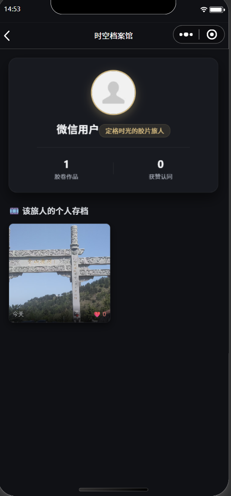
</p>

---

## 四、 问题总结与体会

### 1. 遇到的问题与代码调优

​	在本次小程序的开发与调优的过程中，我遇到了一些涉及云开发端侧规范、安全权限配置以及系统隐私接口调用的问题，并进行了针对性的解决：

* **问题一：云数据库添加记录时在客户端伪造 `_id` 导致的写入静默失败与全网可读权限缺失**
  * *现象*：在发布页冲洗提交照片后，前端提示成功，但在打开云开发控制台查验 `photos` 集合时，数据列表始终显示“没有找到记录”；且当尝试导入种子数据后，真机端列表依然一片漆黑。
  * *分析与解决*：
    1. 查阅控制台网络调用堆栈，发现客户端调用 `db.collection('photos').add()` 时抛出了 `cannot specify _id in add` 异常。这是由于开发初期为了兼顾本地缓存，在数据字典中定义了临时字段 `_id: 'local_xxx'`，而微信 SDK 规定客户端插入数据时严禁指定 `_id`，导致请求被底层直接打回，异常被外层 `catch` 吞噬；
    2. 深入排查发现，新建的 `photos` 集合默认数据安全权限为“仅创建者可读写”，导致通过控制台或外部注入的其他创作者记录，由于 `_openid` 与当前测试者不匹配，被系统安全规则静默过滤，端侧查询返回始终为空数组；
    3. 调优策略上，首先彻底清理了提交载荷中多余的 `_id` 属性，交由腾讯云服务端自增生成 32 位唯一哈希；其次在云开发控制台中将 `photos` 集合的数据权限调整为“所有用户可读，仅创建者及管理员可写”，并在代码中取消静默吞噬，加入显式弹窗排查机制，数据库入库与跨用户拉取恢复正常。
  
* **问题二：时空足迹地图选点被强制退化为“上海”的接口权限排查与真云端解耦**

  * *现象*：在定格工坊点击“时空足迹”选点时，小程序未能唤起预期的全屏地图定位界面，而是每一次都机械式地默认退化赋值为“上海 · 外滩观景台”。
  * *初步尝试*：起初怀疑是开发者工具模拟器的虚拟定位被默认定在华东地区，尝试在开发者工具“传感器”面板中手动输入三亚经纬度进行仿真，但点击打卡时依旧直接跳转并锁定为上海。
  * *结果与分析*：调出调试器 Console 面板捕捉到红字异常 `fail: the api chooseLocation is not declared in app.json`。查阅最新的微信官方隐私规范得知，`chooseLocation` 属于高敏感用户位置接口，必须在全局配置文件 `app.json` 的 `requiredPrivateInfos` 字段中显式声明；此前由于只声明了 `getLocation`，导致调用直接触发系统拒访分支，进而执行了代码中写死的兜底逻辑；同时这也暴露了前端代码存在多处硬编码 Mock 数据退化分支的问题。
  * *最终方案*：在 `app.json` 中补齐 `"chooseLocation"` 隐私声明，并在选点逻辑中移除强制性假值赋值，使用户点击取消时不产生负作用；随后在系统启动层通过云端检测自动完成多用户数据的标准初始化，彻底剔除了前端写死的 samples 数组，实现了所有地标点与相片实体完全由后端数据库动态查询返回，解决了定位锁死的问题。

---

### 2. 实验总结与收获

​	这次实验融入了微信云开发提供的后端数据库，让我学习到了云数据库、云存储以及云函数是如何与前端各个视图模块进行融合的知识。

​	本次应用开发，我认为我最大的提升是增强了对后端数据库重要性的理解。相比于传统纯前端的静态的项目， 在本项目中，后端数据库能够以结构化的 Schema 统筹管理各类不同类型的数据项，这是小程序数据能够记录过去一定历史的信息，并进行动态变化、渲染的重要基础。	

​	这次实验我走通了云开发从数据建模、到功能设计、再到闭环落地的全流程，不仅熟悉了云数据库、云存储管理以及硬件交互接口调用方面的技术，也让我提升了在端云协同体系下的系统排错与用户体验调优能力。

​	总之，这次实验让我学到了严谨规范的工程化开发思维，让我受益匪浅。